<div align="center">

# 🧾 Kansas Frontier Matrix — Deep Archive: Map Metadata Descriptors  
`docs/design/mockups/figma/components/map/archive/metadata/archive-metadata/README.md`

**Mission:** Manage **deep-archive YAML descriptors** for all  
deprecated Map components within the **Kansas Frontier Matrix (KFM)** —  
preserving accessibility lineage, WCAG evaluations, and version provenance  
as immutable MCP-compliant documentation.

[](../../../../../../../../../../)
[](../../../../../../../../../../)
[](../../../../../../../../../../../)
[](../../../../../../../../../../../../../LICENSE)

</div>

---

## 🎯 Purpose

The `/archive-metadata/` directory preserves **deep-archive YAML descriptors**  
for all previously deprecated Map components — capturing the **design, accessibility, and review lineage** of the KFM map subsystem.

Each file acts as a permanent MCP-compliant record that:
- Documents the **final version history** and **reason for deprecation**.  
- Lists the **WCAG 2.1 AA criteria** evaluated and related accessibility issues.  
- Links to the associated **audit**, **review**, **export**, and **replacement component**.  
- Enables **long-term validation** and reproducibility through the MCP audit framework.

---

## 🧭 Directory Structure

```text
docs/design/mockups/figma/components/map/archive/metadata/archive-metadata/
├── README.md                                   # Index (this file)
├── map_controls_v1.9.yml                       # Deep archive descriptor for controls
├── map_overlay_v1.7.yml                        # Deep archive descriptor for overlays
└── map_view_v2.0.yml                           # Deep archive descriptor for map viewports
````

---

## 🧩 YAML Descriptor Schema

Each deep archive metadata record must follow this schema:

```yaml
id: map_controls_v1.9
title: Map Controls Component (v1.9)
archived_on: 2025-10-08
archived_by: accessibility.team
status: deprecated
replaced_by: ../../../../metadata/map_controls_v2.0.yml
figma_source: https://www.figma.com/file/KFM_MAP_COMPONENTS/Library?node-id=350%3A400
reason: >
  Map Controls v1.9 archived after failing accessibility audit on focus visibility
  and color contrast. Version 2.0 corrected these issues with new design tokens
  and ARIA labeling for full WCAG 2.1 AA compliance.
accessibility_issues:
  - Focus outline insufficient contrast (2.3 : 1).
  - Missing ARIA roles for toggle buttons.
  - Keyboard navigation skipped compass element.
wcag_criteria:
  - 1.4.3 Contrast (Minimum)
  - 2.4.7 Focus Visible
  - 2.1.1 Keyboard Navigation
linked_review: ../../../../../../../../../../reviews/2025-09-25_map_controls_v1.9.md
linked_audit: ../../../../accessibility-reports/archive/map_controls_v1.9_team_audit.md
linked_export: ../../../../../exports/archive/map_controls_v1.9.png
license: CC-BY-4.0
notes: >
  This deep archive descriptor ensures traceability of accessibility regressions
  and the remediation path leading to version 2.0 compliance certification.
```

---

## 🧮 Descriptor Workflow

```mermaid
flowchart TD
    A["Deprecate Map Component (vX.Y)"] --> B["Move Metadata → /archive/metadata/"]
    B --> C["Create Deep Descriptor → /archive-metadata/"]
    C --> D["Annotate Issues + WCAG Criteria + Review Links"]
    D --> E["Validate YAML via CI (yamllint · jsonschema)"]
    E --> F["Preserve Under MCP Retention Policy"]
```



<!-- END OF MERMAID -->

### Workflow Summary

1. Identify deprecated map metadata records.
2. Create a deep-archive YAML descriptor in `/archive-metadata/`.
3. Include full provenance (review, audit, replacement links).
4. Validate schema and link structure through CI automation.
5. Store permanently as an immutable MCP provenance record.

---

## ♿ Accessibility Regression Example

| WCAG Criterion            | v1.9 Result | v2.0 Result | Status  |
| :------------------------ | :---------- | :---------- | :------ |
| 1.4.3 Contrast (Minimum)  | Fail        | Pass        | ✅ Fixed |
| 2.4.7 Focus Visible       | Fail        | Pass        | ✅ Fixed |
| 2.1.1 Keyboard Navigation | Partial     | Full        | ✅ Fixed |
| 4.1.2 Name, Role, Value   | Partial     | Full        | ✅ Fixed |

---

## 🧩 Example Descriptor — Map Overlay (v1.7)

```yaml
id: map_overlay_v1.7
title: Map Overlay Component (v1.7)
archived_on: 2025-10-08
archived_by: accessibility.team
status: deprecated
replaced_by: ../../../../metadata/map_overlay_v1.8.yml
figma_source: https://www.figma.com/file/KFM_MAP_COMPONENTS/Library?node-id=480%3A520
reason: >
  Deprecated following accessibility evaluation identifying insufficient
  legend text contrast and missing focus visibility. Corrected in v1.8
  with revised tokens and ARIA role improvements.
accessibility_issues:
  - Legend text contrast 4.0 : 1 (below 4.5 : 1 threshold).
  - Collapsible panels lacked keyboard focus states.
wcag_criteria:
  - 1.4.3
  - 2.4.7
linked_review: ../../../../../../../../../../reviews/2025-09-18_map_overlay_v1.7.md
linked_audit: ../../../../accessibility-reports/archive/map_overlay_v1.7_team_audit.md
linked_export: ../../../../../exports/archive/map_overlay_v1.7.png
license: CC-BY-4.0
notes: >
  Maintained for MCP accessibility provenance and regression documentation.
```

---

## 🧾 CI Validation Rules

| Validation                    | Tool                     | Description                                                    |
| :---------------------------- | :----------------------- | :------------------------------------------------------------- |
| **YAML Structure Validation** | `yamllint`, `jsonschema` | Ensures all required keys are present and correctly formatted. |
| **WCAG Pattern Verification** | Regex (`^\d\.\d+\.\d+$`) | Validates WCAG criterion identifiers.                          |
| **Cross-Link Integrity**      | `validate_links.py`      | Confirms all referenced paths exist and resolve.               |
| **License Enforcement**       | Pre-commit Hook          | Ensures all records specify `CC-BY-4.0`.                       |
| **Replacement Verification**  | CI Workflow              | Confirms `replaced_by` file exists.                            |

---

## 🧠 Governance & Retention Policy

| Action                          | Frequency  | Responsible          | Deliverable                      |
| :------------------------------ | :--------- | :------------------- | :------------------------------- |
| Descriptor Validation           | Continuous | CI Automation        | Validation Logs                  |
| Metadata Review                 | Quarterly  | `design.board`       | Provenance Audit Summary         |
| Accessibility Regression Report | Annual     | `accessibility.team` | WCAG 2.1 AA Comparison           |
| Permanent Retention             | Always     | Maintainers          | Immutable MCP Provenance Archive |

---

## 🧩 Related Documentation

* [`../README.md`](../README.md) — Archived Map metadata overview
* [`../../README.md`](../../README.md) — Active Map metadata schema
* [`../../../../accessibility-reports/archive/README.md`](../../../../accessibility-reports/archive/README.md) — Archived accessibility audits
* [`../../../../../../../../ui-guidelines.md`](../../../../../../../../ui-guidelines.md) — Accessibility & design rules
* [`../../../../../../../../style-guide.md`](../../../../../../../../style-guide.md) — Design tokens & contrast standards
* [`../../../../../../../../reviews/`](../../../../../../../../reviews/) — MCP review and approval records

---

<div align="center">

### 🗺️ “Every version archived keeps accessibility visible —

deep metadata ensures inclusion is never forgotten.”
**— Kansas Frontier Matrix Accessibility & Design Governance Council**

</div>
