<div align="center">

# 🧾 Kansas Frontier Matrix — Map Component Metadata  
`docs/design/mockups/figma/components/map/metadata/README.md`

**Mission:** Define the **metadata schema, validation, and provenance rules**  
for all map-related components (viewport, controls, overlays, popups, legends)  
within the **Kansas Frontier Matrix (KFM)** — ensuring WCAG 2.1 AA compliance,  
MCP documentation integrity, and seamless integration between Figma and React.

[](../../../../../)
[](../../../../../)
[](../../../../../../)
[](../../../../../../../LICENSE)

</div>

---

## 🎯 Purpose

The `/metadata/` directory holds **YAML metadata records** for each map component  
designed in Figma and implemented within the web UI.  
Each file captures version-specific design, accessibility, and provenance details  
— forming a **reproducible link** between the visual design, accessibility audits,  
and live implementation in the KFM codebase.

Metadata provides:
- 🗺️ **Component identification** and version lineage  
- ♿ **WCAG 2.1 AA accessibility data**  
- 🔗 **Cross-links** to design files, audits, and reviews  
- 🧩 **MCP compliance** for version control and reproducibility

---

## 🧭 Directory Structure

```text
docs/design/mockups/figma/components/map/metadata/
├── README.md                      # Index (this file)
├── map_view_v2.1.yml              # Map viewport metadata
├── map_controls_v2.0.yml          # Map controls metadata
├── map_overlay_v1.8.yml           # Overlay/legend metadata
└── archive/                       # Deprecated or replaced metadata versions
````

---

## 🧩 YAML Metadata Schema

Each map component’s metadata file must follow this schema:

```yaml
id: map_controls_v2.0
title: Map Controls Component (v2.0)
author: design.system.team
date: 2025-10-08
version: v2.0
status: active
type: map
source_figma: https://www.figma.com/file/KFM_MAP_COMPONENTS/Library?node-id=350%3A480
description: >
  Interactive control group including zoom, compass, and layer toggle buttons.
  Fully accessible with keyboard shortcuts, ARIA labels, and high-contrast tokens.
accessibility:
  aria_roles: ["button", "region"]
  keyboard_shortcuts: ["+", "-", "r"]
  focusable_elements: true
  reduced_motion: true
  contrast_ratio: 4.9 : 1
  wcag_criteria:
    - 1.4.3 Contrast (Minimum)
    - 2.1.1 Keyboard Accessibility
    - 2.4.7 Focus Visible
linked_docs:
  - ../../../../ui-guidelines.md
  - ../../../../interaction-patterns.md
  - ../../../../style-guide.md
react_mapping: /web/src/components/map/MapControls.tsx
review_log: ../../../../reviews/2025-10-08_map_controls_v2.0.md
license: CC-BY-4.0
```

---

## 🧮 Metadata Lifecycle Workflow

```mermaid
flowchart TD
    A["Design Component in Figma\n(Map View, Controls, Overlay)"] --> B["Accessibility Review\n(WCAG + Plugin Validation)"]
    B --> C["Export Assets\n(PNG · SVG · PDF)"]
    C --> D["Create Metadata File\n(in /metadata/)"]
    D --> E["Link Implementation\n(web/src/components/map/)"]
    E --> F["Submit MCP Review\n(docs/design/reviews/)"]
    F --> G["Archive Old Versions\n(docs/design/mockups/figma/components/map/archive/)"]
```



<!-- END OF MERMAID -->

---

## ♿ Accessibility Metadata Requirements

| Field                | WCAG Ref | Description                                        | Validation Tool     |
| :------------------- | :------- | :------------------------------------------------- | :------------------ |
| `aria_roles`         | 4.1.2    | Role must accurately describe component function.  | Manual / Axe        |
| `keyboard_shortcuts` | 2.1.1    | Map controls must be operable via keyboard.        | Playwright / Manual |
| `focusable_elements` | 2.1.1    | All interactive elements reachable by Tab.         | Axe / Manual        |
| `contrast_ratio`     | 1.4.3    | Minimum 4.5 : 1 contrast required.                 | Stark / Able        |
| `reduced_motion`     | 2.3.3    | All animations must respect OS motion preferences. | Browser Simulation  |

---

## 🧾 Example Metadata File — Map Overlay (v1.8)

```yaml
id: map_overlay_v1.8
title: Map Overlay Component (v1.8)
author: accessibility.team
date: 2025-10-08
version: v1.8
status: active
type: map-overlay
source_figma: https://www.figma.com/file/KFM_MAP_COMPONENTS/Library?node-id=480%3A520
description: >
  Sidebar overlay for map layers, legends, and metadata summaries.
  Provides collapsible panels for categories and integrates with map filters.
accessibility:
  aria_roles: ["region", "tabpanel"]
  focusable_elements: true
  keyboard_shortcuts: ["Tab", "Enter"]
  reduced_motion: true
  contrast_ratio: 5.0 : 1
  wcag_criteria:
    - 1.4.3
    - 2.1.1
    - 2.4.7
linked_docs:
  - ../../../../ui-guidelines.md
  - ../../../../style-guide.md
react_mapping: /web/src/components/map/MapOverlay.tsx
review_log: ../../../../reviews/2025-10-08_map_overlay_v1.8.md
license: CC-BY-4.0
```

---

## 🧩 CI Validation Rules

| Validation                  | Tool                     | Description                                                         |
| :-------------------------- | :----------------------- | :------------------------------------------------------------------ |
| **Schema Validation**       | `yamllint`, `jsonschema` | Ensures required fields and data types are correct.                 |
| **WCAG Format Check**       | Regex (`^\d\.\d+\.\d+$`) | Validates WCAG criterion formatting.                                |
| **Cross-Link Verification** | `validate_links.py`      | Confirms all internal references exist.                             |
| **License Compliance**      | Pre-commit Hook          | Must include `CC-BY-4.0`.                                           |
| **Version Consistency**     | CI                       | Ensures matching version tags in Figma, YAML, and React components. |

---

## 🧠 Governance & Retention Policy

| Action                   | Frequency    | Responsible          | Deliverable              |
| :----------------------- | :----------- | :------------------- | :----------------------- |
| Metadata Review          | Quarterly    | `design.board`       | MCP compliance report    |
| Accessibility Validation | Each Release | `accessibility.team` | WCAG audit summary       |
| CI Schema Validation     | Continuous   | Automation           | Validation log           |
| Permanent Retention      | Always       | Maintainers          | Immutable version record |

---

## 🧩 Related Documentation

* [`../README.md`](../README.md) — Map components overview
* [`../../timeline/README.md`](../../timeline/README.md) — Timeline system documentation
* [`../../panels/README.md`](../../panels/README.md) — Panel components
* [`../../../../ui-guidelines.md`](../../../../ui-guidelines.md) — Accessibility & interaction principles
* [`../../../../style-guide.md`](../../../../style-guide.md) — Design tokens & color standards
* [`../../../../reviews/`](../../../../reviews/) — MCP design & accessibility review logs

---

<div align="center">

### 🗺️ “Maps connect people and places —

metadata connects accessibility and purpose.”
**— Kansas Frontier Matrix Design & Accessibility Council**

</div>
