<div align="center">

# 🗃️ Kansas Frontier Matrix — Archived Map Metadata  
`docs/design/mockups/figma/components/map/metadata/archive/README.md`

**Mission:** Maintain and preserve **archived YAML metadata files**  
for all deprecated map components within the **Kansas Frontier Matrix (KFM)**  
— ensuring accessibility lineage, design provenance, and MCP compliance.

[](../../../../../../../../)
[](../../../../../../../../)
[](../../../../../../../../../)
[](../../../../../../../../../../../LICENSE)

</div>

---

## 🎯 Purpose

The `/archive/` directory retains **deprecated YAML metadata files**  
for map components that have been replaced or superseded by new versions.  

Each file acts as a **historical provenance record** documenting:
- The version lifecycle (author, date, replaced_by).  
- Accessibility audit results and WCAG references.  
- Links to Figma design files, review logs, and design exports.  
- Rationale for deprecation and subsequent accessibility improvements.  

These archives ensure transparency and reproducibility in KFM’s evolving  
design ecosystem while maintaining MCP traceability.

---

## 🧭 Directory Structure

```text
docs/design/mockups/figma/components/map/metadata/archive/
├── README.md                                  # Index (this file)
├── map_controls_v1.9.yml                      # Deprecated map controls metadata
├── map_overlay_v1.7.yml                       # Archived map overlay metadata
├── map_view_v2.0.yml                          # Superseded viewport component
└── archive-metadata/                          # Deep provenance descriptors for MCP archival
````

---

## 🧩 Metadata Schema (for Archived Map Components)

Each archived YAML metadata file must include the following fields:

```yaml
id: map_controls_v1.9
title: Map Controls Component (v1.9)
version: v1.9
status: deprecated
archived_on: 2025-10-08
archived_by: design.board
replaced_by: ../map_controls_v2.0.yml
reason: >
  Superseded by v2.0 following accessibility remediation.
  Focus outlines and contrast ratios improved per WCAG 2.1 AA.
source_figma: https://www.figma.com/file/KFM_MAP_COMPONENTS/Library?node-id=350%3A400
linked_review: ../../../../../../../../../reviews/2025-09-25_map_controls_v1.9.md
linked_export: ../../../../exports/archive/map_controls_v1.9.png
accessibility_issues:
  - Focus outline insufficient contrast (2.3 : 1).
  - Keyboard navigation skipped compass button.
  - Layer toggle lacked ARIA role.
wcag_criteria:
  - 1.4.3 Contrast (Minimum)
  - 2.1.1 Keyboard Navigation
  - 2.4.7 Focus Visible
license: CC-BY-4.0
notes: >
  Retained as MCP evidence of accessibility improvement and design iteration.
```

---

## 🧮 Archival Workflow

```mermaid
flowchart TD
    A["New Version Released (vX.Y+1)"] --> B["Deprecate Previous Metadata (status → deprecated)"]
    B --> C["Move YAML to /archive/metadata/"]
    C --> D["Annotate Deprecation Fields\n(archived_on · reason · replaced_by)"]
    D --> E["Cross-Link Review Logs, Figma, and Audits"]
    E --> F["Validate Schema + Provenance via CI"]
```



<!-- END OF MERMAID -->

### Workflow Summary

1. Move deprecated map metadata into `/archive/metadata/`.
2. Add `archived_on`, `archived_by`, `reason`, and `replaced_by`.
3. Link to Figma, exports, and related audit documents.
4. Validate metadata structure and path integrity.
5. Preserve record permanently under MCP archival retention policy.

---

## ♿ Accessibility Regression Tracking

| WCAG Ref                  | Deprecated Version | Replacement Version | Status  |
| :------------------------ | :----------------- | :------------------ | :------ |
| 1.4.3 Contrast (Minimum)  | 3.8 : 1            | 4.9 : 1             | ✅ Fixed |
| 2.1.1 Keyboard Navigation | Partial            | Full                | ✅ Fixed |
| 2.4.7 Focus Visible       | Fail               | Pass                | ✅ Fixed |
| 4.1.2 Name, Role, Value   | Partial            | Full                | ✅ Fixed |

---

## 🧩 Example Archived Metadata — Overlay (v1.7)

```yaml
id: map_overlay_v1.7
title: Map Overlay Component (v1.7)
version: v1.7
status: deprecated
archived_on: 2025-10-08
archived_by: accessibility.team
replaced_by: ../map_overlay_v1.8.yml
reason: >
  Deprecated after WCAG audit revealed insufficient text contrast
  and inconsistent focus highlight behavior in the legend section.
source_figma: https://www.figma.com/file/KFM_MAP_COMPONENTS/Library?node-id=480%3A520
linked_review: ../../../../../../../../../reviews/2025-09-18_map_overlay_v1.7.md
linked_export: ../../../../exports/archive/map_overlay_v1.7.png
accessibility_issues:
  - Legend text contrast 4.0 : 1 (below 4.5 : 1 threshold).
  - Collapsible panels lacked keyboard focus states.
wcag_criteria:
  - 1.4.3
  - 2.4.7
license: CC-BY-4.0
notes: >
  Corrected in v1.8 with improved color token usage and accessible focus design.
```

---

## 🧾 CI Validation Rules

| Validation                  | Tool                     | Purpose                                         |
| :-------------------------- | :----------------------- | :---------------------------------------------- |
| **YAML Schema Validation**  | `yamllint`, `jsonschema` | Ensures valid structure and required fields.    |
| **WCAG Reference Format**   | Regex (`^\d\.\d+\.\d+$`) | Validates WCAG IDs.                             |
| **Cross-Link Verification** | `validate_links.py`      | Confirms Figma, export, and review links exist. |
| **License Enforcement**     | Pre-commit Hook          | Confirms license equals `CC-BY-4.0`.            |
| **Replacement Path Check**  | CI                       | Ensures valid replacement reference exists.     |

---

## 🧠 Governance & Retention Policy

| Action                         | Frequency  | Responsible          | Deliverable                  |
| :----------------------------- | :--------- | :------------------- | :--------------------------- |
| Archive Validation             | Quarterly  | `design.board`       | MCP integrity report         |
| Accessibility Regression Audit | Annual     | `accessibility.team` | WCAG improvement analysis    |
| Schema + Link Validation       | Continuous | CI Automation        | Validation logs              |
| Retention Policy               | Permanent  | Maintainers          | Immutable MCP archive record |

---

## 🧩 Related Documentation

* [`../README.md`](../README.md) — Active map metadata schema
* [`../../README.md`](../../README.md) — Map components overview
* [`../../accessibility-reports/README.md`](../../accessibility-reports/README.md) — Map accessibility audit index
* [`../../../../../../../../ui-guidelines.md`](../../../../../../../../ui-guidelines.md) — Accessibility & interaction standards
* [`../../../../../../../../style-guide.md`](../../../../../../../../style-guide.md) — Design tokens and color contrast rules
* [`../../../../../../../../reviews/`](../../../../../../../../reviews/) — MCP review and approval records

---

<div align="center">

### 🗺️ “Every archived design is a checkpoint of progress —

metadata keeps the journey verifiable.”
**— Kansas Frontier Matrix Accessibility & Design Governance Council**

</div>
