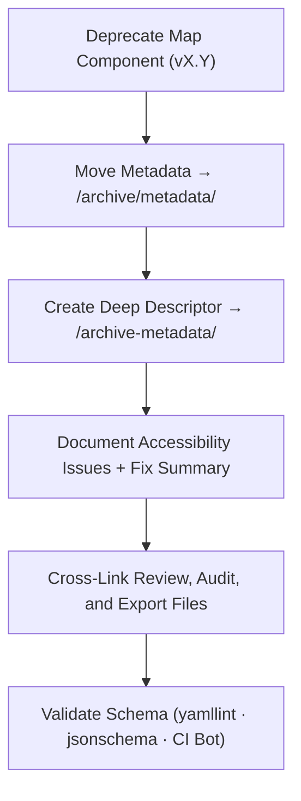

<div align="center">

# 🧾 Kansas Frontier Matrix — Deep Archive: Map Metadata Descriptors  
`docs/design/mockups/figma/components/map/metadata/archive/archive-metadata/README.md`

**Mission:** Maintain **deep-archive YAML descriptors** for all deprecated  
Map components in the **Kansas Frontier Matrix (KFM)** — preserving  
accessibility lineage, design provenance, and historical WCAG compliance  
as immutable records under the **Master Coder Protocol (MCP)**.

[](../../../../../../../../../../../)
[](../../../../../../../../../../../)
[](../../../../../../../../../../../../)
[](../../../../../../../../../../../../../LICENSE)

</div>

---

## 🎯 Purpose

The `/archive-metadata/` directory preserves **final provenance descriptors**  
for all deprecated Map components — Viewports, Overlays, Controls, Tooltips, and Legends —  
documenting accessibility history and design evolution across versions.

Each YAML descriptor contains:
- 🧩 Component identifiers and archival context  
- ♿ WCAG 2.1 AA accessibility outcomes  
- 🔗 Cross-links to reviews, audits, and Figma exports  
- 🗃️ Immutable records for MCP audit verification  

These files are essential to maintaining **complete transparency and traceability**  
in KFM’s design and accessibility ecosystem.

---

## 🧭 Directory Structure

```text
docs/design/mockups/figma/components/map/metadata/archive/archive-metadata/
├── README.md                                  # Index (this file)
├── map_controls_v1.9.yml                      # Deep-archive descriptor (Controls)
├── map_overlay_v1.7.yml                       # Deep-archive descriptor (Overlay)
└── map_view_v2.0.yml                          # Deep-archive descriptor (Viewport)
````

---

## 🧩 YAML Descriptor Schema

Each descriptor must include complete metadata for provenance and compliance.

```yaml
id: map_controls_v1.9
title: Map Controls Component (v1.9)
archived_on: 2025-10-08
archived_by: accessibility.team
status: deprecated
replaced_by: ../../../../metadata/map_controls_v2.0.yml
figma_source: https://www.figma.com/file/KFM_MAP_COMPONENTS/Library?node-id=350%3A400
reason: >
  Map Controls v1.9 deprecated after accessibility audit revealed insufficient focus contrast
  and missing ARIA attributes on toggle buttons. Improvements implemented in v2.0.
accessibility_issues:
  - Focus outline contrast 2.3 : 1 (below WCAG threshold).
  - Keyboard focus skipped compass button.
  - Missing `aria-pressed` states for toggle controls.
wcag_criteria:
  - 1.4.3 Contrast (Minimum)
  - 2.1.1 Keyboard Navigation
  - 2.4.7 Focus Visible
linked_review: ../../../../../../../../../../reviews/2025-09-25_map_controls_v1.9.md
linked_audit: ../../accessibility-reports/archive/map_controls_v1.9_team_audit.md
linked_export: ../../../../../exports/archive/map_controls_v1.9.png
license: CC-BY-4.0
notes: >
  Retained as an immutable MCP record for accessibility progress documentation and design provenance.
```

---

## 🧮 Descriptor Workflow



<!-- END OF MERMAID -->

**Workflow Summary**

1. Identify and deprecate outdated Map component metadata.
2. Move YAML record to `/archive/metadata/` and create a new descriptor in `/archive-metadata/`.
3. Annotate with WCAG compliance details, provenance links, and reasons for replacement.
4. Validate via MCP CI pipelines (`yamllint`, `jsonschema`, `validate_links.py`).
5. Preserve record permanently for reproducibility and audit reference.

---

## ♿ Accessibility Regression Summary

| WCAG Ref                  | v1.9 Result    | v2.0 Result    | Status  |
| :------------------------ | :------------- | :------------- | :------ |
| 1.4.3 Contrast (Minimum)  | Fail (2.3 : 1) | Pass (4.8 : 1) | ✅ Fixed |
| 2.1.1 Keyboard Navigation | Partial        | Full           | ✅ Fixed |
| 2.4.7 Focus Visible       | Fail           | Pass           | ✅ Fixed |
| 4.1.2 ARIA Roles          | Partial        | Full           | ✅ Fixed |

---

## 🧩 Example Descriptor — Map Overlay (v1.7)

```yaml
id: map_overlay_v1.7
title: Map Overlay Component (v1.7)
archived_on: 2025-10-08
archived_by: design.board
status: deprecated
replaced_by: ../../../../metadata/map_overlay_v1.8.yml
figma_source: https://www.figma.com/file/KFM_MAP_COMPONENTS/Library?node-id=480%3A520
reason: >
  Overlay v1.7 deprecated following accessibility evaluation identifying inconsistent
  focus visibility and low text contrast in legend panels. Fixed in v1.8 with new token set.
accessibility_issues:
  - Legend text contrast 4.0 : 1 (below WCAG threshold).
  - Collapsible layer groups lacked keyboard focus visibility.
wcag_criteria:
  - 1.4.3
  - 2.4.7
linked_review: ../../../../../../../../../../reviews/2025-09-18_map_overlay_v1.7.md
linked_audit: ../../accessibility-reports/archive/map_overlay_v1.7_team_audit.md
linked_export: ../../../../../exports/archive/map_overlay_v1.7.png
license: CC-BY-4.0
notes: >
  Retained for accessibility regression analysis and token-based color contrast review under MCP audit.
```

---

## 🧾 CI Validation Rules

| Validation                      | Tool                     | Purpose                                                |
| :------------------------------ | :----------------------- | :----------------------------------------------------- |
| **YAML Schema Validation**      | `yamllint`, `jsonschema` | Ensures correct field structure and data types.        |
| **WCAG Reference Validation**   | Regex (`^\d\.\d+\.\d+$`) | Confirms WCAG ID formatting.                           |
| **Cross-Link Verification**     | `validate_links.py`      | Ensures all references (review, audit, exports) exist. |
| **License Enforcement**         | Pre-commit Hook          | Confirms `CC-BY-4.0` compliance.                       |
| **Replacement Path Validation** | CI Workflow              | Verifies valid `replaced_by` file path.                |

---

## 🧠 Governance & Retention Policy

| Action                            | Frequency  | Responsible          | Deliverable                      |
| :-------------------------------- | :--------- | :------------------- | :------------------------------- |
| Deep Metadata Validation          | Continuous | CI Bot               | Schema + link verification logs  |
| MCP Compliance Review             | Quarterly  | `design.board`       | Audit report summary             |
| Accessibility Regression Analysis | Annual     | `accessibility.team` | WCAG improvement report          |
| Permanent Retention               | Always     | Repo Maintainers     | Immutable MCP Provenance Archive |

---

## 🧩 Related Documentation

* [`../README.md`](../README.md) — Archived Map metadata overview
* [`../../README.md`](../../README.md) — Map metadata schema
* [`../../../../accessibility-reports/archive/README.md`](../../../../accessibility-reports/archive/README.md) — Archived accessibility reports
* [`../../../../../../../../ui-guidelines.md`](../../../../../../../../ui-guidelines.md) — Accessibility and design standards
* [`../../../../../../../../style-guide.md`](../../../../../../../../style-guide.md) — Design tokens and color system documentation
* [`../../../../../../../../reviews/`](../../../../../../../../reviews/) — MCP design and accessibility review logs

---

<div align="center">

### 🗺️ “Each archived design is a map of progress —

deep metadata ensures the route remains discoverable.”
**— Kansas Frontier Matrix Accessibility & Design Governance Council**

</div>
