<div align="center">

# 🪟 Kansas Frontier Matrix — Panel Components  
`docs/design/mockups/figma/components/panels/README.md`

**Mission:** Define, document, and maintain all **panel, drawer, and modal components**  
for the **Kansas Frontier Matrix (KFM)** web interface — ensuring accessibility,  
design consistency, and reproducible behavior across all use cases.

[](../../)
[](../../)
[](../../../)
[](../../../../LICENSE)

</div>

---

## 🎯 Purpose

The `/panels/` directory defines **how panels behave, look, and integrate**  
within the KFM design system.  

Panels are used for **contextual detail display**, **AI assistant interactions**, and **data exploration**,  
bridging static maps and timelines with dynamic storytelling elements.

Panels in this system must be:
- ♿ **Accessible:** Keyboard navigable and ARIA-labeled.  
- 🔁 **Reproducible:** Documented in Figma, linked to metadata, and versioned.  
- 🔒 **Consistent:** Follow KFM visual tokens, animation durations, and spacing scales.  
- 📜 **Traceable:** Each update cross-referenced with MCP review logs.

---

## 🧭 Directory Structure

```text
docs/design/mockups/figma/components/panels/
├── README.md                     # Index (this file)
├── panel_drawer_v1.3.png          # Side drawer export
├── panel_modal_v2.0.png           # Modal panel (centered)
├── panel_detail_v1.5.png          # Right-side info/detail panel
├── metadata/                      # YAML metadata for each component
├── accessibility-reports/         # Audit reports for each version
└── archive/                       # Deprecated panel versions
````

---

## 🧩 Panel Variants

| Type             | Description                                          | Example ID          | Accessibility Features                     |
| :--------------- | :--------------------------------------------------- | :------------------ | :----------------------------------------- |
| **Drawer Panel** | Collapsible side panel for navigation or AI chat.    | `panel_drawer_v1.3` | Focus trap, ESC close, ARIA roles          |
| **Modal Panel**  | Centered dialog for confirmations or data summaries. | `panel_modal_v2.0`  | Keyboard ESC close, overlay dimmer         |
| **Detail Panel** | Context panel tied to map/timeline selections.       | `panel_detail_v1.5` | Auto-focus, tab cycle, live region updates |

---

## 🧾 Metadata Schema

Each panel component includes a corresponding metadata file under `/metadata/`.

```yaml
id: panel_modal_v2.0
title: Modal Panel Component (v2.0)
author: design.system.team
date: 2025-10-06
version: v2.0
status: active
source_figma: https://www.figma.com/file/KFM_PANEL_DOCS/Component-Library?node-id=220%3A450
description: >
  The standard modal panel used for user interactions requiring focused attention.
  Includes dimmed backdrop, keyboard focus trapping, and ESC-to-close support.
accessibility:
  aria_roles: ["dialog", "alertdialog"]
  focus_trap: true
  contrast_ratio: 4.8 : 1
  reduced_motion: true
linked_docs:
  - ../../../../ui-guidelines.md
  - ../../../../interaction-patterns.md
license: CC-BY-4.0
```

---

## 🧮 Design Workflow

```mermaid
flowchart TD
    A["Design Panel in Figma\n(Drawer · Modal · Detail)"] --> B["Accessibility Review\n(WCAG · Keyboard · ARIA)"]
    B --> C["Export Mockups\nPNG · SVG · PDF"]
    C --> D["Annotate Metadata\n(YAML in /metadata/)"]
    D --> E["Link to Implementation\n(web/src/components/panels/)"]
    E --> F["Design Review Log\n(docs/design/reviews/)"]
    F --> G["Archive Old Versions\n(if replaced)"]
```



<!-- END OF MERMAID -->

---

## ♿ Accessibility Standards

| Criterion             | WCAG Ref | Requirement                                 | Validation Tool  |
| :-------------------- | :------- | :------------------------------------------ | :--------------- |
| **Keyboard Focus**    | 2.1.1    | All interactive elements tab-reachable.     | Manual + Axe     |
| **Focus Visible**     | 2.4.7    | 2px accent outline, minimum 3:1 contrast.   | Stark plugin     |
| **ARIA Roles**        | 4.1.2    | Use `dialog`, `region`, or `complementary`. | Figma annotation |
| **Motion Preference** | 2.3.3    | Honors `prefers-reduced-motion`.            | Prototype test   |
| **Color Contrast**    | 1.4.3    | ≥ 4.5 : 1 text contrast.                    | Able plugin      |

---

## 🧱 Design Tokens (from `/docs/design/style-guide.md`)

| Token               | Purpose             | Example                              |
| :------------------ | :------------------ | :----------------------------------- |
| `--color-bg-panel`  | Panel background    | `#ffffff` (light) / `#1a1a1a` (dark) |
| `--color-border`    | Divider and outline | `#d9d9d9`                            |
| `--radius-panel`    | Corner rounding     | `12px`                               |
| `--shadow-elevated` | Panel elevation     | `0 2px 12px rgba(0,0,0,0.1)`         |
| `--transition-fast` | Animation speed     | `150ms ease-out`                     |

---

## 🧩 Example Component — Drawer Panel (v1.3)

**File:** `panel_drawer_v1.3.png`
**Source:** [Figma Link →](https://www.figma.com/file/KFM_PANEL_DOCS/Component-Library?node-id=315%3A500)
**Description:**

> Slide-out drawer panel for AI assistant or filter controls.
> Supports both left- and right-alignment, with non-blocking backdrop overlay.

**Accessibility Summary:**

* ARIA role: `complementary`
* Keyboard ESC → close behavior
* Focus trapped within active region
* Transition honors `prefers-reduced-motion`

---

## 🧩 Implementation Mapping

| Figma ID            | React Component   | File Path                                    | Notes                           |
| :------------------ | :---------------- | :------------------------------------------- | :------------------------------ |
| `panel_drawer_v1.3` | `<DrawerPanel />` | `/web/src/components/panels/DrawerPanel.tsx` | Focus trap & overlay control    |
| `panel_modal_v2.0`  | `<ModalPanel />`  | `/web/src/components/panels/ModalPanel.tsx`  | Dialog role; ESC close          |
| `panel_detail_v1.5` | `<DetailPanel />` | `/web/src/components/panels/DetailPanel.tsx` | Auto-focus on open; ARIA region |

---

## 🧩 Accessibility Regression Example

| Version     | Issue                                   | WCAG Ref | Fix                   |
| :---------- | :-------------------------------------- | :------- | :-------------------- |
| v1.2 → v1.3 | Drawer lacked visible focus ring.       | 2.4.7    | Added accent outline. |
| v1.4 → v1.5 | Modal not labeled for screen readers.   | 4.1.2    | Added `aria-label`.   |
| v1.5 → v2.0 | Backdrop lacked reduced-motion setting. | 2.3.3    | Added fade toggle.    |

---

## 🧾 CI & Validation

| Check                      | Tool                | Description                 |
| :------------------------- | :------------------ | :-------------------------- |
| **YAML Schema Validation** | `yamllint`          | Ensures metadata structure. |
| **Accessibility Audit**    | Axe / Lighthouse    | Confirms WCAG compliance.   |
| **Link Validation**        | `validate_links.py` | Checks all doc references.  |
| **License Verification**   | Pre-commit          | Enforces `CC-BY-4.0`.       |
| **Visual Regression**      | Playwright Snapshot | Confirms design parity.     |

---

## 🧠 Governance & Retention Policy

| Action               | Frequency    | Owner                | Output                |
| :------------------- | :----------- | :------------------- | :-------------------- |
| Metadata Audit       | Quarterly    | `design.board`       | Compliance summary    |
| Accessibility Review | Each version | `accessibility.team` | WCAG validation log   |
| Schema Validation    | Continuous   | CI Automation        | YAML + link integrity |
| Archive Rotation     | As needed    | Maintainers          | Immutable MCP record  |

---

## 🧩 Related Documentation

* [`../README.md`](../README.md) — Component library overview
* [`../../buttons/README.md`](../../buttons/README.md) — Button system
* [`../../../../ui-guidelines.md`](../../../../ui-guidelines.md) — Accessibility standards
* [`../../../../interaction-patterns.md`](../../../../interaction-patterns.md) — Interaction behavior
* [`../../../../style-guide.md`](../../../../style-guide.md) — Visual token specifications
* [`../../../../reviews/`](../../../../reviews/) — MCP review and validation logs

---

<div align="center">

### 🪟 “Panels frame the story —

they hold the dialogue between user, data, and discovery.”
**— Kansas Frontier Matrix Design System Team**

</div>
