<div align="center">

# ♿ Kansas Frontier Matrix — Panel Accessibility Reports  
`docs/design/mockups/figma/components/panels/accessibility-reports/README.md`

**Mission:** Document and preserve **accessibility audit reports**  
for all panel components — drawers, modals, and contextual detail panes —  
within the **Kansas Frontier Matrix (KFM)** design system, ensuring  
transparency, compliance, and reproducibility under the **Master Coder Protocol (MCP)**.

[](../../../../../../)
[](../../../../../../)
[](../../../../../../../)
[](../../../../../../../../LICENSE)

</div>

---

## 🎯 Purpose

This directory contains **accessibility audit documentation** for panel components designed in Figma  
and implemented in the Frontier Matrix web interface.  
Each report captures the evaluation of **WCAG 2.1 AA** criteria, **ARIA roles**, **keyboard navigation**,  
and **motion safety** for the component version under review.

Audits are performed before each release or major version increment  
and stored here as immutable documentation records.

---

## 🧭 Directory Structure

```text
docs/design/mockups/figma/components/panels/accessibility-reports/
├── README.md                               # Index (this file)
├── panel_drawer_v1.3_team_audit.md          # Drawer panel audit (active)
├── panel_modal_v2.0_team_audit.md           # Modal panel audit
├── panel_detail_v1.5_team_audit.md          # Context detail panel audit
└── archive/                                 # Superseded or deprecated audit reports
````

---

## 🧾 YAML Metadata (Front Matter Schema)

Each audit file begins with standardized YAML metadata for traceability:

```yaml
id: panel_modal_v2.0_team_audit
title: Modal Panel (v2.0) — Accessibility Audit
author: accessibility.team
date: 2025-10-06
status: active
source_figma: https://www.figma.com/file/KFM_PANEL_DOCS/Component-Library?node-id=270%3A550
plugin_used:
  - Able v2.3
  - Stark v4.2
criteria:
  - 1.4.3 Contrast (Minimum)
  - 2.1.1 Keyboard Navigation
  - 2.4.7 Focus Visible
  - 2.3.3 Animation from Interactions
result: pass
issues_found: 0
license: CC-BY-4.0
review_log: ../../../../../../../reviews/2025-10-06_panel_modal_v2.0.md
linked_export: ../../../exports/panel_modal_v2.0.png
linked_metadata: ../../../metadata/panel_modal_v2.0.yml
```

---

## 🧩 Example Audit Structure

```markdown
# ♿ Accessibility Audit — Modal Panel (v2.0)

**Audit Date:** October 6, 2025  
**Reviewed by:** Accessibility Team  
**Result:** ✅ Pass (No critical issues)

---

## Summary
The v2.0 Modal Panel meets all WCAG 2.1 AA criteria for contrast, keyboard navigation,
and motion safety. Focus trapping and ESC-to-close behavior function as expected.

---

## WCAG 2.1 Evaluation Results

| WCAG Ref | Criterion | Result | Notes |
|:--|:--|:--|:--|
| **1.4.3** | Contrast (Minimum) | ✅ Pass | Text/background 4.9 : 1 |
| **2.1.1** | Keyboard Navigation | ✅ Pass | Tab and Shift+Tab cycle properly |
| **2.4.7** | Focus Visible | ✅ Pass | Accent 2 px focus ring visible |
| **2.3.3** | Animation from Interactions | ✅ Pass | Honors `prefers-reduced-motion` |

---

## Accessibility Notes
- **Focus management:** Focus returns to triggering element after close.  
- **ARIA roles:** Correctly set to `role="dialog"` with `aria-modal="true"`.  
- **Motion safety:** Fade transition ≤ 150 ms; no parallax motion detected.  

---

## Provenance Links
- **Metadata:** [`../../../metadata/panel_modal_v2.0.yml`](../../../metadata/panel_modal_v2.0.yml)  
- **Design Export:** [`../../../exports/panel_modal_v2.0.png`](../../../exports/panel_modal_v2.0.png)  
- **Review Log:** [`../../../../../../../reviews/2025-10-06_panel_modal_v2.0.md`](../../../../../../../reviews/2025-10-06_panel_modal_v2.0.md)

---

## Reviewer Sign-Off

| Role | Name | Date | Result |
|:--|:--|:--|:--|
| Accessibility Lead | M. Jordan | 2025-10-06 | ✅ Approved |
| UI Engineer | L. Daniels | 2025-10-06 | ✅ Verified |
| Design Reviewer | A. Barta | 2025-10-06 | ✅ Confirmed |

---

> **License:** CC-BY-4.0  
> **Status:** Approved and retained under MCP reproducibility policy.
```

---

## 🧮 Accessibility Audit Workflow

```mermaid
flowchart TD
    A["Figma Panel Prototype"] --> B["Run Accessibility Plugins\n(Able · Stark)"]
    B --> C["Manual Keyboard & Motion Tests"]
    C --> D["Document Results\n(Markdown + YAML Front Matter)"]
    D --> E["Link Metadata + Review Log"]
    E --> F["Commit to /accessibility-reports/"]
```



<!-- END OF MERMAID -->

---

## ♿ Standard WCAG 2.1 Checks

| Category                | WCAG Ref | Requirement                     | Validation Tool    |
| :---------------------- | :------- | :------------------------------ | :----------------- |
| **Contrast Ratio**      | 1.4.3    | ≥ 4.5 : 1 for text              | Able / Stark       |
| **Keyboard Navigation** | 2.1.1    | Full tab/shift-tab coverage     | Manual             |
| **Focus Visible**       | 2.4.7    | Accent outline ≥ 3 : 1 contrast | Plugin + Manual    |
| **Reduced Motion**      | 2.3.3    | Obey `prefers-reduced-motion`   | Prototype playback |
| **ARIA Roles & Labels** | 4.1.2    | Correct role for modal/drawer   | Figma annotations  |

---

## 🧾 Validation & CI Checks

| Check                 | Tool                   | Purpose                   |
| :-------------------- | :--------------------- | :------------------------ |
| **YAML Syntax**       | `yamllint`             | Valid front-matter schema |
| **WCAG Pattern**      | Regex `^\d\.\d+\.\d+$` | Validates checkpoint IDs  |
| **Cross-Links**       | `validate_links.py`    | Verifies all doc paths    |
| **License**           | Pre-commit hook        | Enforces `CC-BY-4.0`      |
| **Schema Compliance** | `jsonschema`           | Confirms required fields  |

---

## 🧠 Governance & Retention Policy

| Action               | Frequency    | Responsible          | Output             |
| :------------------- | :----------- | :------------------- | :----------------- |
| Accessibility Review | Each release | `accessibility.team` | Audit report       |
| Metadata Audit       | Quarterly    | `design.board`       | Compliance summary |
| Schema Validation    | Continuous   | CI Automation        | YAML status log    |
| Retention            | Permanent    | Repo Maintainers     | Immutable archive  |

---

## 🧩 Related Documentation

* [`../README.md`](../README.md) — Component library overview
* [`../../metadata/README.md`](../../metadata/README.md) — Metadata schema
* [`../../archive/README.md`](../../archive/README.md) — Archived panels
* [`../../../../../ui-guidelines.md`](../../../../../ui-guidelines.md) — Accessibility rules
* [`../../../../../style-guide.md`](../../../../../style-guide.md) — Design tokens & colors
* [`../../../../../interaction-patterns.md`](../../../../../interaction-patterns.md) — Panel behaviors
* [`../../../../../reviews/`](../../../../../reviews/) — MCP review logs

---

<div align="center">

### ♿ “Accessibility is a dialogue between design and empathy —

each audit is a record of how we listen and improve.”
**— Kansas Frontier Matrix Accessibility & Design Team**

</div>
