<div align="center">

# 🗃️ Kansas Frontier Matrix — Archived Panel Accessibility Reports  
`docs/design/mockups/figma/components/panels/accessibility-reports/archive/README.md`

**Mission:** Preserve and document **superseded accessibility audits**  
for all panel components in the **Kansas Frontier Matrix (KFM)** design system —  
ensuring that every accessibility finding, fix, and regression is  
traceable under the **Master Coder Protocol (MCP)**.

[](../../../../../../../)
[](../../../../../../../)
[](../../../../../../../../)
[](../../../../../../../../../LICENSE)

</div>

---

## 🎯 Purpose

This directory houses **archived accessibility audit reports**  
for deprecated panel versions (drawers, modals, and detail panels).  
Each archived audit includes its original findings, remediation history,  
and links to the updated, compliant version.

By preserving past reports, the KFM design team maintains  
a verifiable record of accessibility progress, allowing MCP auditors  
and developers to review the evolution of inclusive design practices.

---

## 🧭 Directory Structure

```text
docs/design/mockups/figma/components/panels/accessibility-reports/archive/
├── README.md                                     # Index (this file)
├── panel_drawer_v1.2_team_audit.md               # Superseded drawer audit
├── panel_modal_v1.9_team_audit.md                # Deprecated modal audit
├── panel_detail_v1.4_team_audit.md               # Previous detail panel audit
└── archive-metadata/                             # YAML descriptors for archived audits
````

---

## 🧩 YAML Metadata Schema (for archive-metadata/)

```yaml
id: panel_modal_v1.9_team_audit
title: Modal Panel Accessibility Audit (v1.9)
archived_on: 2025-10-06
archived_by: accessibility.team
status: archived
replaced_by: ../../panel_modal_v2.0_team_audit.md
source_figma: https://www.figma.com/file/KFM_PANEL_DOCS/Component-Library?node-id=270%3A550
review_log: ../../../../../../../../reviews/2025-09-25_panel_modal_v1.9.md
linked_export: ../../../exports/archive/panel_modal_v1.9.png
wcag_criteria:
  - 2.4.7 Focus Visible
  - 2.3.3 Animation from Interactions
  - 4.1.2 Name, Role, Value
issues_summary:
  - Missing visible focus ring for input fields.
  - Motion not disabled under `prefers-reduced-motion`.
resolution_summary: >
  Both issues corrected in v2.0 via focus outline token and motion toggle.
license: CC-BY-4.0
notes: >
  Retained for historical audit traceability and regression tracking.
```

---

## 🧮 Archival Workflow

```mermaid
flowchart TD
    A["Accessibility Audit Complete (vX.Y)"] --> B["Deprecate Version (status → archived)"]
    B --> C["Move Audit File → /archive/"]
    C --> D["Create Metadata Descriptor\n(in /archive-metadata/)"]
    D --> E["Cross-Link to Replacement Audit + Review Log"]
    E --> F["Validate Schema (yamllint · jsonschema · pre-commit)"]
```



<!-- END OF MERMAID -->

**Workflow Summary**

1. When a new version (vX.Y+1) is approved, mark the previous audit as **archived**.
2. Move the old audit markdown file to `/archive/`.
3. Create a YAML descriptor with provenance data, review links, and accessibility deltas.
4. Validate all fields and links in CI.

---

## ♿ Accessibility Regression Comparison (Example)

| WCAG Criterion           | Deprecated Version | Replacement Version     | Status      |
| :----------------------- | :----------------- | :---------------------- | :---------- |
| 2.4.7 Focus Visible      | Missing outline    | Added accent focus ring | ✅ Fixed     |
| 2.3.3 Reduced Motion     | Not supported      | Honors preference       | ✅ Fixed     |
| 4.1.2 ARIA Role Accuracy | Partial            | Full                    | ✅ Fixed     |
| 1.4.3 Contrast           | 4.3 : 1            | 4.8 : 1                 | 🟢 Improved |

---

## 🧩 Example Archived Audit Summary — Drawer Panel (v1.2)

**File:** `panel_drawer_v1.2_team_audit.md`
**Archived:** 2025-10-06
**Replaced By:** [`../panel_drawer_v1.3_team_audit.md`](../panel_drawer_v1.3_team_audit.md)

**Key Findings:**

* ❌ Focus trap failed when nested inputs were added.
* ❌ Contrast ratio 3.8 : 1 (below minimum).
* ✅ Fixed in v1.3 with corrected shadow color and keyboard handling.

**Linked Review:** [`../../../../../../../../reviews/2025-09-20_panel_drawer_v1.2.md`](../../../../../../../../reviews/2025-09-20_panel_drawer_v1.2.md)
**Metadata File:** `/archive-metadata/panel_drawer_v1.2.yml`

---

## 🧾 Validation & CI Rules

| Check                    | Tool                     | Description                                              |
| :----------------------- | :----------------------- | :------------------------------------------------------- |
| **Schema Validation**    | `yamllint`, `jsonschema` | Ensures YAML front matter and metadata fields are valid. |
| **Cross-Link Integrity** | `validate_links.py`      | Confirms review and replacement paths resolve.           |
| **WCAG ID Format**       | Regex (`^\d\.\d+\.\d+$`) | Prevents malformed criteria references.                  |
| **License Check**        | Pre-commit hook          | Must be `CC-BY-4.0`.                                     |
| **Replacement Exists**   | CI                       | Verifies `replaced_by` path points to valid file.        |

---

## 🧠 Governance & Retention Policy

| Action                        | Frequency  | Responsible          | Output               |
| :---------------------------- | :--------- | :------------------- | :------------------- |
| Archive Audit                 | Quarterly  | `design.board`       | Summary report       |
| Validation Review             | Continuous | CI Bot               | Pass/fail log        |
| Accessibility Progress Review | Annual     | `accessibility.team` | Regression report    |
| Permanent Retention           | Always     | Maintainers          | Immutable MCP record |

---

## 🧩 Related Documentation

* [`../README.md`](../README.md) — Active panel accessibility reports
* [`../../metadata/README.md`](../../metadata/README.md) — Panel metadata schema
* [`../../metadata/archive/README.md`](../../metadata/archive/README.md) — Archived metadata specs
* [`../../../../../../ui-guidelines.md`](../../../../../../ui-guidelines.md) — Accessibility principles
* [`../../../../../../style-guide.md`](../../../../../../style-guide.md) — Color, tokens, typography
* [`../../../../../../reviews/`](../../../../../../reviews/) — MCP review and sign-off logs

---

<div align="center">

### ♿ “Accessibility progress is proof of empathy in motion —

archived audits preserve how we learn, fix, and improve.”
**— Kansas Frontier Matrix Accessibility & Design Council**

</div>
