<div align="center">

# 🧾 Kansas Frontier Matrix — Archived Panel Accessibility Report Metadata  
`docs/design/mockups/figma/components/panels/accessibility-reports/archive/archive-metadata/README.md`

**Mission:** Maintain **YAML metadata descriptors** for all archived accessibility audit reports  
associated with drawer, modal, and detail panels in the **Kansas Frontier Matrix (KFM)** design system —  
ensuring long-term reproducibility, WCAG traceability, and **Master Coder Protocol (MCP)** compliance.

[](../../../../../../../../)
[](../../../../../../../../)
[](../../../../../../../../../)
[](../../../../../../../../../LICENSE)

</div>

---

## 🎯 Purpose

This directory holds **metadata files** (`.yml`) describing archived accessibility audits  
for outdated panel versions.  
Each metadata file provides a structured summary of the archived audit’s:
- Provenance (date, author, source, review log)
- WCAG 2.1 results and issues
- Replacement reference
- Remediation summary

These records form the **final provenance layer** in the accessibility documentation lifecycle  
— guaranteeing design accountability and transparent MCP validation.

---

## 🧭 Directory Structure

```text
docs/design/mockups/figma/components/panels/accessibility-reports/archive/archive-metadata/
├── README.md                                 # Index (this file)
├── panel_drawer_v1.2_audit.yml               # Drawer audit metadata descriptor
├── panel_modal_v1.9_audit.yml                # Modal audit metadata descriptor
└── panel_detail_v1.4_audit.yml               # Detail audit metadata descriptor
````

---

## 🧩 YAML Metadata Schema

Each `.yml` file must include these fields:

```yaml
id: panel_modal_v1.9_audit
title: Modal Panel Accessibility Audit (v1.9)
archived_on: 2025-10-06
archived_by: accessibility.team
status: archived
replaced_by: ../panel_modal_v2.0_team_audit.md
source_figma: https://www.figma.com/file/KFM_PANEL_DOCS/Component-Library?node-id=270%3A550
review_log: ../../../../../../../../reviews/2025-09-25_panel_modal_v1.9.md
linked_audit: ../panel_modal_v1.9_team_audit.md
linked_export: ../../../exports/archive/panel_modal_v1.9.png
wcag_criteria:
  - 1.4.3 Contrast (Minimum)
  - 2.4.7 Focus Visible
  - 2.3.3 Animation from Interactions
issues_summary:
  - Focus outlines missing on input elements.
  - Reduced-motion preference not respected.
resolution_summary: >
  Both issues resolved in v2.0 through new focus token (`--focus-outline-accent`)
  and motion toggle via CSS media queries.
license: CC-BY-4.0
notes: >
  Metadata retained for longitudinal accessibility tracking
  and regression documentation under MCP audit retention.
```

---

## 🧮 Metadata Workflow

```mermaid
flowchart TD
    A["Audit Completed (vX.Y)"] --> B["Deprecate Version\n(status → archived)"]
    B --> C["Move Audit → /archive/"]
    C --> D["Create Metadata File\n(in /archive-metadata/)"]
    D --> E["Annotate Provenance + WCAG Results"]
    E --> F["Validate Schema\n(yamllint · jsonschema)"]
    F --> G["Link to Review Log + Replacement Audit"]
```



<!-- END OF MERMAID -->

### Step Summary

1. Archive the audit markdown file under `/archive/`.
2. Create a corresponding YAML descriptor here in `/archive-metadata/`.
3. Annotate metadata fields (WCAG, issues, replacements, provenance).
4. Validate links and schema in CI.
5. Preserve file permanently under MCP retention.

---

## ♿ Accessibility Regression Reference Example

| WCAG Ref                          | v1.9 Result | v2.0 Result | Status    |
| :-------------------------------- | :---------- | :---------- | :-------- |
| 2.4.7 Focus Visible               | Fail        | Pass        | ✅ Fixed   |
| 2.3.3 Animation from Interactions | Partial     | Pass        | ✅ Fixed   |
| 4.1.2 Name, Role, Value           | Partial     | Full        | ✅ Fixed   |
| 1.4.3 Contrast                    | Pass        | Pass        | 🟢 Stable |

---

## 🧩 Example Metadata — Drawer Panel v1.2 Audit

```yaml
id: panel_drawer_v1.2_audit
title: Drawer Panel Accessibility Audit (v1.2)
archived_on: 2025-10-06
archived_by: accessibility.team
status: archived
replaced_by: ../panel_drawer_v1.3_team_audit.md
source_figma: https://www.figma.com/file/KFM_PANEL_DOCS/Component-Library?node-id=305%3A480
review_log: ../../../../../../../../reviews/2025-09-20_panel_drawer_v1.2.md
linked_audit: ../panel_drawer_v1.2_team_audit.md
linked_export: ../../../exports/archive/panel_drawer_v1.2.png
wcag_criteria:
  - 1.4.3
  - 2.1.1
  - 2.4.7
issues_summary:
  - Focus trap not implemented correctly for nested forms.
  - Text contrast below minimum (3.8 : 1).
resolution_summary: >
  Updated in v1.3 with focus-trap library and enhanced color tokens (contrast 4.8 : 1).
license: CC-BY-4.0
notes: >
  Retained for historical accessibility verification; illustrates successful remediation.
```

---

## 🧾 Validation & CI Rules

| Check                  | Tool                     | Description                          |
| :--------------------- | :----------------------- | :----------------------------------- |
| **Schema Integrity**   | `yamllint`, `jsonschema` | Ensures structural validity.         |
| **Link Consistency**   | `validate_links.py`      | Verifies paths and replacements.     |
| **WCAG Format**        | Regex (`^\d\.\d+\.\d+$`) | Confirms valid WCAG IDs.             |
| **License Check**      | Pre-commit Hook          | Must equal `CC-BY-4.0`.              |
| **Replacement Exists** | CI Script                | Confirms `replaced_by` audit exists. |

---

## 🧠 Governance & Retention

| Task                          | Frequency  | Responsible          | Output                 |
| :---------------------------- | :--------- | :------------------- | :--------------------- |
| Metadata Validation           | Continuous | CI Automation        | Build logs             |
| Schema Audit                  | Quarterly  | `design.board`       | YAML compliance report |
| Accessibility Progress Review | Annual     | `accessibility.team` | Trend summary          |
| Permanent Retention           | Always     | Repo Maintainers     | Immutable MCP archive  |

---

## 🧩 Related Documentation

* [`../README.md`](../README.md) — Archived accessibility audit overview
* [`../../README.md`](../../README.md) — Active panel accessibility reports
* [`../../../metadata/archive/README.md`](../../../metadata/archive/README.md) — Archived panel metadata schema
* [`../../../../../../../../ui-guidelines.md`](../../../../../../../../ui-guidelines.md) — Accessibility guidelines
* [`../../../../../../../../style-guide.md`](../../../../../../../../style-guide.md) — Design token reference
* [`../../../../../../../../reviews/`](../../../../../../../../reviews/) — MCP review logs

---

<div align="center">

### ♿ “Metadata is design memory —

it’s how we prove progress and preserve accountability.”
**— Kansas Frontier Matrix Accessibility & Design Council**

</div>
