<div align="center">

# 🗃️ Kansas Frontier Matrix — Archived Panel Components  
`docs/design/mockups/figma/components/panels/archive/README.md`

**Mission:** Preserve all **deprecated or superseded panel components**  
(drawers, modals, and detail panels) from the **Kansas Frontier Matrix (KFM)** design system.  
This archive ensures **provenance, reproducibility, and accessibility evolution**  
across every iteration, following **Master Coder Protocol (MCP)** documentation standards.

[](../../../../)
[](../../../../)
[](../../../../../)
[](../../../../../LICENSE)

</div>

---

## 🎯 Purpose

The `/archive/` directory acts as a **historical repository** for all  
deprecated panel components.  
Each archived file includes:
- ✅ The original exported design mockup (PNG, SVG, or PDF)  
- ✅ YAML metadata file describing accessibility and version provenance  
- ✅ Accessibility audit reports and WCAG results  
- ✅ Links to replacement (active) versions for continuity  

Archival ensures every design decision, accessibility fix, and interaction refinement  
is traceable — creating a complete timeline of UI evolution for the Kansas Frontier Matrix.

---

## 🧭 Directory Structure

```text
docs/design/mockups/figma/components/panels/archive/
├── README.md                                  # Index (this file)
├── panel_drawer_v1.2.png                      # Deprecated drawer panel export
├── panel_modal_v1.9.png                       # Old modal panel layout
├── panel_detail_v1.4.png                      # Previous detail panel design
├── metadata/                                  # YAML metadata for archived panels
├── accessibility-reports/                     # Archived WCAG audits
└── archive-metadata/                          # Deep provenance descriptors for long-term retention
````

---

## 🧩 Archival Schema (Metadata Fields)

Archived panel metadata YAMLs (stored under `/metadata/`) follow this schema:

```yaml
id: panel_drawer_v1.2
title: Drawer Panel (v1.2)
version: v1.2
status: deprecated
archived_on: 2025-10-06
archived_by: design.board
replaced_by: ../metadata/panel_drawer_v1.3.yml
reason: >
  Superseded by v1.3 due to accessibility enhancements to focus visibility and color contrast.
source_figma: https://www.figma.com/file/KFM_PANEL_DOCS/Component-Library?node-id=305%3A480
linked_review: ../../../../../reviews/2025-09-20_panel_drawer_v1.2.md
linked_export: ../../exports/archive/panel_drawer_v1.2.png
accessibility_issues:
  - Focus ring contrast below 3:1
  - Missing ARIA label for close icon
wcag_criteria:
  - 1.4.3 Contrast (Minimum)
  - 2.4.7 Focus Visible
license: CC-BY-4.0
notes: >
  This file retains context and audit provenance for the deprecated drawer panel (v1.2).
```

---

## 🧮 Archival Workflow

```mermaid
flowchart TD
    A["New Version Released (vX.Y+1)"] --> B["Deprecate Previous Panel (status → deprecated)"]
    B --> C["Move Assets → /archive/"]
    C --> D["Annotate Metadata\n(archived_on · reason · replaced_by)"]
    D --> E["Add to Accessibility Report Archive"]
    E --> F["Validate Schema\n(yamllint · jsonschema · CI hooks)"]
```



<!-- END OF MERMAID -->

**Workflow Summary:**

1. When a new panel version is approved, the old version’s assets and documentation move here.
2. Metadata and audit details are updated for historical clarity.
3. CI validation ensures that each file maintains structural and provenance integrity.
4. Records are never deleted — ensuring **permanent traceability** under MCP.

---

## ♿ Accessibility Regression Example

| WCAG Criterion            | Deprecated Version | Replacement Version | Status  |
| :------------------------ | :----------------- | :------------------ | :------ |
| 2.4.7 Focus Visible       | Fail               | Pass                | ✅ Fixed |
| 1.4.3 Contrast            | 3.8 : 1            | 4.8 : 1             | ✅ Fixed |
| 2.1.1 Keyboard Navigation | Partial            | Full                | ✅ Fixed |
| 4.1.2 Name, Role, Value   | Partial            | Full                | ✅ Fixed |

---

## 🧩 Example Archived Record — Modal Panel (v1.9)

**File:** `panel_modal_v1.9.png`
**Archived:** 2025-10-06
**Replaced By:** `panel_modal_v2.0.png`
**Review Log:** [`/docs/design/reviews/2025-09-25_panel_modal_v1.9.md`](../../../../../reviews/2025-09-25_panel_modal_v1.9.md)

> Version 1.9 of the modal panel was deprecated after failing motion-preference and focus visibility criteria.
> Version 2.0 resolved these issues, achieving full WCAG 2.1 AA compliance.
> Both records are preserved under the MCP Accessibility Registry for reproducibility and transparency.

---

## 🧾 CI Validation Rules

| Validation               | Tool                      | Description                           |
| :----------------------- | :------------------------ | :------------------------------------ |
| **YAML Schema Check**    | `yamllint` / `jsonschema` | Ensures consistent metadata fields.   |
| **WCAG Pattern Check**   | Regex (`^\d\.\d+\.\d+$`)  | Validates WCAG IDs.                   |
| **Link Integrity**       | `validate_links.py`       | Verifies internal cross-references.   |
| **License Check**        | Pre-commit hook           | Confirms CC-BY-4.0 license presence.  |
| **Replaced File Exists** | CI Workflow               | Ensures replacement version is valid. |

---

## 🧠 Governance & Retention Policy

| Action                       | Frequency  | Responsible          | Output                     |
| :--------------------------- | :--------- | :------------------- | :------------------------- |
| Archive Review               | Quarterly  | `design.board`       | Audit integrity report     |
| Metadata Validation          | Continuous | CI Automation        | Validation log             |
| Accessibility Trend Analysis | Annual     | `accessibility.team` | MCP regression summary     |
| Permanent Retention          | Always     | Maintainers          | Immutable archive snapshot |

---

## 🧩 Related Documentation

* [`../README.md`](../README.md) — Active panel component overview
* [`../metadata/README.md`](../metadata/README.md) — Panel metadata schema
* [`../accessibility-reports/README.md`](../accessibility-reports/README.md) — Panel accessibility audits
* [`../../../../../ui-guidelines.md`](../../../../../ui-guidelines.md) — Accessibility and keyboard design rules
* [`../../../../../style-guide.md`](../../../../../style-guide.md) — Visual token and contrast standards
* [`../../../../../interaction-patterns.md`](../../../../../interaction-patterns.md) — Drawer and modal interactions
* [`../../../../../reviews/`](../../../../../reviews/) — MCP review logs

---

<div align="center">

### 🗃️ “Design maturity means remembering what we fixed —

each archived panel is a lesson captured in documentation.”
**— Kansas Frontier Matrix Design & Accessibility Team**

</div>
