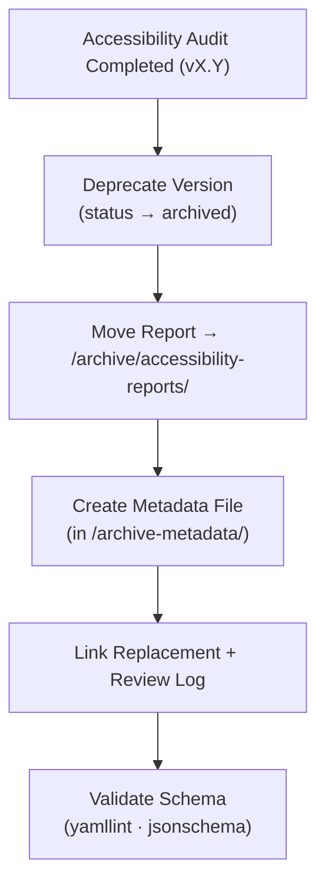

<div align="center">

# 🗃️ Kansas Frontier Matrix — Archived Panel Accessibility Reports  
`docs/design/mockups/figma/components/panels/archive/accessibility-reports/README.md`

**Mission:** Preserve and document **past accessibility audits** for  
drawer, modal, and detail panels in the **Kansas Frontier Matrix (KFM)** design system —  
capturing the history of improvements, regressions, and lessons learned under  
the **Master Coder Protocol (MCP)**.

[](../../../../../../../)
[](../../../../../../../)
[](../../../../../../../../)
[](../../../../../../../../../LICENSE)

</div>

---

## 🎯 Purpose

The `/archive/accessibility-reports/` directory contains **archived accessibility audit reports**
for panel components that have since been replaced by newer, compliant versions.
Each archived report maintains:

- 🕰 **Historical context** — documenting issues, testing, and resolution.  
- ♿ **Accessibility lineage** — linking failed WCAG 2.1 criteria to the fix.  
- 🧩 **MCP provenance** — metadata cross-referenced with review logs and design exports.  
- 🔗 **Continuity** — bridging deprecated and current versions.

---

## 🧭 Directory Structure

```text
docs/design/mockups/figma/components/panels/archive/accessibility-reports/
├── README.md                                    # Index (this file)
├── panel_drawer_v1.2_team_audit.md              # Drawer audit (archived)
├── panel_modal_v1.9_team_audit.md               # Modal audit (archived)
├── panel_detail_v1.4_team_audit.md              # Detail panel audit (archived)
└── archive-metadata/                            # YAML descriptors for archived audits
````

---

## 🧩 YAML Metadata Schema (for archive-metadata)

```yaml
id: panel_modal_v1.9_team_audit
title: Modal Panel Accessibility Audit (v1.9)
archived_on: 2025-10-06
archived_by: accessibility.team
status: archived
replaced_by: ../../../../accessibility-reports/panel_modal_v2.0_team_audit.md
source_figma: https://www.figma.com/file/KFM_PANEL_DOCS/Component-Library?node-id=270%3A550
review_log: ../../../../../../../../../reviews/2025-09-25_panel_modal_v1.9.md
linked_export: ../../../exports/archive/panel_modal_v1.9.png
wcag_criteria:
  - 2.4.7 Focus Visible
  - 2.3.3 Animation from Interactions
issues_summary:
  - Missing visible focus ring on input fields.
  - Motion not disabled under prefers-reduced-motion.
resolution_summary: >
  Both issues corrected in v2.0 with updated focus token and motion toggle.
license: CC-BY-4.0
notes: >
  Retained as proof of accessibility evolution under MCP governance.
```

---

## 🧮 Archival Workflow



<!-- END OF MERMAID -->

**Workflow Summary**

1. When a new version supersedes an older panel audit, mark the old version as *archived*.
2. Move its audit file here under `/archive/accessibility-reports/`.
3. Create a YAML descriptor in `/archive-metadata/` linking replacement, review, and Figma sources.
4. Validate schema and links via CI.
5. Retain permanently under MCP retention policy.

---

## ♿ Regression Comparison Example

| WCAG Criterion           | Deprecated Version | Replacement Version | Status      |
| :----------------------- | :----------------- | :------------------ | :---------- |
| 2.4.7 Focus Visible      | Missing outline    | Accent ring added   | ✅ Fixed     |
| 2.3.3 Reduced Motion     | Ignored            | Honors preference   | ✅ Fixed     |
| 4.1.2 ARIA Role Accuracy | Partial            | Full                | ✅ Fixed     |
| 1.4.3 Contrast           | 4.3 : 1            | 4.9 : 1             | 🟢 Improved |

---

## 🧩 Example Archived Audit — Detail Panel (v1.4)

**File:** `panel_detail_v1.4_team_audit.md`
**Replaced By:** `panel_detail_v1.5_team_audit.md`
**Archived On:** 2025-10-06

> The v1.4 Detail Panel audit revealed keyboard-focus leakage and low-contrast body text.
> These issues were corrected in v1.5, achieving full WCAG 2.1 AA compliance.
> This file remains as evidence of iterative accessibility refinement.

---

## 🧾 CI Validation Rules

| Validation                | Tool                     | Description                             |
| :------------------------ | :----------------------- | :-------------------------------------- |
| **YAML Schema Check**     | `yamllint`, `jsonschema` | Ensures structural integrity.           |
| **WCAG Pattern Check**    | Regex (`^\d\.\d+\.\d+$`) | Confirms valid checkpoint IDs.          |
| **Cross-Link Validation** | `validate_links.py`      | Verifies internal references.           |
| **License Check**         | Pre-commit hook          | Must equal `CC-BY-4.0`.                 |
| **Replacement Exists**    | CI Workflow              | Ensures `replaced_by` audit is present. |

---

## 🧠 Governance & Retention Policy

| Action                     | Frequency   | Responsible          | Output                |
| :------------------------- | :---------- | :------------------- | :-------------------- |
| Archive Validation         | Continuous  | CI Automation        | Build validation logs |
| Quarterly Audit            | 4× per year | `design.board`       | YAML integrity report |
| Accessibility Trend Review | Annual      | `accessibility.team` | WCAG progress summary |
| Retention Policy           | Permanent   | Repo Maintainers     | Immutable MCP record  |

---

## 🧩 Related Documentation

* [`../README.md`](../README.md) — Active panel accessibility reports
* [`../../metadata/README.md`](../../metadata/README.md) — Metadata schema for panels
* [`../../metadata/archive/README.md`](../../metadata/archive/README.md) — Archived panel metadata rules
* [`../../../../../../../../ui-guidelines.md`](../../../../../../../../ui-guidelines.md) — Accessibility & keyboard rules
* [`../../../../../../../../style-guide.md`](../../../../../../../../style-guide.md) — Visual token standards
* [`../../../../../../../../reviews/`](../../../../../../../../reviews/) — MCP review logs

---

<div align="center">

### ♿ “Accessibility history is progress documented —

archived audits are proof of care made visible.”
**— Kansas Frontier Matrix Accessibility & Design Council**

</div>
