<div align="center">

# 🧾 Kansas Frontier Matrix — Archived Panel Accessibility Report Metadata  
`docs/design/mockups/figma/components/panels/archive/accessibility-reports/archive-metadata/README.md`

**Mission:** Define the **schema, validation rules, and governance**  
for metadata describing archived accessibility reports (drawers, modals, detail panels)  
in the **Kansas Frontier Matrix (KFM)** design system — ensuring every WCAG audit  
remains verifiable and documented under **Master Coder Protocol (MCP)** provenance.

[](../../../../../../../../../)
[](../../../../../../../../../)
[](../../../../../../../../../../)
[](../../../../../../../../../../../LICENSE)

</div>

---

## 🎯 Purpose

The `/archive-metadata/` directory contains **YAML metadata files** describing  
archived accessibility audits for panels that have been replaced by newer versions.  

Each file acts as a **permanent index record** detailing:
- Original audit findings and issues.  
- WCAG 2.1 criteria tested.  
- Date and reason for deprecation.  
- References to the replacement audit, review log, and design assets.  

These metadata descriptors ensure **reproducibility** and **audit lineage continuity** within the KFM documentation system.

---

## 🧭 Directory Structure

```text
docs/design/mockups/figma/components/panels/archive/accessibility-reports/archive-metadata/
├── README.md                                   # Index (this file)
├── panel_drawer_v1.2_audit.yml                 # Archived Drawer audit metadata
├── panel_modal_v1.9_audit.yml                  # Archived Modal audit metadata
└── panel_detail_v1.4_audit.yml                 # Archived Detail Panel audit metadata
````

---

## 🧩 YAML Metadata Schema

Each YAML metadata file must follow the structure below:

```yaml
id: panel_modal_v1.9_audit
title: Modal Panel Accessibility Audit (v1.9)
archived_on: 2025-10-06
archived_by: accessibility.team
status: archived
replaced_by: ../../../../accessibility-reports/panel_modal_v2.0_team_audit.md
source_figma: https://www.figma.com/file/KFM_PANEL_DOCS/Component-Library?node-id=270%3A550
review_log: ../../../../../../../../reviews/2025-09-25_panel_modal_v1.9.md
linked_audit: ../panel_modal_v1.9_team_audit.md
linked_export: ../../../exports/archive/panel_modal_v1.9.png
wcag_criteria:
  - 2.4.7 Focus Visible
  - 2.3.3 Animation from Interactions
  - 4.1.2 Name, Role, Value
issues_summary:
  - Focus indicators missing on text inputs and buttons.
  - Reduced-motion preference not applied to transitions.
resolution_summary: >
  Corrected in v2.0 by adding accent focus outlines and respecting user motion settings.
license: CC-BY-4.0
notes: >
  Retained as an immutable record of accessibility regression and correction.
```

---

## 🧮 Metadata Workflow

```mermaid
flowchart TD
    A["Audit Deprecation (vX.Y)"] --> B["Move Markdown Audit → /archive/"]
    B --> C["Create Metadata Descriptor\n(in /archive-metadata/)"]
    C --> D["Annotate Provenance + WCAG Data"]
    D --> E["Link to Replacement Audit + Review Log"]
    E --> F["Validate Schema + Cross-links via CI"]
```



<!-- END OF MERMAID -->

### Workflow Summary

1. When a panel audit is deprecated, create a YAML descriptor file in `/archive-metadata/`.
2. Include audit provenance (author, date, version, source).
3. Link to review logs, audit markdown, and replacement audit.
4. Validate YAML schema with CI tools (`yamllint`, `jsonschema`, `validate_links.py`).
5. Maintain as a **permanent, immutable archive record** under MCP standards.

---

## ♿ Accessibility Regression Summary (Example)

| WCAG Ref                          | v1.9 Result | v2.0 Result | Status    |
| :-------------------------------- | :---------- | :---------- | :-------- |
| 2.4.7 Focus Visible               | Fail        | Pass        | ✅ Fixed   |
| 2.3.3 Animation from Interactions | Partial     | Full        | ✅ Fixed   |
| 4.1.2 ARIA Roles                  | Partial     | Full        | ✅ Fixed   |
| 1.4.3 Contrast                    | Pass        | Pass        | 🟢 Stable |

---

## 🧩 Example Metadata File — Drawer Panel v1.2 Audit

```yaml
id: panel_drawer_v1.2_audit
title: Drawer Panel Accessibility Audit (v1.2)
archived_on: 2025-10-06
archived_by: design.board
status: archived
replaced_by: ../../../../accessibility-reports/panel_drawer_v1.3_team_audit.md
source_figma: https://www.figma.com/file/KFM_PANEL_DOCS/Component-Library?node-id=305%3A480
review_log: ../../../../../../../../reviews/2025-09-20_panel_drawer_v1.2.md
linked_audit: ../panel_drawer_v1.2_team_audit.md
linked_export: ../../../exports/archive/panel_drawer_v1.2.png
wcag_criteria:
  - 1.4.3 Contrast (Minimum)
  - 2.1.1 Keyboard Navigation
  - 2.4.7 Focus Visible
issues_summary:
  - Keyboard focus leaked outside drawer boundary.
  - Low text contrast (3.8 : 1).
resolution_summary: >
  Updated in v1.3 to include focus-trap handling and enhanced contrast via color token revision.
license: CC-BY-4.0
notes: >
  This descriptor provides audit context and compliance history between versions 1.2 and 1.3.
```

---

## 🧾 CI Validation Rules

| Check                    | Tool                      | Description                                          |
| :----------------------- | :------------------------ | :--------------------------------------------------- |
| **Schema Validation**    | `yamllint` + `jsonschema` | Confirms correct YAML structure and required fields. |
| **WCAG ID Validation**   | Regex (`^\d\.\d+\.\d+$`)  | Ensures all WCAG references are valid.               |
| **Cross-Link Integrity** | `validate_links.py`       | Verifies all linked files and paths exist.           |
| **License Check**        | Pre-commit hook           | Must equal `CC-BY-4.0`.                              |
| **Replacement Exists**   | CI                        | Checks `replaced_by` audit file is valid.            |

---

## 🧠 Governance & Retention Policy

| Task                              | Frequency  | Responsible          | Deliverable                 |
| :-------------------------------- | :--------- | :------------------- | :-------------------------- |
| Metadata Schema Audit             | Quarterly  | `design.board`       | Validation summary          |
| Accessibility Regression Analysis | Annual     | `accessibility.team` | WCAG improvement report     |
| CI Validation                     | Continuous | CI Automation        | Pass/fail logs              |
| Archive Retention                 | Permanent  | Maintainers          | Immutable provenance record |

---

## 🧩 Related Documentation

* [`../README.md`](../README.md) — Archived audit index
* [`../../README.md`](../../README.md) — Parent accessibility report archive
* [`../../../metadata/archive/README.md`](../../../metadata/archive/README.md) — Archived panel metadata schema
* [`../../../../../../../../ui-guidelines.md`](../../../../../../../../ui-guidelines.md) — Accessibility rules & principles
* [`../../../../../../../../style-guide.md`](../../../../../../../../style-guide.md) — Token, color, and contrast standards
* [`../../../../../../../../reviews/`](../../../../../../../../reviews/) — MCP review logs and audit approvals

---

<div align="center">

### ♿ “Accessibility history is proof of design empathy —

archived metadata ensures no lesson is forgotten.”
**— Kansas Frontier Matrix Accessibility & Design Governance Council**

</div>
