<div align="center">

# 🧾 Kansas Frontier Matrix — Deep Archive: Panel Component Metadata  
`docs/design/mockups/figma/components/panels/archive/archive-metadata/README.md`

**Mission:** Define how **deep-archive metadata descriptors** are created and maintained  
for all deprecated panel components in the **Kansas Frontier Matrix (KFM)** —  
ensuring that each iteration’s accessibility, provenance, and design evolution  
are permanently traceable under the **Master Coder Protocol (MCP)**.

[](../../../../../../../)
[](../../../../../../../)
[](../../../../../../../../)
[](../../../../../../../../../LICENSE)

</div>

---

## 🎯 Purpose

The `/archive-metadata/` directory acts as the **final provenance layer** for panel components  
that have been archived or deprecated. These YAML descriptors record each component’s lifecycle —  
capturing accessibility audits, WCAG outcomes, version relationships, and Figma sources —  
to guarantee MCP-level documentation transparency and reproducibility.

Each record is **immutable** and maintained for:
- 🕰 Historical version traceability  
- ♿ Accessibility compliance verification  
- 🧩 Provenance linking across audits, metadata, and design exports  
- 🔗 Long-term MCP validation and governance  

---

## 🧭 Directory Structure

```text
docs/design/mockups/figma/components/panels/archive/archive-metadata/
├── README.md                                  # Index (this file)
├── panel_drawer_v1.2.yml                      # Deep archive descriptor (Drawer)
├── panel_modal_v1.9.yml                       # Deep archive descriptor (Modal)
└── panel_detail_v1.4.yml                      # Deep archive descriptor (Detail)
````

---

## 🧩 YAML Descriptor Schema

Each descriptor file must conform to this schema for validation and provenance consistency:

```yaml
id: panel_modal_v1.9
title: Modal Panel (v1.9)
archived_on: 2025-10-06
archived_by: design.board
status: deprecated
replaced_by: ../../../../metadata/panel_modal_v2.0.yml
figma_source: https://www.figma.com/file/KFM_PANEL_DOCS/Component-Library?node-id=270%3A550
reason: >
  Version 1.9 deprecated due to missing focus visibility and lack of reduced-motion support.
  Issues remediated in v2.0 achieving WCAG 2.1 AA compliance.
accessibility_issues:
  - Focus ring missing on input fields and buttons.
  - Transition animations not disabled under `prefers-reduced-motion`.
wcag_criteria:
  - 2.4.7 Focus Visible
  - 2.3.3 Animation from Interactions
  - 4.1.2 Name, Role, Value
linked_review: ../../../../../../../../reviews/2025-09-25_panel_modal_v1.9.md
linked_audit: ../../accessibility-reports/archive/panel_modal_v1.9_team_audit.md
linked_export: ../../../../exports/archive/panel_modal_v1.9.png
license: CC-BY-4.0
notes: >
  Archived metadata record preserving accessibility and design history for Modal Panel v1.9.
  Maintained for compliance verification and MCP provenance continuity.
```

---

## 🧮 Archival Workflow

```mermaid
flowchart TD
    A["Panel Deprecated (vX.Y)"] --> B["Move Metadata → /archive/"]
    B --> C["Create Descriptor → /archive-metadata/"]
    C --> D["Annotate WCAG Results + Replacement Path"]
    D --> E["Cross-Link Audit + Review Log + Exports"]
    E --> F["Validate Schema via CI\n(yamllint · jsonschema · validate_links)"]
```



<!-- END OF MERMAID -->

**Workflow Summary**

1. When a new version supersedes a panel, move its YAML to `/archive/metadata/`.
2. Create a corresponding deep-archive descriptor in `/archive-metadata/`.
3. Include `accessibility_issues`, `wcag_criteria`, and provenance links.
4. Validate all fields and references through CI automation.
5. Retain permanently under MCP accessibility governance.

---

## ♿ Accessibility Regression Reference Example

| WCAG Ref                 | v1.9 Result | v2.0 Result | Status    |
| :----------------------- | :---------- | :---------- | :-------- |
| 2.4.7 Focus Visible      | Fail        | Pass        | ✅ Fixed   |
| 2.3.3 Reduced Motion     | Partial     | Pass        | ✅ Fixed   |
| 4.1.2 ARIA Role Accuracy | Partial     | Full        | ✅ Fixed   |
| 1.4.3 Contrast           | Pass        | Pass        | 🟢 Stable |

---

## 🧩 Example Descriptor — Drawer Panel (v1.2)

```yaml
id: panel_drawer_v1.2
title: Drawer Panel (v1.2)
archived_on: 2025-10-06
archived_by: accessibility.team
status: deprecated
replaced_by: ../../../../metadata/panel_drawer_v1.3.yml
figma_source: https://www.figma.com/file/KFM_PANEL_DOCS/Component-Library?node-id=305%3A480
reason: >
  Deprecated after accessibility audit revealed low contrast text and keyboard navigation failures.
  Version 1.3 introduced focus trap improvements and increased color contrast.
accessibility_issues:
  - Keyboard focus escaped panel bounds.
  - Text contrast below 4.5 : 1 threshold.
wcag_criteria:
  - 1.4.3 Contrast (Minimum)
  - 2.1.1 Keyboard Navigation
linked_review: ../../../../../../../../reviews/2025-09-20_panel_drawer_v1.2.md
linked_audit: ../../accessibility-reports/archive/panel_drawer_v1.2_team_audit.md
linked_export: ../../../../exports/archive/panel_drawer_v1.2.png
license: CC-BY-4.0
notes: >
  Preserved for accessibility regression history. Demonstrates MCP traceability between v1.2 and v1.3.
```

---

## 🧾 CI Validation Rules

| Validation                | Tool                     | Description                                         |
| :------------------------ | :----------------------- | :-------------------------------------------------- |
| **YAML Schema Integrity** | `yamllint`, `jsonschema` | Ensures field structure and completeness.           |
| **WCAG Reference Format** | Regex (`^\d\.\d+\.\d+$`) | Validates proper WCAG ID formatting.                |
| **Cross-Link Integrity**  | `validate_links.py`      | Verifies linked audits, reviews, and exports exist. |
| **License Compliance**    | Pre-commit hook          | Must equal `CC-BY-4.0`.                             |
| **Replacement Exists**    | CI                       | Checks `replaced_by` file path is valid.            |

---

## 🧠 Governance & Retention Policy

| Action                            | Frequency  | Responsible          | Deliverable                  |
| :-------------------------------- | :--------- | :------------------- | :--------------------------- |
| Schema Audit                      | Quarterly  | `design.board`       | YAML compliance report       |
| Accessibility Regression Analysis | Annual     | `accessibility.team` | WCAG progress summary        |
| Link Validation                   | Continuous | CI Bot               | Pass/fail validation log     |
| Retention                         | Permanent  | Repo Maintainers     | Immutable MCP archive record |

---

## 🧩 Related Documentation

* [`../README.md`](../README.md) — Panel archive index
* [`../../README.md`](../../README.md) — Archive overview
* [`../../metadata/archive/README.md`](../../metadata/archive/README.md) — Archived panel metadata schema
* [`../../accessibility-reports/archive/README.md`](../../accessibility-reports/archive/README.md) — Accessibility audit archive
* [`../../../../../../../../ui-guidelines.md`](../../../../../../../../ui-guidelines.md) — Accessibility design standards
* [`../../../../../../../../style-guide.md`](../../../../../../../../style-guide.md) — Design tokens & color accessibility
* [`../../../../../../../../reviews/`](../../../../../../../../reviews/) — MCP audit and review records

---

<div align="center">

### 🧾 “Documentation preserves memory —

archival metadata turns design iteration into evidence of progress.”
**— Kansas Frontier Matrix Accessibility & Design Governance Team**

</div>
