<div align="center">

# 🧾 Kansas Frontier Matrix — Archived Panel Metadata  
`docs/design/mockups/figma/components/panels/archive/metadata/README.md`

**Mission:** Define the **metadata schema and archival governance**  
for deprecated panel components — drawers, modals, and detail panels —  
within the **Kansas Frontier Matrix (KFM)** design system.  
All archived entries maintain provenance, accessibility records,  
and compliance with **Master Coder Protocol (MCP)** documentation standards.

[](../../../../../../../)
[](../../../../../../../)
[](../../../../../../../../)
[](../../../../../../../../../LICENSE)

</div>

---

## 🎯 Purpose

The `/archive/metadata/` directory retains **YAML metadata** for all deprecated  
panel versions (e.g., Drawer v1.2, Modal v1.9, Detail v1.4).  
Each file contains accessibility provenance, replacement references,  
and documentation links for traceable MCP-compliant version history.

Metadata ensures:
- 🔍 **Transparency** — Design lineage and decision records remain accessible.  
- ♿ **Accessibility Traceability** — WCAG audit linkage and improvement tracking.  
- 🧩 **Reproducibility** — All metadata follows structured YAML validated by CI.  
- 🗃️ **Historical Integrity** — Archived entries remain immutable under MCP retention.  

---

## 🧭 Directory Structure

```text
docs/design/mockups/figma/components/panels/archive/metadata/
├── README.md                                # Index (this file)
├── panel_drawer_v1.2.yml                    # Deprecated drawer metadata
├── panel_modal_v1.9.yml                     # Archived modal metadata
├── panel_detail_v1.4.yml                    # Archived detail panel metadata
└── archive-metadata/                        # Deep provenance descriptors
````

---

## 🧩 YAML Schema (for Archived Panels)

Each metadata file must follow this schema:

```yaml
id: panel_drawer_v1.2
title: Drawer Panel (v1.2)
version: v1.2
status: deprecated
archived_on: 2025-10-06
archived_by: design.board
replaced_by: ../../metadata/panel_drawer_v1.3.yml
reason: >
  Superseded by v1.3 with improved focus trapping, ESC key handling,
  and enhanced contrast ratios for WCAG 2.1 AA compliance.
source_figma: https://www.figma.com/file/KFM_PANEL_DOCS/Component-Library?node-id=305%3A480
linked_review: ../../../../../../../reviews/2025-09-20_panel_drawer_v1.2.md
linked_export: ../../../../../exports/archive/panel_drawer_v1.2.png
accessibility_issues:
  - Focus escaped container during keyboard navigation.
  - Missing visible focus ring for form fields.
  - Text contrast below 4.5 : 1 threshold.
wcag_criteria:
  - 1.4.3 Contrast (Minimum)
  - 2.1.1 Keyboard Accessibility
  - 2.4.7 Focus Visible
license: CC-BY-4.0
notes: >
  Deprecated following accessibility and usability review.
  Replaced by v1.3 with verified MCP audit compliance.
```

---

## 🧮 Archival Workflow

```mermaid
flowchart TD
    A["New Version Released (vX.Y+1)"] --> B["Deprecate Old Metadata (status → deprecated)"]
    B --> C["Move File → /archive/metadata/"]
    C --> D["Annotate Fields\n(archived_on · reason · replaced_by)"]
    D --> E["Cross-Link Audit & Review Log"]
    E --> F["Validate Schema (yamllint · jsonschema)"]
```



<!-- END OF MERMAID -->

### Workflow Summary

1. Mark outdated panel metadata as `deprecated`.
2. Move file to `/archive/metadata/`.
3. Add archival fields (`archived_on`, `replaced_by`, etc.).
4. Validate with CI and ensure linked files exist.
5. Maintain indefinitely as immutable provenance.

---

## ♿ Accessibility Regression Record Example

| WCAG Ref                     | v1.2 Result | v1.3 Result | Status    |
| :--------------------------- | :---------- | :---------- | :-------- |
| 1.4.3 Contrast (Minimum)     | 3.8 : 1     | 4.8 : 1     | ✅ Fixed   |
| 2.1.1 Keyboard Accessibility | Fail        | Pass        | ✅ Fixed   |
| 2.4.7 Focus Visible          | Partial     | Pass        | ✅ Fixed   |
| 2.3.3 Motion Reduction       | Pass        | Pass        | 🟢 Stable |

---

## 🧩 Example Archived Entry — Modal Panel (v1.9)

```yaml
id: panel_modal_v1.9
title: Modal Panel (v1.9)
version: v1.9
status: deprecated
archived_on: 2025-10-06
archived_by: accessibility.team
replaced_by: ../../metadata/panel_modal_v2.0.yml
reason: >
  Version 1.9 deprecated due to missing focus visibility and noncompliance
  with `prefers-reduced-motion`. Addressed in v2.0.
source_figma: https://www.figma.com/file/KFM_PANEL_DOCS/Component-Library?node-id=270%3A550
linked_review: ../../../../../../../reviews/2025-09-25_panel_modal_v1.9.md
linked_export: ../../../../../exports/archive/panel_modal_v1.9.png
accessibility_issues:
  - Focus outline missing for text input fields.
  - Reduced-motion setting ignored.
wcag_criteria:
  - 2.4.7
  - 2.3.3
license: CC-BY-4.0
notes: >
  Archived following accessibility audit. Replacement v2.0 verified compliant.
```

---

## 🧾 Validation Rules (CI / Pre-Commit)

| Check                    | Tool                      | Description                                |
| :----------------------- | :------------------------ | :----------------------------------------- |
| **YAML Structure**       | `yamllint` + `jsonschema` | Ensures key/value structure and hierarchy. |
| **WCAG Pattern**         | Regex (`^\d\.\d+\.\d+$`)  | Validates WCAG ID formatting.              |
| **Cross-Link Integrity** | `validate_links.py`       | Ensures paths to linked files are valid.   |
| **License Enforcement**  | Pre-commit Hook           | Must equal `CC-BY-4.0`.                    |
| **Replacement Exists**   | CI Validation             | Confirms replacement metadata exists.      |

---

## 🧠 Governance & Retention Policy

| Action               | Frequency    | Responsible          | Deliverable                 |
| :------------------- | :----------- | :------------------- | :-------------------------- |
| Metadata Audit       | Quarterly    | `design.board`       | YAML compliance report      |
| Accessibility Review | Each release | `accessibility.team` | WCAG regression summary     |
| Schema Validation    | Continuous   | CI Bot               | Validation logs             |
| Archive Retention    | Permanent    | Maintainers          | Immutable historical record |

---

## 🧩 Related Documentation

* [`../README.md`](../README.md) — Archive overview
* [`../../metadata/README.md`](../../metadata/README.md) — Active panel metadata schema
* [`../../accessibility-reports/README.md`](../../accessibility-reports/README.md) — Accessibility audits
* [`../../../../../ui-guidelines.md`](../../../../../ui-guidelines.md) — Accessibility design standards
* [`../../../../../style-guide.md`](../../../../../style-guide.md) — Visual token and layout definitions
* [`../../../../../reviews/`](../../../../../reviews/) — MCP design and accessibility review logs

---

<div align="center">

### 🧾 “Archiving isn’t about endings —

it’s how design keeps its memory intact.”
**— Kansas Frontier Matrix Design Governance Council**

</div>
