<div align="center">

# 🧾 Kansas Frontier Matrix — Deep Archive: Panel Metadata Descriptors  
`docs/design/mockups/figma/components/panels/archive/metadata/archive-metadata/README.md`

**Mission:** Maintain **deep-archive metadata descriptors** for all deprecated panel components  
within the **Kansas Frontier Matrix (KFM)** design system — guaranteeing  
long-term accessibility traceability and MCP-grade provenance documentation.

[](../../../../../../../../)
[](../../../../../../../../)
[](../../../../../../../../../)
[](../../../../../../../../../LICENSE)

</div>

---

## 🎯 Purpose

The `/archive-metadata/` directory captures **final provenance descriptors**  
for all archived panel metadata — creating a permanent audit trail of  
design, accessibility, and documentation evolution across KFM versions.  

Each YAML descriptor acts as a **historical record** linking:
- 🗂️ The archived component metadata (drawer, modal, detail).  
- ♿ Its accessibility audit results.  
- 🔗 Replacement version and associated design reviews.  
- 🧩 WCAG 2.1 compliance metrics and fixes.  

These records are immutable and serve as the definitive reference  
for accessibility, provenance, and reproducibility verification.  

---

## 🧭 Directory Structure

```text
docs/design/mockups/figma/components/panels/archive/metadata/archive-metadata/
├── README.md                                 # Index (this file)
├── panel_drawer_v1.2.yml                     # Drawer panel deep archive record
├── panel_modal_v1.9.yml                      # Modal panel deep archive record
└── panel_detail_v1.4.yml                     # Detail panel deep archive record
````

---

## 🧩 YAML Descriptor Schema

Each descriptor file follows this structure:

```yaml
id: panel_modal_v1.9
title: Modal Panel (v1.9)
archived_on: 2025-10-06
archived_by: design.board
status: deprecated
replaced_by: ../../../../metadata/panel_modal_v2.0.yml
figma_source: https://www.figma.com/file/KFM_PANEL_DOCS/Component-Library?node-id=270%3A550
reason: >
  Version 1.9 was deprecated following accessibility audit failures related
  to focus visibility and reduced-motion support. Replaced by v2.0 with full
  WCAG 2.1 AA compliance.
accessibility_issues:
  - Focus outline missing for form fields.
  - Reduced-motion setting ignored by fade transition.
wcag_criteria:
  - 2.4.7 Focus Visible
  - 2.3.3 Animation from Interactions
  - 4.1.2 Name, Role, Value
linked_review: ../../../../../../../../reviews/2025-09-25_panel_modal_v1.9.md
linked_audit: ../../../../accessibility-reports/archive/panel_modal_v1.9_team_audit.md
linked_export: ../../../../../exports/archive/panel_modal_v1.9.png
license: CC-BY-4.0
notes: >
  This descriptor preserves all metadata and accessibility context
  for Modal Panel v1.9, archived under MCP retention policy for
  historical and compliance verification.
```

---

## 🧮 Descriptor Workflow

```mermaid
flowchart TD
    A["Deprecate Metadata (vX.Y)"] --> B["Move YAML → /archive/metadata/"]
    B --> C["Create Descriptor in /archive-metadata/"]
    C --> D["Annotate WCAG Results + Replacement Path"]
    D --> E["Cross-Link Audit, Review, and Export Files"]
    E --> F["Validate Schema via CI\n(yamllint · jsonschema)"]
```



<!-- END OF MERMAID -->

**Workflow Steps**

1. Move the old metadata YAML to `/archive/metadata/`.
2. Create a descriptor entry in `/archive-metadata/` with WCAG and provenance details.
3. Include cross-links to the related audit report and replacement file.
4. Validate schema and links in CI.
5. Preserve file permanently under MCP retention protocols.

---

## ♿ Accessibility Regression Summary (Example)

| WCAG Ref             | v1.9 Result | v2.0 Result | Status    |
| :------------------- | :---------- | :---------- | :-------- |
| 2.4.7 Focus Visible  | Fail        | Pass        | ✅ Fixed   |
| 2.3.3 Reduced Motion | Partial     | Pass        | ✅ Fixed   |
| 4.1.2 ARIA Roles     | Partial     | Full        | ✅ Fixed   |
| 1.4.3 Contrast       | Pass        | Pass        | 🟢 Stable |

---

## 🧩 Example Descriptor — Drawer Panel (v1.2)

```yaml
id: panel_drawer_v1.2
title: Drawer Panel (v1.2)
archived_on: 2025-10-06
archived_by: accessibility.team
status: deprecated
replaced_by: ../../../../metadata/panel_drawer_v1.3.yml
figma_source: https://www.figma.com/file/KFM_PANEL_DOCS/Component-Library?node-id=305%3A480
reason: >
  Deprecated due to keyboard focus escaping container boundaries and low text contrast.
  Fixed in Drawer Panel v1.3 after introducing focus-trap functionality and new color tokens.
accessibility_issues:
  - Keyboard focus escaped drawer on tab cycle.
  - Text contrast 3.8 : 1 (below 4.5 : 1 threshold).
wcag_criteria:
  - 2.1.1 Keyboard Accessibility
  - 1.4.3 Contrast (Minimum)
linked_review: ../../../../../../../../reviews/2025-09-20_panel_drawer_v1.2.md
linked_audit: ../../../../accessibility-reports/archive/panel_drawer_v1.2_team_audit.md
linked_export: ../../../../../exports/archive/panel_drawer_v1.2.png
license: CC-BY-4.0
notes: >
  Maintained as an immutable MCP record illustrating accessibility regression
  tracking between v1.2 and v1.3.
```

---

## 🧾 CI Validation Rules

| Check                        | Tool                      | Description                                    |
| :--------------------------- | :------------------------ | :--------------------------------------------- |
| **Schema Compliance**        | `yamllint` + `jsonschema` | Validates descriptor fields and hierarchy.     |
| **Link Integrity**           | `validate_links.py`       | Ensures all paths exist and resolve correctly. |
| **WCAG Format**              | Regex (`^\d\.\d+\.\d+$`)  | Enforces valid WCAG checkpoint formatting.     |
| **License Field**            | Pre-commit Hook           | Must be `CC-BY-4.0`.                           |
| **Replacement Verification** | CI Workflow               | Confirms referenced version exists.            |

---

## 🧠 Governance & Retention Policy

| Action                         | Frequency  | Responsible          | Output                       |
| :----------------------------- | :--------- | :------------------- | :--------------------------- |
| Descriptor Validation          | Continuous | CI Automation        | Build and validation logs    |
| Accessibility Regression Audit | Annual     | `accessibility.team` | WCAG trend analysis          |
| Metadata Integrity Check       | Quarterly  | `design.board`       | Compliance report            |
| Permanent Retention            | Always     | Maintainers          | Immutable MCP archive record |

---

## 🧩 Related Documentation

* [`../README.md`](../README.md) — Archived panel metadata overview
* [`../../README.md`](../../README.md) — Archive root index
* [`../../../metadata/README.md`](../../../metadata/README.md) — Active panel metadata schema
* [`../../../../accessibility-reports/archive/README.md`](../../../../accessibility-reports/archive/README.md) — Archived accessibility audits
* [`../../../../../../../../ui-guidelines.md`](../../../../../../../../ui-guidelines.md) — Accessibility design framework
* [`../../../../../../../../style-guide.md`](../../../../../../../../style-guide.md) — Token, color, and layout standards
* [`../../../../../../../../reviews/`](../../../../../../../../reviews/) — MCP review logs

---

<div align="center">

### 🧾 “Deep archives preserve more than files —

they safeguard the story of how accessibility grows.”
**— Kansas Frontier Matrix Accessibility & Design Governance Team**

</div>
