<div align="center">

# 🧾 Kansas Frontier Matrix — Panel Component Metadata  
`docs/design/mockups/figma/components/panels/metadata/README.md`

**Mission:** Define the **YAML metadata schema, validation rules, and governance process**  
for all panel components (drawers, modals, and detail panels) within the  
**Kansas Frontier Matrix (KFM)** design system — guaranteeing accessibility,  
version transparency, and MCP reproducibility.

[](../../../../../)
[](../../../../../)
[](../../../../../../)
[](../../../../../../../LICENSE)

</div>

---

## 🎯 Purpose

The `/metadata/` directory provides structured **YAML metadata files** for every panel component  
in the KFM design system.  
Metadata enables seamless integration between **Figma designs**, **accessibility reviews**, and **React code** —  
serving as the connective tissue of design provenance.

Each YAML file captures:
- Component identity, version, and authorship.  
- Accessibility and WCAG compliance details.  
- Implementation mapping (React and Figma).  
- Provenance references (review logs, audit results, licenses).  

---

## 🧭 Directory Structure

```text
docs/design/mockups/figma/components/panels/metadata/
├── README.md                        # Index (this file)
├── panel_drawer_v1.3.yml            # Drawer panel metadata
├── panel_modal_v2.0.yml             # Modal panel metadata
├── panel_detail_v1.5.yml            # Context detail panel metadata
└── archive/                         # Deprecated or superseded panel metadata
````

---

## 🧩 Metadata Schema (YAML)

Each metadata file must conform to this schema:

```yaml
id: panel_modal_v2.0
title: Modal Panel Component (v2.0)
author: design.system.team
date: 2025-10-06
version: v2.0
status: active
type: modal
source_figma: https://www.figma.com/file/KFM_PANEL_DOCS/Component-Library?node-id=210%3A450
description: >
  A centered modal dialog component providing focus-trapped interactions for user confirmation,
  configuration, or data detail display.
accessibility:
  aria_roles: ["dialog", "alertdialog"]
  focus_trap: true
  escape_close: true
  contrast_ratio: 4.8 : 1
  reduced_motion: true
  wcag_criteria:
    - 1.4.3 Contrast (Minimum)
    - 2.4.7 Focus Visible
    - 2.1.1 Keyboard Accessibility
    - 2.3.3 Animation from Interactions
linked_docs:
  - ../../../../../ui-guidelines.md
  - ../../../../../interaction-patterns.md
  - ../../../../../style-guide.md
react_mapping: /web/src/components/panels/ModalPanel.tsx
review_log: ../../../../../reviews/2025-10-06_panel_modal_v2.0.md
license: CC-BY-4.0
```

---

## 🧮 Metadata Workflow

```mermaid
flowchart TD
    A["Design Panel in Figma"] --> B["Export Mockup + Accessibility Test"]
    B --> C["Create YAML Metadata File\n(in /metadata/)"]
    C --> D["Annotate Accessibility · Version · Figma Link"]
    D --> E["Cross-link Review Logs + React Mapping"]
    E --> F["CI Validation\n(yamllint · jsonschema · pre-commit)"]
    F --> G["Archive Previous Metadata (if superseded)"]
```



<!-- END OF MERMAID -->

---

## ♿ Accessibility Metadata Requirements

| Field            | WCAG Ref | Requirement                                            | Validation     |
| :--------------- | :------- | :----------------------------------------------------- | :------------- |
| `aria_roles`     | 4.1.2    | Must match element purpose (`dialog`, `region`, etc.). | Manual Review  |
| `focus_trap`     | 2.1.1    | Required for modals and drawers.                       | Audit Check    |
| `escape_close`   | 2.1.2    | All modals must close on `ESC`.                        | Prototype Test |
| `contrast_ratio` | 1.4.3    | ≥ 4.5 : 1 text/background.                             | Able / Stark   |
| `reduced_motion` | 2.3.3    | Must support `prefers-reduced-motion`.                 | Figma Preview  |

---

## 🧾 Example Metadata File — Drawer Panel

```yaml
id: panel_drawer_v1.3
title: Drawer Panel Component (v1.3)
author: design.system.team
date: 2025-09-30
version: v1.3
status: active
type: drawer
source_figma: https://www.figma.com/file/KFM_PANEL_DOCS/Component-Library?node-id=315%3A500
description: >
  Slide-in drawer used for AI assistant and contextual navigation.
  Non-modal interaction with ESC-to-close and reduced motion support.
accessibility:
  aria_roles: ["complementary"]
  focus_trap: true
  escape_close: true
  contrast_ratio: 4.7 : 1
  reduced_motion: true
  wcag_criteria:
    - 1.4.3
    - 2.4.7
    - 2.1.1
linked_docs:
  - ../../../../../ui-guidelines.md
  - ../../../../../interaction-patterns.md
react_mapping: /web/src/components/panels/DrawerPanel.tsx
review_log: ../../../../../reviews/2025-09-30_panel_drawer_v1.3.md
license: CC-BY-4.0
```

---

## 🧩 CI Validation Rules

| Validation              | Tool                     | Description                      |
| :---------------------- | :----------------------- | :------------------------------- |
| **Schema Integrity**    | `yamllint`, `jsonschema` | Verifies key fields and nesting. |
| **WCAG Pattern**        | Regex (`^\d\.\d+\.\d+$`) | Ensures valid checkpoint IDs.    |
| **Link Resolution**     | `validate_links.py`      | Confirms all references exist.   |
| **License Enforcement** | Pre-commit               | Must equal `CC-BY-4.0`.          |
| **Version Format**      | Regex (`^v\d+\.\d+$`)    | Confirms semantic versioning.    |

---

## 🧠 Governance & Retention Policy

| Action                     | Frequency    | Responsible          | Output                    |
| :------------------------- | :----------- | :------------------- | :------------------------ |
| Metadata Audit             | Quarterly    | `design.board`       | YAML compliance report    |
| Accessibility Verification | Each Release | `accessibility.team` | WCAG validation summary   |
| Schema Validation          | Continuous   | CI Automation        | Build report              |
| Permanent Retention        | Always       | Maintainers          | Immutable metadata record |

---

## 🧩 Related Documentation

* [`../README.md`](../README.md) — Panel component overview
* [`../../README.md`](../../README.md) — Component library root
* [`../../../../ui-guidelines.md`](../../../../ui-guidelines.md) — Accessibility behavior guide
* [`../../../../style-guide.md`](../../../../style-guide.md) — Design tokens & layout
* [`../../../../interaction-patterns.md`](../../../../interaction-patterns.md) — Interactive flows
* [`../../../../reviews/`](../../../../reviews/) — MCP design review logs

---

<div align="center">

### 🧾 “Metadata transforms design into evidence —

each panel recorded here is a reproducible artifact of accessibility.”
**— Kansas Frontier Matrix Design System Team**

</div>
