<div align="center">

# 🗃️ Kansas Frontier Matrix — Archived Panel Metadata  
`docs/design/mockups/figma/components/panels/metadata/archive/README.md`

**Mission:** Preserve the full metadata lineage of all **deprecated or replaced panel components**  
(drawers, modals, and detail panels) in the **Kansas Frontier Matrix (KFM)** design system —  
ensuring accessibility provenance, version traceability, and documentation reproducibility under  
the **Master Coder Protocol (MCP)**.

[](../../../../../../)
[](../../../../../../)
[](../../../../../../../)
[](../../../../../../../../LICENSE)

</div>

---

## 🎯 Purpose

The `/archive/` directory under `/metadata/` retains **deprecated YAML metadata files**  
for panel components that have been replaced or updated in subsequent design versions.  

Archived metadata is **never deleted** — it serves as a transparent historical record  
of how accessibility, usability, and visual standards have evolved in the KFM system.

Each archived file:
- Records the version, replacement, and deprecation reason.  
- Links to relevant Figma sources and accessibility audit results.  
- Maintains MCP-compliant provenance fields for reproducibility.  

---

## 🧭 Directory Structure

```text
docs/design/mockups/figma/components/panels/metadata/archive/
├── README.md                             # Index (this file)
├── panel_drawer_v1.2.yml                 # Deprecated drawer panel metadata
├── panel_modal_v1.9.yml                  # Deprecated modal component metadata
├── panel_detail_v1.4.yml                 # Replaced detail panel
└── archive-metadata/                     # YAML descriptors for archived files
````

---

## 🧩 Metadata Schema for Archived Panels

Each YAML file follows the active schema with additional archival fields:

```yaml
id: panel_drawer_v1.2
title: Drawer Panel (v1.2)
version: v1.2
status: deprecated
archived_on: 2025-10-06
archived_by: design.board
replaced_by: ../panel_drawer_v1.3.yml
reason: >
  Deprecated after accessibility improvements to focus handling and color contrast.
  Replaced by v1.3 with updated transition timing and ARIA labels.
source_figma: https://www.figma.com/file/KFM_PANEL_DOCS/Component-Library?node-id=305%3A480
linked_review: ../../../../../../../reviews/2025-09-20_panel_drawer_v1.2.md
linked_export: ../../../../../exports/archive/panel_drawer_v1.2.png
accessibility_issues:
  - Focus trap failure in nested elements.
  - Background contrast 3.8 : 1 (below standard).
wcag_criteria:
  - 2.1.1 Keyboard Accessibility
  - 1.4.3 Contrast (Minimum)
license: CC-BY-4.0
notes: >
  Retained for regression comparison and documentation transparency.
```

---

## 🧮 Archival Workflow

```mermaid
flowchart TD
    A["New Panel Version Released (vX.Y+1)"] --> B["Deprecate Old Metadata (status → deprecated)"]
    B --> C["Move YAML to /archive/"]
    C --> D["Add Fields: archived_on · replaced_by · reason"]
    D --> E["Cross-Link Figma Source + Review Log"]
    E --> F["Validate Schema & Links (CI)"]
```



<!-- END OF MERMAID -->

**Workflow Summary**

1. 🔁 Move outdated YAML to `/archive/`.
2. 🧾 Add deprecation metadata fields (`archived_on`, `replaced_by`, `reason`).
3. 🔗 Update links to reviews and replacement versions.
4. 🧠 Run CI validation for completeness and structural integrity.

---

## ♿ Accessibility Regression Example

| WCAG Criterion            | Deprecated Version | Replacement Version | Status      |
| :------------------------ | :----------------- | :------------------ | :---------- |
| 1.4.3 Contrast (Minimum)  | 3.8 : 1            | 4.8 : 1             | ✅ Fixed     |
| 2.1.1 Keyboard Navigation | Partial            | Full                | ✅ Fixed     |
| 2.3.3 Motion Reduction    | Missing            | Supported           | 🟢 Improved |
| 2.4.7 Focus Visible       | Inconsistent       | Stable              | 🟢 Improved |

---

## 🧩 Example Archive Metadata — Modal Panel (v1.9)

**File:** `panel_modal_v1.9.yml`

```yaml
id: panel_modal_v1.9
title: Modal Panel (v1.9)
version: v1.9
status: deprecated
archived_on: 2025-10-06
archived_by: accessibility.team
replaced_by: ../panel_modal_v2.0.yml
reason: >
  Replaced by v2.0 after focus visibility and motion compliance improvements.
source_figma: https://www.figma.com/file/KFM_PANEL_DOCS/Component-Library?node-id=270%3A550
linked_review: ../../../../../../../reviews/2025-09-25_panel_modal_v1.9.md
accessibility_issues:
  - No visible focus ring on input fields.
  - Missing ARIA role for close icon.
wcag_criteria:
  - 2.4.7
  - 4.1.2
license: CC-BY-4.0
notes: >
  Archived following the introduction of ARIA-compliant Modal Panel v2.0.
  This file remains part of the MCP historical accessibility record.
```

---

## 🧾 CI Validation Rules

| Validation                  | Tool                      | Description                        |
| :-------------------------- | :------------------------ | :--------------------------------- |
| **YAML Schema Validation**  | `yamllint` + `jsonschema` | Ensures metadata compliance.       |
| **WCAG Pattern Check**      | Regex (`^\d\.\d+\.\d+$`)  | Validates WCAG IDs.                |
| **Link Validation**         | `validate_links.py`       | Ensures cross-references resolve.  |
| **License Field Check**     | Pre-commit hook           | Must be `CC-BY-4.0`.               |
| **Replacement File Exists** | CI                        | Confirms valid `replaced_by` path. |

---

## 🧠 Governance & Retention Policy

| Action                          | Frequency  | Responsible          | Output                       |
| :------------------------------ | :--------- | :------------------- | :--------------------------- |
| Metadata Integrity Audit        | Quarterly  | `design.board`       | YAML compliance report       |
| Accessibility Regression Review | Annual     | `accessibility.team` | WCAG trend analysis          |
| Schema Validation               | Continuous | CI Bot               | Validation log               |
| Retention                       | Permanent  | Repo Maintainers     | Immutable historical archive |

---

## 🧩 Related Documentation

* [`../README.md`](../README.md) — Active panel metadata schema
* [`../../README.md`](../../README.md) — Panel component overview
* [`../../../../../../ui-guidelines.md`](../../../../../../ui-guidelines.md) — Accessibility & UI logic
* [`../../../../../../style-guide.md`](../../../../../../style-guide.md) — Design tokens & colors
* [`../../../../../../interaction-patterns.md`](../../../../../../interaction-patterns.md) — Interactive flows
* [`../../../../../../reviews/`](../../../../../../reviews/) — MCP design & accessibility reviews

---

<div align="center">

### 🗃️ “Design maturity is measured in what we preserve —

archived metadata is our record of progress.”
**— Kansas Frontier Matrix Design System Team**

</div>
