<div align="center">

# 🧾 Kansas Frontier Matrix — Deep Archive: Panel Metadata Descriptors  
`docs/design/mockups/figma/components/panels/metadata/archive/archive-metadata/README.md`

**Mission:** Manage **YAML metadata descriptors** for archived panel component versions  
in the **Kansas Frontier Matrix (KFM)** design system — ensuring full historical provenance,  
WCAG traceability, and reproducible accessibility documentation under the  
**Master Coder Protocol (MCP)**.

[](../../../../../../../)
[](../../../../../../../)
[](../../../../../../../../)
[](../../../../../../../../../LICENSE)

</div>

---

## 🎯 Purpose

This `/archive-metadata/` directory provides **final metadata descriptors** for all  
archived panel components — documenting design context, accessibility outcomes,  
and version lineage for permanent reproducibility.  

Each YAML entry includes:
- Component version and archive timestamp.  
- Reason for deprecation and replacement reference.  
- WCAG 2.1 criteria results and remediation notes.  
- Provenance links to Figma, audits, and review logs.  

---

## 🧭 Directory Structure

```text
docs/design/mockups/figma/components/panels/metadata/archive/archive-metadata/
├── README.md                                   # Index (this file)
├── panel_modal_v1.9.yml                        # Archived modal descriptor
├── panel_drawer_v1.2.yml                       # Deprecated drawer descriptor
└── panel_detail_v1.4.yml                       # Replaced detail panel descriptor
````

---

## 🧩 YAML Descriptor Schema

```yaml
id: panel_modal_v1.9
title: Modal Panel (v1.9)
archived_on: 2025-10-06
archived_by: design.board
status: deprecated
replaced_by: ../../../../metadata/panel_modal_v2.0.yml
figma_source: https://www.figma.com/file/KFM_PANEL_DOCS/Component-Library?node-id=270%3A550
reason: >
  Deprecated following focus-visibility and motion-preference updates.
  Replaced by v2.0, which meets WCAG 2.1 AA requirements.
accessibility_issues:
  - Focus outline missing for text inputs.
  - No support for `prefers-reduced-motion`.
wcag_criteria:
  - 2.4.7 Focus Visible
  - 2.3.3 Animation from Interactions
linked_review: ../../../../../../../../reviews/2025-09-25_panel_modal_v1.9.md
linked_export: ../../../../../exports/archive/panel_modal_v1.9.png
license: CC-BY-4.0
notes: >
  This descriptor records the complete audit context for Modal Panel v1.9.
  It links all related provenance artifacts and WCAG corrections in v2.0.
```

---

## 🧮 Descriptor Workflow

```mermaid
flowchart TD
    A["Deprecate Panel (vX.Y)"] --> B["Move Metadata → /archive/"]
    B --> C["Create Descriptor in /archive-metadata/"]
    C --> D["Add Accessibility & Provenance Fields"]
    D --> E["Validate Schema\n(yamllint · jsonschema)"]
    E --> F["Cross-Link Replacement + Review Logs"]
```



<!-- END OF MERMAID -->

**Workflow Summary**

1. Deprecate old version metadata.
2. Add descriptor entry with replacement and reasoning.
3. Include WCAG results and fix tracking.
4. Validate through CI and MCP governance review.

---

## ♿ Accessibility Regression Table

| WCAG Criterion            | v1.9 Result    | v2.0 Result    | Status    |
| :------------------------ | :------------- | :------------- | :-------- |
| 1.4.3 Contrast (Minimum)  | Pass (4.6 : 1) | Pass (4.8 : 1) | 🟢 Stable |
| 2.4.7 Focus Visible       | Fail           | Pass           | ✅ Fixed   |
| 2.3.3 Reduced Motion      | Missing        | Supported      | ✅ Added   |
| 2.1.1 Keyboard Navigation | Partial        | Full           | ✅ Fixed   |

---

## 🧩 Example Descriptor — Drawer Panel (v1.2)

```yaml
id: panel_drawer_v1.2
title: Drawer Panel (v1.2)
archived_on: 2025-09-30
archived_by: accessibility.team
status: deprecated
replaced_by: ../../../../metadata/panel_drawer_v1.3.yml
figma_source: https://www.figma.com/file/KFM_PANEL_DOCS/Component-Library?node-id=305%3A480
reason: >
  Replaced due to inconsistent focus trap behavior and missing ARIA
  role annotations. Addressed in v1.3 with new event handling.
accessibility_issues:
  - Focus escaped drawer container on Tab.
  - Drawer close icon lacked `aria-label`.
wcag_criteria:
  - 2.1.1
  - 4.1.2
linked_review: ../../../../../../../../reviews/2025-09-30_panel_drawer_v1.2.md
linked_export: ../../../../../exports/archive/panel_drawer_v1.2.png
license: CC-BY-4.0
notes: >
  Maintained as evidence of early accessibility remediation.
```

---

## 🧾 Validation & CI Checks

| Check                    | Tool                     | Purpose                             |
| :----------------------- | :----------------------- | :---------------------------------- |
| **YAML Syntax**          | `yamllint`               | Prevent malformed descriptors.      |
| **Schema Compliance**    | `jsonschema`             | Ensure all mandatory fields exist.  |
| **WCAG Format**          | Regex (`^\d\.\d+\.\d+$`) | Validate proper WCAG ID format.     |
| **Cross-Link Integrity** | `validate_links.py`      | Confirm all referenced paths exist. |
| **License Field**        | Pre-commit hook          | Must equal `CC-BY-4.0`.             |
| **Replacement Exists**   | CI job                   | Verifies `replaced_by` file path.   |

---

## 🧠 Governance & Retention Policy

| Task                       | Frequency  | Responsible          | Output                |
| :------------------------- | :--------- | :------------------- | :-------------------- |
| Descriptor Audit           | Quarterly  | `design.board`       | YAML integrity report |
| Accessibility Trend Review | Annual     | `accessibility.team` | WCAG progress summary |
| Schema Validation          | Continuous | CI Automation        | Pass/fail build logs  |
| Permanent Retention        | Always     | Maintainers          | Immutable MCP record  |

---

## 🧩 Related Documentation

* [`../README.md`](../README.md) — Archived panel metadata overview
* [`../../README.md`](../../README.md) — Active panel metadata schema
* [`../../../../../README.md`](../../../../../README.md) — Panel component index
* [`../../../../../../../../ui-guidelines.md`](../../../../../../../../ui-guidelines.md) — Accessibility framework
* [`../../../../../../../../style-guide.md`](../../../../../../../../style-guide.md) — Design tokens and visual standards
* [`../../../../../../../../reviews/`](../../../../../../../../reviews/) — Design and audit logs

---

<div align="center">

### 🧾 “Archival metadata turns design change into documented evolution —

a visible thread between accessibility lessons and progress.”
**— Kansas Frontier Matrix Design System Governance Team**

</div>
