<div align="center">

# 🕰️ Kansas Frontier Matrix — Timeline Components  
`docs/design/mockups/figma/components/timeline/README.md`

**Mission:** Document the **design, accessibility, and metadata structure**  
of the **Timeline System** — the primary temporal navigation interface for the  
**Kansas Frontier Matrix (KFM)** — combining map, data, and narrative layers  
under a unified, interactive, and reproducible MCP framework.

[](../../)
[](../../)
[](../../../)
[](../../../../LICENSE)

</div>

---

## 🎯 Purpose

The `/timeline/` directory documents all **timeline-related components**  
designed in Figma and implemented within the KFM interface.  
The timeline visually connects **events, datasets, and narratives** across centuries,  
allowing users to explore Kansas’s historical and ecological evolution through time.

Each component follows MCP documentation-first standards, including:
- ✅ Versioned Figma exports and YAML metadata  
- ♿ Accessibility & keyboard compliance  
- 🔗 Cross-linked MapLibre synchronization and data filtering  
- 🧩 React component parity with Figma design frames  

---

## 🧭 Directory Structure

```text
docs/design/mockups/figma/components/timeline/
├── README.md                        # Index (this file)
├── timeline_bar_v2.0.png             # Main horizontal timeline bar export
├── timeline_marker_v1.5.png          # Event marker visual
├── timeline_zoom_v1.1.png            # Zoom and scale controls
├── metadata/                         # YAML metadata for each component
├── accessibility-reports/            # WCAG and keyboard audits
└── archive/                          # Deprecated timeline component versions
````

---

## 🧩 Core Components

| Component                       | Purpose                                                                                     | Example ID             | Accessibility Features                                          |
| :------------------------------ | :------------------------------------------------------------------------------------------ | :--------------------- | :-------------------------------------------------------------- |
| **Timeline Bar**                | Primary horizontal or vertical scrollable line displaying time intervals and data clusters. | `timeline_bar_v2.0`    | High contrast gridlines, scroll ARIA roles, focusable segments. |
| **Timeline Marker**             | Individual events with tooltips or popovers; synced with map overlays.                      | `timeline_marker_v1.5` | Keyboard navigable, ARIA-labeled markers.                       |
| **Zoom Control**                | Adjusts temporal granularity (e.g., decade → year).                                         | `timeline_zoom_v1.1`   | Accessible slider control; meets 2.1.1 keyboard operability.    |
| **Playback Control (optional)** | Plays through events chronologically for narrative mode.                                    | `timeline_play_v1.0`   | Pause/resume keyboard shortcuts; reduced motion aware.          |

---

## 🧾 Metadata Schema

Each timeline component has a YAML metadata file stored in `/metadata/`.

```yaml
id: timeline_bar_v2.0
title: Timeline Bar Component (v2.0)
author: design.system.team
date: 2025-10-07
version: v2.0
status: active
type: timeline
source_figma: https://www.figma.com/file/KFM_TIMELINE_DOCS/Component-Library?node-id=320%3A450
description: >
  Core horizontal timeline component enabling date filtering and data visualization.
  Supports keyboard navigation, zoom, and event tooltips synchronized with map layers.
accessibility:
  aria_roles: ["scrollbar", "region"]
  focusable_elements: true
  keyboard_shortcuts: ["←", "→", "Tab", "Enter"]
  reduced_motion: true
  wcag_criteria:
    - 1.4.3 Contrast (Minimum)
    - 2.1.1 Keyboard Accessibility
    - 2.4.7 Focus Visible
linked_docs:
  - ../../../../ui-guidelines.md
  - ../../../../interaction-patterns.md
  - ../../../../style-guide.md
react_mapping: /web/src/components/timeline/TimelineBar.tsx
review_log: ../../../../reviews/2025-10-07_timeline_bar_v2.0.md
license: CC-BY-4.0
```

---

## 🧮 Design Workflow

```mermaid
flowchart TD
    A["Design in Figma\n(Timeline · Marker · Zoom)"] --> B["Run Accessibility Audit\n(Able · Stark Plugins)"]
    B --> C["Export Mockups\nPNG · SVG · PDF"]
    C --> D["Annotate Metadata\n(YAML with WCAG + Provenance)"]
    D --> E["Implement in React\n(web/src/components/timeline/)"]
    E --> F["Record Review Log\n(docs/design/reviews/)"]
    F --> G["Archive Old Versions\n(Immutable MCP Record)"]
```



<!-- END OF MERMAID -->

---

## ♿ Accessibility Guidelines

| Check                   | WCAG Ref | Requirement                                     | Validation Tool  |
| :---------------------- | :------- | :---------------------------------------------- | :--------------- |
| **Keyboard Navigation** | 2.1.1    | Full navigation via `Tab` / arrow keys.         | Manual / Axe     |
| **Focus Visibility**    | 2.4.7    | Minimum 3 : 1 contrast; outline tokenized.      | Stark Plugin     |
| **Contrast Ratio**      | 1.4.3    | ≥ 4.5 : 1 text / icon ratio.                    | Able Plugin      |
| **Reduced Motion**      | 2.3.3    | Obeys `prefers-reduced-motion`.                 | Browser test     |
| **Colorblind Modes**    | 1.4.1    | Timeline color tokens tested under all filters. | Figma simulation |

---

## 🧩 Interaction Model (Simplified)


<!-- END OF MERMAID -->

---

## 🧾 Implementation Notes

* All event markers must have descriptive text or icon labels.
* Tab order: `Timeline → Marker → Zoom → Play Controls`.
* `aria-valuenow` / `aria-valuetext` attributes used for dynamic ranges.
* CSS variables (`--timeline-accent`, `--timeline-grid`) ensure consistent theming.
* Avoid motion beyond 200 ms transitions; all playback animations pauseable.

---

## 🧩 CI Validation

| Check                      | Tool                      | Output                           |
| :------------------------- | :------------------------ | :------------------------------- |
| **YAML Schema Validation** | `yamllint` / `jsonschema` | Pass/Fail                        |
| **Contrast Check**         | Stark / Able              | Visual Report                    |
| **Link Validation**        | `validate_links.py`       | Verified                         |
| **License Enforcement**    | Pre-commit Hook           | CC-BY-4.0                        |
| **Component Sync**         | CI Script                 | Confirms React ↔ Metadata parity |

---

## 🧠 Governance & Retention Policy

| Action                 | Frequency          | Responsible          | Deliverable            |
| :--------------------- | :----------------- | :------------------- | :--------------------- |
| Accessibility Audit    | Each major version | `accessibility.team` | WCAG validation report |
| Metadata Schema Review | Quarterly          | `design.board`       | Compliance summary     |
| Regression Testing     | Continuous         | CI Automation        | Audit log              |
| Archive Review         | Annual             | Maintainers          | Immutable changelog    |

---

## 🧩 Related Documentation

* [`../README.md`](../README.md) — Component library overview
* [`../../panels/README.md`](../../panels/README.md) — Panel component documentation
* [`../../../../ui-guidelines.md`](../../../../ui-guidelines.md) — Accessibility & interaction standards
* [`../../../../interaction-patterns.md`](../../../../interaction-patterns.md) — Input & sync behavior
* [`../../../../style-guide.md`](../../../../style-guide.md) — Visual tokens & color definitions
* [`../../../../reviews/`](../../../../reviews/) — MCP design review logs

---

<div align="center">

### 🕰️ “Timelines connect moments —

accessible design connects people to them.”
**— Kansas Frontier Matrix Design & Accessibility Team**

</div>
