<div align="center">

# ♿ Kansas Frontier Matrix — Timeline Accessibility Reports  
`docs/design/mockups/figma/components/timeline/accessibility-reports/README.md`

**Mission:** Document and maintain **accessibility audit reports** for all  
timeline-related components in the **Kansas Frontier Matrix (KFM)** —  
ensuring compliance with **WCAG 2.1 AA**, accessibility transparency,  
and Master Coder Protocol (MCP) reproducibility.

[](../../../../../../)
[](../../../../../../)
[](../../../../../../../)
[](../../../../../../../../LICENSE)

</div>

---

## 🎯 Purpose

This directory captures **formal accessibility audit reports** for all timeline components,  
including the **Timeline Bar**, **Event Markers**, **Zoom Controls**, and **Playback Controls**.

Each audit follows:
- ✅ **WCAG 2.1 AA Compliance**  
- ✅ **Figma Accessibility Plugin Validation (Able · Stark)**  
- ✅ **Manual Keyboard & Motion Testing**  
- ✅ **MCP Documentation Requirements** (metadata, provenance, versioning)

Every audit is preserved as an immutable documentation artifact —  
linking directly to its corresponding **metadata**, **design exports**, and **review logs**.

---

## 🧭 Directory Structure

```text
docs/design/mockups/figma/components/timeline/accessibility-reports/
├── README.md                                   # Index (this file)
├── timeline_bar_v2.0_team_audit.md             # Current audit for timeline bar
├── timeline_marker_v1.5_team_audit.md          # Marker accessibility review
├── timeline_zoom_v1.1_team_audit.md            # Zoom control accessibility audit
└── archive/                                    # Superseded or deprecated audits
````

---

## 🧩 YAML Metadata Schema (Audit Front Matter)

Each audit file begins with YAML front matter capturing provenance and compliance metadata.

```yaml
id: timeline_bar_v2.0_team_audit
title: Timeline Bar (v2.0) — Accessibility Audit
author: accessibility.team
date: 2025-10-07
status: active
source_figma: https://www.figma.com/file/KFM_TIMELINE_DOCS/Component-Library?node-id=320%3A450
plugin_used:
  - Able v2.3
  - Stark v4.2
criteria:
  - 1.4.3 Contrast (Minimum)
  - 2.1.1 Keyboard Navigation
  - 2.4.7 Focus Visible
  - 2.3.3 Animation from Interactions
result: pass
issues_found: 0
license: CC-BY-4.0
review_log: ../../../../../../../../../reviews/2025-10-07_timeline_bar_v2.0.md
linked_export: ../../../exports/timeline_bar_v2.0.png
linked_metadata: ../../../metadata/timeline_bar_v2.0.yml
related_docs:
  - ../../../../../../../../ui-guidelines.md
  - ../../../../../../../../style-guide.md
  - ../../../../../../../../interaction-patterns.md
```

---

## 🧮 Accessibility Audit Workflow

```mermaid
flowchart TD
    A["Figma Design (Timeline · Marker · Zoom)"] --> B["Run Accessibility Tools\n(Able · Stark · Axe)"]
    B --> C["Manual Keyboard & Motion Tests"]
    C --> D["Create Audit Markdown\n(Include YAML Front Matter)"]
    D --> E["Link to Metadata + Review Log"]
    E --> F["Store in /accessibility-reports/\nImmutable MCP Record"]
```



<!-- END OF MERMAID -->

---

## ♿ Standard WCAG 2.1 Criteria

| Category                | WCAG Ref | Requirement                                                  | Validation Tool    |
| :---------------------- | :------- | :----------------------------------------------------------- | :----------------- |
| **Contrast Ratio**      | 1.4.3    | ≥ 4.5 : 1 for text, ≥ 3 : 1 for non-text.                    | Able / Stark       |
| **Keyboard Navigation** | 2.1.1    | Full keyboard operability (`Tab`, `Enter`, `Space`, arrows). | Manual / Axe       |
| **Focus Visibility**    | 2.4.7    | 2 px minimum focus outline; ≥ 3 : 1 contrast.                | Stark / Axe        |
| **Reduced Motion**      | 2.3.3    | Respects `prefers-reduced-motion`.                           | Browser Simulation |
| **ARIA Roles**          | 4.1.2    | Descriptive roles for all interactive elements.              | Manual             |

---

## 🧩 Example Audit Summary — Timeline Marker (v1.5)

**Audit Date:** October 7, 2025
**Result:** ✅ Pass
**Version:** v1.5

| WCAG Ref  | Criterion           | Result | Notes                                       |
| :-------- | :------------------ | :----- | :------------------------------------------ |
| **1.4.3** | Contrast (Minimum)  | ✅ Pass | Marker icon 5.1 : 1 on timeline background. |
| **2.1.1** | Keyboard Navigation | ✅ Pass | Fully operable via `Tab` and `Enter`.       |
| **2.4.7** | Focus Visible       | ✅ Pass | Accent outline token applied.               |
| **4.1.2** | Name, Role, Value   | ✅ Pass | Accessible `aria-label` for all markers.    |
| **2.3.3** | Animation           | ✅ Pass | Tooltip fade respects motion preferences.   |

---

## 🧩 Accessibility Metrics

| Metric               | Measured | Target    | Status |
| :------------------- | :------- | :-------- | :----- |
| Text/Icon Contrast   | 5.1 : 1  | ≥ 4.5 : 1 | ✅      |
| Keyboard Operability | 100 %    | 100 %     | ✅      |
| Focus Indicator      | 3.4 : 1  | ≥ 3 : 1   | ✅      |
| Animation Duration   | 150 ms   | ≤ 200 ms  | ✅      |

---

## 🧾 CI & Validation Rules

| Validation                | Tool                      | Description                                  |
| :------------------------ | :------------------------ | :------------------------------------------- |
| **Schema Validation**     | `yamllint` / `jsonschema` | Ensures YAML front matter completeness.      |
| **WCAG Pattern**          | Regex (`^\d\.\d+\.\d+$`)  | Confirms proper WCAG ID format.              |
| **Cross-Link Validation** | `validate_links.py`       | Verifies paths to metadata and assets.       |
| **License Field**         | Pre-commit Hook           | Must equal `CC-BY-4.0`.                      |
| **Audit Retention**       | CI Script                 | Confirms replacement linkage on deprecation. |

---

## 🧠 Governance & Retention Policy

| Action              | Frequency          | Responsible          | Deliverable                    |
| :------------------ | :----------------- | :------------------- | :----------------------------- |
| Accessibility Audit | Each major version | `accessibility.team` | WCAG audit summary             |
| Metadata Validation | Continuous         | CI Bot               | YAML and link verification     |
| Schema Review       | Quarterly          | `design.board`       | Compliance report              |
| Archive Rotation    | Annual             | Maintainers          | Immutable MCP Archive Snapshot |

---

## 🧩 Related Documentation

* [`../README.md`](../README.md) — Timeline components overview
* [`../../metadata/README.md`](../../metadata/README.md) — Timeline metadata schema
* [`../../metadata/archive/README.md`](../../metadata/archive/README.md) — Archived metadata index
* [`../../../../../../../../ui-guidelines.md`](../../../../../../../../ui-guidelines.md) — Accessibility standards
* [`../../../../../../../../style-guide.md`](../../../../../../../../style-guide.md) — Color & visual token specifications
* [`../../../../../../../../interaction-patterns.md`](../../../../../../../../interaction-patterns.md) — Keyboard and motion logic
* [`../../../../../../../../reviews/`](../../../../../../../../reviews/) — MCP review logs

---

<div align="center">

### ♿ “Accessibility isn’t optional —

each audit is a checkpoint on the path to inclusive design.”
**— Kansas Frontier Matrix Accessibility & Design Council**

</div>
