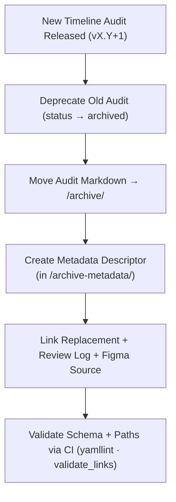

<div align="center">

# 🗃️ Kansas Frontier Matrix — Archived Timeline Accessibility Reports  
`docs/design/mockups/figma/components/timeline/accessibility-reports/archive/README.md`

**Mission:** Preserve all **deprecated or superseded accessibility audit reports**  
for **Timeline components** within the **Kansas Frontier Matrix (KFM)** design system —  
ensuring full transparency, reproducibility, and continuous improvement under the  
**Master Coder Protocol (MCP)**.

[](../../../../../../../../../)
[](../../../../../../../../../)
[](../../../../../../../../../../)
[](../../../../../../../../../../../LICENSE)

</div>

---

## 🎯 Purpose

This directory serves as the **archival index for accessibility audits** of all timeline-related components  
that have been replaced or deprecated. Each archived audit is retained as a **permanent historical record**  
capturing accessibility compliance data, WCAG evaluation, and remediation context for MCP review.

Archived reports include:
- 🧩 **Accessibility test results** (WCAG 2.1 AA compliant)  
- 🔗 **Cross-links** to replacement audits and metadata  
- 🧾 **Design provenance** via Figma source, export, and review logs  
- ♿ **Regression tracking** for continuous accessibility improvement  

---

## 🧭 Directory Structure

```text
docs/design/mockups/figma/components/timeline/accessibility-reports/archive/
├── README.md                                 # Index (this file)
├── timeline_bar_v1.9_team_audit.md           # Archived timeline bar audit
├── timeline_marker_v1.4_team_audit.md        # Deprecated marker audit
├── timeline_zoom_v1.0_team_audit.md          # First version of zoom control audit
└── archive-metadata/                         # YAML metadata descriptors for archived audits
````

---

## 🧩 YAML Metadata Schema (for `/archive-metadata/`)

Each archived audit includes a YAML metadata descriptor to maintain provenance context:

```yaml
id: timeline_bar_v1.9_team_audit
title: Timeline Bar (v1.9) — Accessibility Audit (Archived)
archived_on: 2025-10-07
archived_by: accessibility.team
status: archived
replaced_by: ../../timeline_bar_v2.0_team_audit.md
source_figma: https://www.figma.com/file/KFM_TIMELINE_DOCS/Component-Library?node-id=300%3A400
review_log: ../../../../../../../../reviews/2025-09-30_timeline_bar_v1.9.md
linked_export: ../../../exports/archive/timeline_bar_v1.9.png
wcag_criteria:
  - 2.1.1 Keyboard Navigation
  - 2.4.7 Focus Visible
  - 1.4.3 Contrast (Minimum)
issues_summary:
  - Focus ring low visibility under dark theme.
  - Keyboard trap when zoom overlay active.
resolution_summary: >
  All issues corrected in v2.0 with new contrast tokens and refined tab order logic.
license: CC-BY-4.0
notes: >
  This audit remains archived for MCP accessibility regression analysis.
```

---

## 🧮 Archival Workflow



<!-- END OF MERMAID -->

**Workflow Summary**

1. When a newer audit replaces an older version, the old file is marked as **archived**.
2. Move the markdown and metadata descriptor into `/archive/`.
3. Annotate the YAML metadata with the replacement audit path and accessibility updates.
4. Validate link and schema consistency through automated CI jobs.
5. Preserve all audit records permanently as MCP traceable documentation.

---

## ♿ Accessibility Regression Example

| WCAG Criterion                    | Deprecated Version | Replacement Version | Status      |
| :-------------------------------- | :----------------- | :------------------ | :---------- |
| 2.1.1 Keyboard Accessibility      | Partial            | Full                | ✅ Fixed     |
| 2.4.7 Focus Visible               | Fail               | Pass                | ✅ Fixed     |
| 1.4.3 Contrast                    | 4.0 : 1            | 4.8 : 1             | ✅ Fixed     |
| 2.3.3 Animation from Interactions | N/A                | Supported           | 🟢 Improved |

---

## 🧩 Example Archived Report — Marker (v1.4)

**File:** `timeline_marker_v1.4_team_audit.md`
**Archived On:** 2025-10-07
**Replaced By:** [`../../timeline_marker_v1.5_team_audit.md`](../../timeline_marker_v1.5_team_audit.md)

> Timeline Marker v1.4 failed contrast and ARIA compliance tests.
> Marker outline and keyboard focus indicators improved in v1.5,
> achieving full WCAG 2.1 AA compliance.

---

## 🧾 CI Validation Rules

| Validation                  | Tool                      | Description                                  |
| :-------------------------- | :------------------------ | :------------------------------------------- |
| **YAML Schema Validation**  | `yamllint` + `jsonschema` | Ensures descriptor structure consistency.    |
| **WCAG ID Format**          | Regex (`^\d\.\d+\.\d+$`)  | Validates correct WCAG reference syntax.     |
| **Cross-Link Integrity**    | `validate_links.py`       | Confirms references to metadata and reviews. |
| **License Check**           | Pre-commit Hook           | Must equal `CC-BY-4.0`.                      |
| **Replacement File Exists** | CI Workflow               | Confirms valid `replaced_by` target.         |

---

## 🧠 Governance & Retention Policy

| Action                         | Frequency  | Responsible          | Deliverable           |
| :----------------------------- | :--------- | :------------------- | :-------------------- |
| Archive Review                 | Quarterly  | `design.board`       | Validation report     |
| Accessibility Regression Audit | Annual     | `accessibility.team` | WCAG trend report     |
| Metadata Verification          | Continuous | CI Automation        | Build validation logs |
| Retention Policy               | Permanent  | Maintainers          | Immutable MCP Record  |

---

## 🧩 Related Documentation

* [`../README.md`](../README.md) — Active accessibility audits
* [`../../metadata/README.md`](../../metadata/README.md) — Timeline metadata schema
* [`../../metadata/archive/README.md`](../../metadata/archive/README.md) — Archived metadata index
* [`../../../../../../../../ui-guidelines.md`](../../../../../../../../ui-guidelines.md) — Accessibility and keyboard design standards
* [`../../../../../../../../style-guide.md`](../../../../../../../../style-guide.md) — Design tokens and visual accessibility rules
* [`../../../../../../../../interaction-patterns.md`](../../../../../../../../interaction-patterns.md) — Timeline behavior and motion guidance
* [`../../../../../../../../reviews/`](../../../../../../../../reviews/) — MCP design review logs

---

<div align="center">

### ♿ “Accessibility archives aren’t history —

they’re the proof of progress.”
**— Kansas Frontier Matrix Accessibility & Design Governance Team**

</div>
