<div align="center">

# 🧾 Kansas Frontier Matrix — Deep Archive: Timeline Accessibility Audit Metadata  
`docs/design/mockups/figma/components/timeline/accessibility-reports/archive/archive-metadata/README.md`

**Mission:** Maintain **deep-archive metadata descriptors** for all  
**Timeline accessibility audits** (bars, markers, zooms, and playback controls)  
in the **Kansas Frontier Matrix (KFM)** design system — ensuring long-term  
provenance, WCAG compliance visibility, and documentation permanence under  
the **Master Coder Protocol (MCP)**.

[](../../../../../../../../../)
[](../../../../../../../../../)
[](../../../../../../../../../../)
[](../../../../../../../../../../../LICENSE)

</div>

---

## 🎯 Purpose

This `/archive-metadata/` directory documents **YAML descriptors** for  
archived Timeline accessibility audits, connecting each deprecated audit  
to its replacement version, WCAG findings, remediation summary, and review provenance.

These descriptors act as the **final audit index**, preserving every accessibility  
evaluation’s outcome and historical context in accordance with MCP governance.

Each metadata file includes:
- 📅 Audit details and archival timestamp  
- ♿ WCAG 2.1 AA criteria evaluated and outcomes  
- 🔗 Replacement audit cross-reference  
- 🧩 Review logs, exports, and Figma source links  
- 🗃️ Immutable MCP archival compliance record  

---

## 🧭 Directory Structure

```text
docs/design/mockups/figma/components/timeline/accessibility-reports/archive/archive-metadata/
├── README.md                                 # Index (this file)
├── timeline_bar_v1.9_audit.yml               # Deep metadata record (Timeline Bar)
├── timeline_marker_v1.4_audit.yml            # Deep metadata record (Marker)
└── timeline_zoom_v1.0_audit.yml              # Deep metadata record (Zoom Control)
````

---

## 🧩 YAML Descriptor Schema

Each YAML file must follow this schema for MCP validation:

```yaml
id: timeline_bar_v1.9_audit
title: Timeline Bar Accessibility Audit (v1.9)
archived_on: 2025-10-07
archived_by: accessibility.team
status: archived
replaced_by: ../../../../timeline_bar_v2.0_team_audit.md
source_figma: https://www.figma.com/file/KFM_TIMELINE_DOCS/Component-Library?node-id=300%3A400
review_log: ../../../../../../../../reviews/2025-09-30_timeline_bar_v1.9.md
linked_audit: ../timeline_bar_v1.9_team_audit.md
linked_export: ../../../exports/archive/timeline_bar_v1.9.png
wcag_criteria:
  - 1.4.3 Contrast (Minimum)
  - 2.1.1 Keyboard Navigation
  - 2.4.7 Focus Visible
  - 2.3.3 Animation from Interactions
issues_summary:
  - Focus outline below 3:1 contrast ratio.
  - Inconsistent tab order for zoom control access.
  - Label contrast below minimum under dark theme.
resolution_summary: >
  All accessibility failures resolved in v2.0. Focus ring standardized,
  tab order corrected, and new color tokens introduced for consistency.
license: CC-BY-4.0
notes: >
  Preserved for historical provenance and MCP accessibility lineage tracking.
```

---

## 🧮 Metadata Workflow

```mermaid
flowchart TD
    A["Deprecate Accessibility Audit (vX.Y)"] --> B["Create Descriptor → /archive-metadata/"]
    B --> C["Add WCAG Criteria · Issue Summary · Resolution"]
    C --> D["Link to Replacement Audit + Review Log"]
    D --> E["Validate Schema (yamllint · jsonschema)"]
    E --> F["Commit to Immutable MCP Archive"]
```



<!-- END OF MERMAID -->

**Workflow Steps**

1. When an audit is replaced, generate a YAML descriptor here.
2. Include key WCAG criteria, findings, and resolutions.
3. Link the previous audit, replacement audit, and relevant Figma design export.
4. Validate YAML structure and link integrity using CI pipelines.
5. Preserve file permanently for compliance verification and MCP audit review.

---

## ♿ Accessibility Regression Example

| WCAG Ref                  | v1.9 Result    | v2.0 Result    | Status   |
| :------------------------ | :------------- | :------------- | :------- |
| 1.4.3 Contrast (Minimum)  | Fail (4.0 : 1) | Pass (4.8 : 1) | ✅ Fixed  |
| 2.1.1 Keyboard Navigation | Partial        | Full           | ✅ Fixed  |
| 2.4.7 Focus Visible       | Fail           | Pass           | ✅ Fixed  |
| 2.3.3 Reduced Motion      | N/A            | Supported      | 🟢 Added |

---

## 🧩 Example Descriptor — Marker (v1.4 Audit)

```yaml
id: timeline_marker_v1.4_audit
title: Timeline Marker Accessibility Audit (v1.4)
archived_on: 2025-10-07
archived_by: accessibility.team
status: archived
replaced_by: ../../../../timeline_marker_v1.5_team_audit.md
source_figma: https://www.figma.com/file/KFM_TIMELINE_DOCS/Component-Library?node-id=400%3A320
review_log: ../../../../../../../../reviews/2025-09-28_timeline_marker_v1.4.md
linked_audit: ../timeline_marker_v1.4_team_audit.md
linked_export: ../../../exports/archive/timeline_marker_v1.4.png
wcag_criteria:
  - 1.4.3 Contrast (Minimum)
  - 2.4.7 Focus Visible
  - 4.1.2 Name, Role, Value
issues_summary:
  - Hover contrast below 4.5 : 1 for inactive markers.
  - Focus outline not visible under light theme.
  - Tooltip missing accessible name.
resolution_summary: >
  Fixed in v1.5 with accent focus outlines, higher-contrast hover states,
  and `aria-describedby` for tooltips.
license: CC-BY-4.0
notes: >
  Marker v1.4 audit metadata retained for MCP compliance history and regression tracking.
```

---

## 🧾 CI Validation Rules

| Validation                 | Tool                      | Description                                   |
| :------------------------- | :------------------------ | :-------------------------------------------- |
| **YAML Schema Check**      | `yamllint` + `jsonschema` | Ensures key-value structure and completeness. |
| **WCAG Format Validation** | Regex (`^\d\.\d+\.\d+$`)  | Confirms valid WCAG references.               |
| **Cross-Link Integrity**   | `validate_links.py`       | Verifies relative paths and linked files.     |
| **License Compliance**     | Pre-commit Hook           | Confirms license field equals `CC-BY-4.0`.    |
| **Replacement Exists**     | CI Pipeline               | Confirms `replaced_by` audit file is present. |

---

## 🧠 Governance & Retention Policy

| Action                         | Frequency  | Responsible          | Output                         |
| :----------------------------- | :--------- | :------------------- | :----------------------------- |
| Descriptor Audit               | Quarterly  | `design.board`       | YAML schema compliance report  |
| Accessibility Regression Audit | Annual     | `accessibility.team` | WCAG improvement summary       |
| Link Integrity Check           | Continuous | CI Automation        | Validation logs                |
| Archive Retention              | Permanent  | Maintainers          | Immutable MCP archive snapshot |

---

## 🧩 Related Documentation

* [`../README.md`](../README.md) — Archived accessibility audit index
* [`../../README.md`](../../README.md) — Active timeline accessibility audit docs
* [`../../../metadata/archive/README.md`](../../../metadata/archive/README.md) — Archived timeline metadata schema
* [`../../../../../../../../ui-guidelines.md`](../../../../../../../../ui-guidelines.md) — Accessibility framework
* [`../../../../../../../../style-guide.md`](../../../../../../../../style-guide.md) — Visual token & color standards
* [`../../../../../../../../reviews/`](../../../../../../../../reviews/) — MCP audit review records

---

<div align="center">

### ♿ “An audit preserved is inclusion documented —

each archived report tells the story of progress.”
**— Kansas Frontier Matrix Accessibility & Design Governance Team**

</div>
