<div align="center">

# 🗃️ Kansas Frontier Matrix — Archived Timeline Components  
`docs/design/mockups/figma/components/timeline/archive/README.md`

**Mission:** Document, preserve, and trace all **deprecated Timeline components**  
within the **Kansas Frontier Matrix (KFM)** design system — ensuring that each  
iteration of design, interaction, and accessibility improvement remains  
fully auditable and reproducible under the **Master Coder Protocol (MCP)**.

[](../../../../../../)
[](../../../../../../)
[](../../../../../../../)
[](../../../../../../../LICENSE)

</div>

---

## 🎯 Purpose

The `/archive/` directory maintains **deprecated or replaced timeline components**,  
serving as a permanent accessibility and design provenance repository.  

Each archived file provides:
- 🧾 **Metadata** documenting component lineage and deprecation context.  
- ♿ **Accessibility audits** referencing WCAG 2.1 AA compliance.  
- 🖼️ **Design exports** (PNGs, SVGs) stored for version traceability.  
- 🔗 **Cross-links** to replacement components and review logs.  

By archiving these records, the KFM system guarantees that every iteration  
of the timeline interface can be reproduced, reviewed, and understood  
through its documented accessibility history.

---

## 🧭 Directory Structure

```text
docs/design/mockups/figma/components/timeline/archive/
├── README.md                                   # Index (this file)
├── timeline_bar_v1.9.png                       # Deprecated timeline bar export
├── timeline_marker_v1.4.png                    # Deprecated marker export
├── timeline_zoom_v1.0.png                      # Deprecated zoom control export
├── metadata/                                   # YAML metadata for archived components
├── accessibility-reports/                      # Archived accessibility audits
└── archive-metadata/                           # Deep provenance descriptors for MCP retention
````

---

## 🧩 YAML Metadata Schema

Each archived component includes a metadata file following this structure:

```yaml
id: timeline_bar_v1.9
title: Timeline Bar (v1.9)
version: v1.9
status: deprecated
archived_on: 2025-10-07
archived_by: design.board
replaced_by: ../metadata/timeline_bar_v2.0.yml
reason: >
  Superseded by v2.0 after accessibility audit identified focus visibility
  and keyboard navigation issues. Resolved through new design tokens and ARIA roles.
source_figma: https://www.figma.com/file/KFM_TIMELINE_DOCS/Component-Library?node-id=300%3A400
linked_review: ../../../../../../../reviews/2025-09-30_timeline_bar_v1.9.md
linked_export: ../../exports/archive/timeline_bar_v1.9.png
accessibility_issues:
  - Focus ring not visible in dark mode.
  - Keyboard navigation skipped interactive markers.
wcag_criteria:
  - 2.1.1 Keyboard Navigation
  - 2.4.7 Focus Visible
license: CC-BY-4.0
notes: >
  Timeline Bar v1.9 deprecated under MCP accessibility compliance policy.
```

---

## 🧮 Archival Workflow

```mermaid
flowchart TD
    A["Release New Timeline Version (vX.Y+1)"] --> B["Deprecate Old Version (status → deprecated)"]
    B --> C["Move Export + Metadata → /archive/"]
    C --> D["Annotate Metadata (reason · replaced_by · accessibility issues)"]
    D --> E["Cross-Link Audit + Review Log"]
    E --> F["Validate Schema + License via CI"]
```



<!-- END OF MERMAID -->

### Workflow Summary

1. Identify deprecated timeline version.
2. Move associated exports, metadata, and audits into `/archive/`.
3. Add `archived_on`, `reason`, and `replaced_by` fields in metadata.
4. Validate through CI for schema integrity and cross-link accuracy.
5. Store permanently under MCP audit retention policy.

---

## ♿ Accessibility Regression Example

| WCAG Ref                     | Deprecated Version | Replacement Version | Status      |
| :--------------------------- | :----------------- | :------------------ | :---------- |
| 1.4.3 Contrast (Minimum)     | 4.0 : 1            | 4.8 : 1             | ✅ Fixed     |
| 2.1.1 Keyboard Accessibility | Partial            | Full                | ✅ Fixed     |
| 2.4.7 Focus Visible          | Fail               | Pass                | ✅ Fixed     |
| 2.3.3 Reduced Motion         | N/A                | Supported           | 🟢 Improved |

---

## 🧩 Example Archived Entry — Marker (v1.4)

**File:** `timeline_marker_v1.4.png`
**Archived:** 2025-10-07
**Replaced By:** `timeline_marker_v1.5.png`
**Reason:** Failed focus visibility and hover contrast criteria.

**Audit Reference:**
[`accessibility-reports/archive/timeline_marker_v1.4_team_audit.md`](accessibility-reports/archive/timeline_marker_v1.4_team_audit.md)

> Marker v1.4 displayed low-contrast outlines under bright backgrounds.
> Fixed in v1.5 through new accent tokens (`--timeline-marker-outline`)
> and improved ARIA role coverage.

---

## 🧾 CI Validation Rules

| Validation                      | Tool                      | Description                        |
| :------------------------------ | :------------------------ | :--------------------------------- |
| **Schema Validation**           | `yamllint` / `jsonschema` | Checks YAML file integrity.        |
| **WCAG Format Validation**      | Regex (`^\d\.\d+\.\d+$`)  | Validates WCAG reference syntax.   |
| **Cross-Link Verification**     | `validate_links.py`       | Ensures all links resolve.         |
| **License Field Check**         | Pre-commit Hook           | Must equal `CC-BY-4.0`.            |
| **Replacement Reference Check** | CI Workflow               | Ensures `replaced_by` file exists. |

---

## 🧠 Governance & Retention Policy

| Action                          | Frequency  | Responsible          | Output                         |
| :------------------------------ | :--------- | :------------------- | :----------------------------- |
| Metadata Audit                  | Quarterly  | `design.board`       | MCP compliance report          |
| Accessibility Regression Review | Annual     | `accessibility.team` | WCAG improvement summary       |
| CI Validation                   | Continuous | CI Bot               | Build + link verification logs |
| Retention Policy                | Permanent  | Maintainers          | Immutable MCP Archive Record   |

---

## 🧩 Related Documentation

* [`../README.md`](../README.md) — Active timeline component documentation
* [`../metadata/README.md`](../metadata/README.md) — Timeline metadata schema
* [`../accessibility-reports/README.md`](../accessibility-reports/README.md) — Accessibility audit reports
* [`../../../../../../../ui-guidelines.md`](../../../../../../../ui-guidelines.md) — Accessibility principles
* [`../../../../../../../style-guide.md`](../../../../../../../style-guide.md) — Color & design tokens
* [`../../../../../../../interaction-patterns.md`](../../../../../../../interaction-patterns.md) — User interaction logic
* [`../../../../../../../reviews/`](../../../../../../../reviews/) — MCP review logs

---

<div align="center">

### 🕰️ “Timelines measure progress —

archived components prove how far accessibility has come.”
**— Kansas Frontier Matrix Accessibility & Design Governance Council**

</div>
