<div align="center">

# 🗃️ Kansas Frontier Matrix — Archived Timeline Accessibility Reports  
`docs/design/mockups/figma/components/timeline/archive/accessibility-reports/README.md`

**Mission:** Archive and document **deprecated accessibility audits**  
for all **Timeline components** (bars, markers, zooms, and playback)  
in the **Kansas Frontier Matrix (KFM)** — preserving historical  
WCAG 2.1 AA data, remediation progress, and MCP traceability.

[](../../../../../../../../../)
[](../../../../../../../../../)
[](../../../../../../../../../../)
[](../../../../../../../../../../../LICENSE)

</div>

---

## 🎯 Purpose

The `/archive/accessibility-reports/` directory preserves  
**deprecated timeline accessibility audit reports**, ensuring  
that all historical WCAG assessments, findings, and improvements  
remain verifiable and accessible for MCP-compliant documentation review.

Each archived report includes:
- 🧩 WCAG 2.1 AA audit data and results  
- 📅 Dates, authors, and version lineage  
- 🔗 Links to replacement audit, metadata, and design exports  
- ♿ Regression comparisons and remediation summaries  

This enables long-term reproducibility and accountability within  
the Kansas Frontier Matrix accessibility governance system.

---

## 🧭 Directory Structure

```text
docs/design/mockups/figma/components/timeline/archive/accessibility-reports/
├── README.md                                   # Index (this file)
├── timeline_bar_v1.9_team_audit.md             # Deprecated timeline bar audit
├── timeline_marker_v1.4_team_audit.md          # Deprecated event marker audit
├── timeline_zoom_v1.0_team_audit.md            # Deprecated zoom control audit
└── archive-metadata/                           # YAML descriptors for archived audit provenance
````

---

## 🧩 YAML Metadata Schema (in `/archive-metadata/`)

Each audit has a corresponding YAML descriptor defining its provenance and replacement linkage:

```yaml
id: timeline_bar_v1.9_team_audit
title: Timeline Bar (v1.9) — Accessibility Audit (Archived)
archived_on: 2025-10-07
archived_by: accessibility.team
status: archived
replaced_by: ../../../../accessibility-reports/timeline_bar_v2.0_team_audit.md
source_figma: https://www.figma.com/file/KFM_TIMELINE_DOCS/Component-Library?node-id=300%3A400
review_log: ../../../../../../../../reviews/2025-09-30_timeline_bar_v1.9.md
linked_export: ../../../exports/archive/timeline_bar_v1.9.png
wcag_criteria:
  - 1.4.3 Contrast (Minimum)
  - 2.1.1 Keyboard Navigation
  - 2.4.7 Focus Visible
issues_summary:
  - Focus indicator too faint under dark theme.
  - Tab order skipped zoom control.
resolution_summary: >
  Corrected in v2.0 with standardized focus tokens and improved keyboard sequencing.
license: CC-BY-4.0
notes: >
  Retained as a permanent MCP audit artifact for accessibility regression analysis.
```

---

## 🧮 Archival Workflow

```mermaid
flowchart TD
    A["New Accessibility Audit (vX.Y+1)"] --> B["Deprecate Old Audit (status → archived)"]
    B --> C["Move Report → /archive/accessibility-reports/"]
    C --> D["Create Metadata Descriptor\n(in /archive-metadata/)"]
    D --> E["Link to Replacement Audit + Review Log"]
    E --> F["Validate Schema + Cross-Links via CI"]
```



<!-- END OF MERMAID -->

### Workflow Steps

1. Mark outdated audit markdown as **archived** when a new version is validated.
2. Move to `/archive/accessibility-reports/` and generate a metadata YAML entry.
3. Record reasons for deprecation, WCAG findings, and replacement link.
4. Verify all metadata and cross-references via CI validation.
5. Retain files permanently under MCP archival governance.

---

## ♿ Accessibility Regression Comparison

| WCAG Criterion            | Deprecated Version | Replacement Version | Status      |
| :------------------------ | :----------------- | :------------------ | :---------- |
| 1.4.3 Contrast (Minimum)  | 4.0 : 1            | 4.8 : 1             | ✅ Fixed     |
| 2.1.1 Keyboard Navigation | Partial            | Full                | ✅ Fixed     |
| 2.4.7 Focus Visible       | Fail               | Pass                | ✅ Fixed     |
| 4.1.2 ARIA Role Accuracy  | Partial            | Full                | ✅ Fixed     |
| 2.3.3 Reduced Motion      | N/A                | Supported           | 🟢 Improved |

---

## 🧩 Example Archived Report — Zoom Control (v1.0)

**File:** `timeline_zoom_v1.0_team_audit.md`
**Archived:** 2025-10-07
**Replaced By:** `timeline_zoom_v1.1_team_audit.md`

> Timeline Zoom v1.0 failed color contrast and keyboard focus tests.
> The revised v1.1 improved ARIA labeling, motion preference support,
> and introduced sequential tab navigation.
> This record is retained as part of the MCP audit lineage for reproducibility.

---

## 🧾 CI Validation Rules

| Validation                 | Tool                     | Description                           |
| :------------------------- | :----------------------- | :------------------------------------ |
| **YAML Schema Validation** | `yamllint`, `jsonschema` | Ensures metadata fields are complete. |
| **WCAG ID Validation**     | Regex (`^\d\.\d+\.\d+$`) | Validates WCAG references.            |
| **Cross-Link Integrity**   | `validate_links.py`      | Confirms all linked paths resolve.    |
| **License Field Check**    | Pre-commit Hook          | Ensures `CC-BY-4.0` compliance.       |
| **Replacement Exists**     | CI                       | Verifies valid `replaced_by` link.    |

---

## 🧠 Governance & Retention Policy

| Action                          | Frequency  | Responsible          | Deliverable                    |
| :------------------------------ | :--------- | :------------------- | :----------------------------- |
| Audit Archive Review            | Quarterly  | `design.board`       | MCP compliance summary         |
| Accessibility Regression Review | Annual     | `accessibility.team` | WCAG improvement report        |
| Schema Validation               | Continuous | CI Automation        | YAML + link verification       |
| Retention                       | Permanent  | Maintainers          | Immutable MCP Archive Snapshot |

---

## 🧩 Related Documentation

* [`../README.md`](../README.md) — Active Timeline Accessibility Reports
* [`../../metadata/README.md`](../../metadata/README.md) — Timeline Metadata Schema
* [`../../metadata/archive/README.md`](../../metadata/archive/README.md) — Archived Metadata Rules
* [`../../../../../../../../ui-guidelines.md`](../../../../../../../../ui-guidelines.md) — Accessibility & Interaction Standards
* [`../../../../../../../../style-guide.md`](../../../../../../../../style-guide.md) — Visual Tokens & Contrast Rules
* [`../../../../../../../../reviews/`](../../../../../../../../reviews/) — MCP Audit Review Logs

---

<div align="center">

### ♿ “Every archived audit tells the story of progress —

documented, verified, and preserved for inclusion.”
**— Kansas Frontier Matrix Accessibility & Design Governance Council**

</div>
