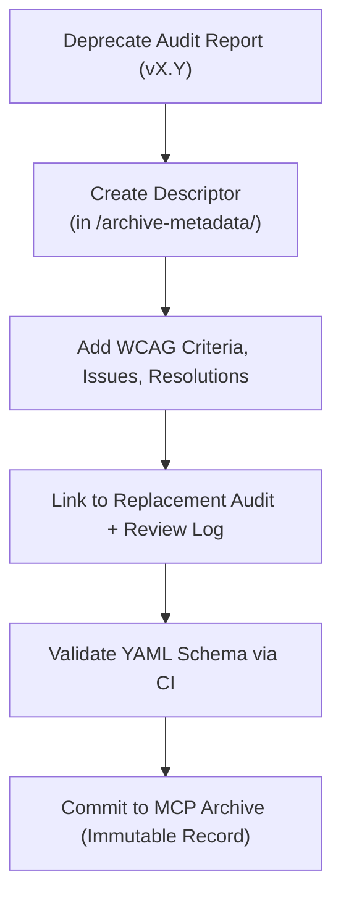

<div align="center">

# 🧾 Kansas Frontier Matrix — Deep Archive: Timeline Accessibility Report Metadata  
`docs/design/mockups/figma/components/timeline/archive/accessibility-reports/archive-metadata/README.md`

**Mission:** Preserve and govern **deep-archive metadata descriptors**  
for all **Timeline accessibility audits** (bars, markers, zoom, playback)  
in the **Kansas Frontier Matrix (KFM)** — maintaining MCP-grade  
traceability, historical WCAG lineage, and reproducibility.

[](../../../../../../../../../../)
[](../../../../../../../../../../)
[](../../../../../../../../../../../)
[](../../../../../../../../../../../LICENSE)

</div>

---

## 🎯 Purpose

This `/archive-metadata/` directory contains **final YAML descriptors**  
for archived accessibility reports of timeline components.  

Each YAML file records:
- The **version** of the audit and archival date.  
- **WCAG 2.1 AA** criteria evaluated.  
- **Key accessibility issues** and resolutions.  
- Links to replacement audits, reviews, and Figma sources.  
- Provenance metadata ensuring **MCP documentation integrity**.

These descriptors create a **permanent accessibility evidence chain**,  
ensuring the KFM design system remains transparent and reproducible.

---

## 🧭 Directory Structure

```text
docs/design/mockups/figma/components/timeline/archive/accessibility-reports/archive-metadata/
├── README.md                                   # Index (this file)
├── timeline_bar_v1.9_audit.yml                 # Archived audit descriptor — Timeline Bar
├── timeline_marker_v1.4_audit.yml              # Archived audit descriptor — Timeline Marker
└── timeline_zoom_v1.0_audit.yml                # Archived audit descriptor — Zoom Control
````

---

## 🧩 YAML Descriptor Schema

Each metadata descriptor follows this structure:

```yaml
id: timeline_bar_v1.9_audit
title: Timeline Bar Accessibility Audit (v1.9)
archived_on: 2025-10-07
archived_by: accessibility.team
status: archived
replaced_by: ../../../../accessibility-reports/timeline_bar_v2.0_team_audit.md
source_figma: https://www.figma.com/file/KFM_TIMELINE_DOCS/Component-Library?node-id=300%3A400
review_log: ../../../../../../../../../../reviews/2025-09-30_timeline_bar_v1.9.md
linked_audit: ../timeline_bar_v1.9_team_audit.md
linked_export: ../../../exports/archive/timeline_bar_v1.9.png
wcag_criteria:
  - 1.4.3 Contrast (Minimum)
  - 2.1.1 Keyboard Navigation
  - 2.4.7 Focus Visible
  - 2.3.3 Animation from Interactions
issues_summary:
  - Focus outlines below minimum contrast ratio (2.3 : 1).
  - Keyboard sequence skipped zoom controls.
  - Gridline labels below 4.5 : 1 threshold.
resolution_summary: >
  Fixed in v2.0 with improved focus token, sequential tab ordering, and higher-contrast color tokens.
license: CC-BY-4.0
notes: >
  Retained for MCP provenance verification and regression benchmarking.
```

---

## 🧮 Descriptor Workflow



<!-- END OF MERMAID -->

### Step Summary

1. Move deprecated accessibility audit to `/archive/`.
2. Create a metadata descriptor in `/archive-metadata/` with WCAG and provenance fields.
3. Link the replacement audit, review log, and design exports.
4. Validate YAML schema and link structure through CI automation.
5. Retain permanently as an immutable MCP archival record.

---

## ♿ Accessibility Regression Example

| WCAG Ref                  | v1.9 Result | v2.0 Result | Status    |
| :------------------------ | :---------- | :---------- | :-------- |
| 1.4.3 Contrast (Minimum)  | 4.0 : 1     | 4.8 : 1     | ✅ Fixed   |
| 2.1.1 Keyboard Navigation | Partial     | Full        | ✅ Fixed   |
| 2.4.7 Focus Visible       | Fail        | Pass        | ✅ Fixed   |
| 2.3.3 Animation           | Pass        | Pass        | 🟢 Stable |

---

## 🧩 Example Descriptor — Timeline Marker (v1.4 Audit)

```yaml
id: timeline_marker_v1.4_audit
title: Timeline Marker Accessibility Audit (v1.4)
archived_on: 2025-10-07
archived_by: accessibility.team
status: archived
replaced_by: ../../../../accessibility-reports/timeline_marker_v1.5_team_audit.md
source_figma: https://www.figma.com/file/KFM_TIMELINE_DOCS/Component-Library?node-id=400%3A320
review_log: ../../../../../../../../../../reviews/2025-09-28_timeline_marker_v1.4.md
linked_audit: ../timeline_marker_v1.4_team_audit.md
linked_export: ../../../exports/archive/timeline_marker_v1.4.png
wcag_criteria:
  - 1.4.3 Contrast (Minimum)
  - 2.4.7 Focus Visible
  - 4.1.2 Name, Role, Value
issues_summary:
  - Focus ring too faint under dark mode.
  - Tooltip lacked descriptive `aria-label`.
resolution_summary: >
  Fixed in v1.5 with enhanced outline contrast and added ARIA attributes for tooltips.
license: CC-BY-4.0
notes: >
  This record documents the accessibility improvements and color token changes from v1.4 to v1.5.
```

---

## 🧾 CI Validation Rules

| Validation                | Tool                     | Description                                         |
| :------------------------ | :----------------------- | :-------------------------------------------------- |
| **YAML Schema Integrity** | `yamllint`, `jsonschema` | Ensures correct structure and required fields.      |
| **WCAG Reference Check**  | Regex (`^\d\.\d+\.\d+$`) | Validates WCAG criterion format.                    |
| **Link Verification**     | `validate_links.py`      | Confirms paths to audit, review, and exports exist. |
| **License Enforcement**   | Pre-commit Hook          | Must equal `CC-BY-4.0`.                             |
| **Replacement Existence** | CI Workflow              | Ensures linked `replaced_by` file exists.           |

---

## 🧠 Governance & Retention Policy

| Action                          | Frequency  | Responsible          | Deliverable              |
| :------------------------------ | :--------- | :------------------- | :----------------------- |
| Metadata Validation             | Continuous | CI Automation        | Build validation logs    |
| Schema Audit                    | Quarterly  | `design.board`       | MCP compliance report    |
| Accessibility Regression Review | Annual     | `accessibility.team` | WCAG improvement summary |
| Permanent Retention             | Always     | Repo Maintainers     | Immutable archival index |

---

## 🧩 Related Documentation

* [`../README.md`](../README.md) — Archived accessibility report index
* [`../../README.md`](../../README.md) — Active timeline accessibility reports
* [`../../../metadata/archive/README.md`](../../../metadata/archive/README.md) — Archived component metadata schema
* [`../../../../../../../../ui-guidelines.md`](../../../../../../../../ui-guidelines.md) — Accessibility design rules
* [`../../../../../../../../style-guide.md`](../../../../../../../../style-guide.md) — Design tokens and contrast standards
* [`../../../../../../../../reviews/`](../../../../../../../../reviews/) — MCP audit reviews

---

<div align="center">

### ♿ “Documentation is the memory of accessibility —

deep archives ensure progress is never lost.”
**— Kansas Frontier Matrix Accessibility & Design Governance Council**

</div>
