<div align="center">

# 🧾 Kansas Frontier Matrix — Deep Archive: Timeline Component Metadata  
`docs/design/mockups/figma/components/timeline/archive/archive-metadata/README.md`

**Mission:** Maintain **deep-archive metadata descriptors** for deprecated  
timeline components — ensuring every design, accessibility decision, and  
iteration remains permanently auditable, reproducible, and traceable under  
the **Master Coder Protocol (MCP)**.

[](../../../../../../../../../)
[](../../../../../../../../../)
[](../../../../../../../../../../)
[](../../../../../../../../../../../LICENSE)

</div>

---

## 🎯 Purpose

The `/archive-metadata/` directory serves as the **final provenance layer**  
for archived timeline component metadata — documenting accessibility history,  
WCAG evaluations, and replacement lineage.

Each YAML descriptor provides:
- 🧩 **Historical context** for archived versions.  
- ♿ **WCAG 2.1 AA** audit results summary.  
- 🔗 **Cross-links** to replacement files, Figma sources, and reviews.  
- 🗃️ **Immutable MCP compliance records** for governance and provenance.  

These records allow future contributors, researchers, and auditors to trace  
the exact accessibility journey of the timeline system, ensuring open documentation  
for the KFM’s long-term scientific and design archive.

---

## 🧭 Directory Structure

```text
docs/design/mockups/figma/components/timeline/archive/archive-metadata/
├── README.md                               # Index (this file)
├── timeline_bar_v1.9.yml                   # Deep-archive descriptor — Timeline Bar
├── timeline_marker_v1.4.yml                # Deep-archive descriptor — Timeline Marker
└── timeline_zoom_v1.0.yml                  # Deep-archive descriptor — Timeline Zoom Control
````

---

## 🧩 YAML Descriptor Schema

Each descriptor must include complete provenance and accessibility documentation fields.

```yaml
id: timeline_bar_v1.9
title: Timeline Bar (v1.9)
archived_on: 2025-10-07
archived_by: design.board
status: deprecated
replaced_by: ../../../../metadata/timeline_bar_v2.0.yml
figma_source: https://www.figma.com/file/KFM_TIMELINE_DOCS/Component-Library?node-id=300%3A400
reason: >
  Deprecated following accessibility audit identifying low label contrast,
  incomplete keyboard focus states, and missing ARIA role mapping.
accessibility_issues:
  - Text and gridline contrast 4.0 : 1 (below WCAG minimum).
  - Focus outline contrast 2.3 : 1 in dark theme.
  - Missing `role="region"` attribute for timeline scroll container.
wcag_criteria:
  - 1.4.3 Contrast (Minimum)
  - 2.4.7 Focus Visible
  - 2.1.1 Keyboard Accessibility
linked_review: ../../../../../../../../../../reviews/2025-09-30_timeline_bar_v1.9.md
linked_audit: ../../accessibility-reports/archive/timeline_bar_v1.9_team_audit.md
linked_export: ../../../../../exports/archive/timeline_bar_v1.9.png
license: CC-BY-4.0
notes: >
  This YAML descriptor preserves complete accessibility provenance for Timeline Bar v1.9,
  linking original audit data and remediation documentation leading to v2.0 improvements.
```

---

## 🧮 Descriptor Workflow

```mermaid
flowchart TD
    A["Deprecate Component (vX.Y)"] --> B["Move Metadata → /archive/metadata/"]
    B --> C["Create Descriptor → /archive-metadata/"]
    C --> D["Add WCAG Criteria, Audit Links, Replacement Path"]
    D --> E["Validate Schema (yamllint · jsonschema)"]
    E --> F["Commit to MCP Archive (Immutable Record)"]
```



<!-- END OF MERMAID -->

### Workflow Summary

1. Identify timeline component metadata to archive.
2. Add descriptor YAML to `/archive-metadata/` with provenance and WCAG data.
3. Include links to reviews, audits, and exports for verification.
4. Validate schema structure and links via CI automation.
5. Retain permanently under MCP archival governance.

---

## ♿ Accessibility Regression Reference

| WCAG Ref                     | v1.9 Result | v2.0 Result | Status  |
| :--------------------------- | :---------- | :---------- | :------ |
| 1.4.3 Contrast (Minimum)     | Fail        | Pass        | ✅ Fixed |
| 2.4.7 Focus Visible          | Fail        | Pass        | ✅ Fixed |
| 2.1.1 Keyboard Accessibility | Partial     | Full        | ✅ Fixed |
| 4.1.2 Name, Role, Value      | Partial     | Full        | ✅ Fixed |

---

## 🧩 Example Descriptor — Marker (v1.4)

```yaml
id: timeline_marker_v1.4
title: Timeline Marker Component (v1.4)
archived_on: 2025-10-07
archived_by: accessibility.team
status: deprecated
replaced_by: ../../../../metadata/timeline_marker_v1.5.yml
figma_source: https://www.figma.com/file/KFM_TIMELINE_DOCS/Component-Library?node-id=400%3A320
reason: >
  Marker v1.4 archived after accessibility review revealed hover contrast
  and focus outline visibility failures under high brightness conditions.
accessibility_issues:
  - Hover contrast below 4.5 : 1.
  - Focus ring absent in dark mode.
  - Tooltip lacked accessible label.
wcag_criteria:
  - 1.4.3 Contrast (Minimum)
  - 2.4.7 Focus Visible
  - 4.1.2 Name, Role, Value
linked_review: ../../../../../../../../../../reviews/2025-09-28_timeline_marker_v1.4.md
linked_audit: ../../accessibility-reports/archive/timeline_marker_v1.4_team_audit.md
linked_export: ../../../../../exports/archive/timeline_marker_v1.4.png
license: CC-BY-4.0
notes: >
  Retained for MCP regression analysis and accessibility provenance tracking.
```

---

## 🧾 CI Validation Rules

| Validation                    | Tool                     | Purpose                                              |
| :---------------------------- | :----------------------- | :--------------------------------------------------- |
| **YAML Schema Integrity**     | `yamllint`, `jsonschema` | Verifies structure, required fields, and data types. |
| **WCAG Reference Validation** | Regex (`^\d\.\d+\.\d+$`) | Ensures correct WCAG ID formatting.                  |
| **Cross-Link Integrity**      | `validate_links.py`      | Checks all linked file paths for existence.          |
| **License Compliance**        | Pre-commit Hook          | Must equal `CC-BY-4.0`.                              |
| **Replacement Path Check**    | CI                       | Ensures valid `replaced_by` references exist.        |

---

## 🧠 Governance & Retention Policy

| Action                          | Frequency  | Responsible          | Deliverable                  |
| :------------------------------ | :--------- | :------------------- | :--------------------------- |
| Descriptor Schema Validation    | Continuous | CI Automation        | Validation logs              |
| MCP Metadata Audit              | Quarterly  | `design.board`       | YAML integrity report        |
| Accessibility Regression Review | Annual     | `accessibility.team` | WCAG improvement summary     |
| Permanent Retention             | Always     | Repo Maintainers     | Immutable MCP archive record |

---

## 🧩 Related Documentation

* [`../README.md`](../README.md) — Archived timeline component index
* [`../../metadata/archive/README.md`](../../metadata/archive/README.md) — Archived metadata schema
* [`../../accessibility-reports/archive/README.md`](../../accessibility-reports/archive/README.md) — Archived accessibility audits
* [`../../../../../../../../ui-guidelines.md`](../../../../../../../../ui-guidelines.md) — Accessibility and interface best practices
* [`../../../../../../../../style-guide.md`](../../../../../../../../style-guide.md) — Color and design token documentation
* [`../../../../../../../../reviews/`](../../../../../../../../reviews/) — MCP design and accessibility review logs

---

<div align="center">

### 🕰️ “Every version archived is a chapter of progress —

deep metadata preserves the map of inclusion.”
**— Kansas Frontier Matrix Accessibility & Design Governance Council**

</div>
