<div align="center">

# 🧾 Kansas Frontier Matrix — Archived Timeline Metadata  
`docs/design/mockups/figma/components/timeline/archive/metadata/README.md`

**Mission:** Maintain structured **metadata records** for all deprecated  
Timeline components — preserving accessibility lineage, design provenance,  
and documentation integrity under the **Master Coder Protocol (MCP)**.

[](../../../../../../../../)
[](../../../../../../../../)
[](../../../../../../../../../)
[](../../../../../../../../../../../LICENSE)

</div>

---

## 🎯 Purpose

The `/archive/metadata/` directory preserves **YAML metadata files**  
for **deprecated Timeline components**, capturing version history,  
accessibility compliance status, and cross-links to audits and exports.

Each file documents:
- 🧩 Component identity (name, version, author, status).  
- ♿ WCAG 2.1 criteria tested and compliance outcomes.  
- 🔗 Provenance links (Figma, review, accessibility report, replacement).  
- 🗃️ Archival metadata for MCP audit and documentation governance.

These files form the **source of truth** for how the KFM timeline design evolved  
through accessibility-driven iteration and MCP reproducibility standards.

---

## 🧭 Directory Structure

```text
docs/design/mockups/figma/components/timeline/archive/metadata/
├── README.md                                  # Index (this file)
├── timeline_bar_v1.9.yml                      # Deprecated Timeline Bar metadata
├── timeline_marker_v1.4.yml                   # Deprecated Timeline Marker metadata
├── timeline_zoom_v1.0.yml                     # Deprecated Zoom Control metadata
└── archive-metadata/                          # Deep provenance descriptors for MCP archive
````

---

## 🧩 YAML Schema (for Archived Timeline Metadata)

Each archived YAML metadata file follows this structure:

```yaml
id: timeline_bar_v1.9
title: Timeline Bar (v1.9)
version: v1.9
status: deprecated
archived_on: 2025-10-07
archived_by: accessibility.team
replaced_by: ../../metadata/timeline_bar_v2.0.yml
reason: >
  Deprecated after accessibility review revealed low-contrast gridlines
  and missing focus visibility in dark mode. Fixed in v2.0 through new
  color tokens and consistent ARIA role application.
source_figma: https://www.figma.com/file/KFM_TIMELINE_DOCS/Component-Library?node-id=300%3A400
linked_review: ../../../../../../../../../reviews/2025-09-30_timeline_bar_v1.9.md
linked_export: ../../../../exports/archive/timeline_bar_v1.9.png
accessibility_issues:
  - Focus outline insufficient contrast ratio (2.4 : 1).
  - Gridline labels below minimum contrast threshold (4.0 : 1).
  - No ARIA label on scrollbar container.
wcag_criteria:
  - 1.4.3 Contrast (Minimum)
  - 2.1.1 Keyboard Navigation
  - 2.4.7 Focus Visible
license: CC-BY-4.0
notes: >
  Retained as an immutable record of design iteration and accessibility improvement.
```

---

## 🧮 Archival Workflow

```mermaid
flowchart TD
    A["New Version Released (vX.Y+1)"] --> B["Deprecate Old Metadata (status → deprecated)"]
    B --> C["Move YAML to /archive/metadata/"]
    C --> D["Add Fields: archived_on · replaced_by · reason"]
    D --> E["Cross-Link Review, Export, and Audit"]
    E --> F["Validate Schema and Paths via CI"]
```



<!-- END OF MERMAID -->

**Workflow Summary**

1. Move deprecated timeline metadata files into `/archive/metadata/`.
2. Add archival metadata fields: `archived_on`, `archived_by`, `replaced_by`, `reason`.
3. Link Figma source, review, and exports for complete provenance.
4. Validate YAML structure and references through CI.
5. Preserve permanently for audit reproducibility under MCP governance.

---

## ♿ Accessibility Regression Example

| WCAG Ref                     | Deprecated Version | Replacement Version | Status  |
| :--------------------------- | :----------------- | :------------------ | :------ |
| 1.4.3 Contrast (Minimum)     | 4.0 : 1            | 4.8 : 1             | ✅ Fixed |
| 2.1.1 Keyboard Accessibility | Partial            | Full                | ✅ Fixed |
| 2.4.7 Focus Visible          | Fail               | Pass                | ✅ Fixed |
| 4.1.2 ARIA Roles             | Partial            | Full                | ✅ Fixed |

---

## 🧩 Example Archived Metadata — Marker (v1.4)

```yaml
id: timeline_marker_v1.4
title: Timeline Marker (v1.4)
version: v1.4
status: deprecated
archived_on: 2025-10-07
archived_by: design.board
replaced_by: ../../metadata/timeline_marker_v1.5.yml
reason: >
  Deprecated following accessibility audit indicating low hover contrast
  and missing ARIA labels for tooltips. Resolved in v1.5 with new accent
  color tokens and semantic role attributes.
source_figma: https://www.figma.com/file/KFM_TIMELINE_DOCS/Component-Library?node-id=400%3A320
linked_review: ../../../../../../../../../reviews/2025-09-28_timeline_marker_v1.4.md
linked_export: ../../../../exports/archive/timeline_marker_v1.4.png
accessibility_issues:
  - Tooltip text contrast 4.1 : 1 (below standard).
  - Focus outline not visible under bright backgrounds.
wcag_criteria:
  - 1.4.3
  - 2.4.7
license: CC-BY-4.0
notes: >
  Archived as part of the MCP documentation archive for historical accessibility tracking.
```

---

## 🧾 CI Validation Rules

| Validation                      | Tool                     | Description                         |
| :------------------------------ | :----------------------- | :---------------------------------- |
| **Schema Validation**           | `yamllint`, `jsonschema` | Ensures proper YAML structure.      |
| **WCAG Format Validation**      | Regex (`^\d\.\d+\.\d+$`) | Confirms WCAG criteria syntax.      |
| **Cross-Link Integrity**        | `validate_links.py`      | Verifies linked paths are valid.    |
| **License Enforcement**         | Pre-commit Hook          | Ensures license equals `CC-BY-4.0`. |
| **Replacement Reference Check** | CI                       | Confirms replacement file exists.   |

---

## 🧠 Governance & Retention Policy

| Action                          | Frequency  | Responsible          | Output                         |
| :------------------------------ | :--------- | :------------------- | :----------------------------- |
| Metadata Audit                  | Quarterly  | `design.board`       | MCP compliance report          |
| Accessibility Regression Review | Annual     | `accessibility.team` | WCAG improvement report        |
| CI Validation                   | Continuous | CI Bot               | Build + link verification logs |
| Retention                       | Permanent  | Maintainers          | Immutable MCP Archive Record   |

---

## 🧩 Related Documentation

* [`../README.md`](../README.md) — Archived timeline component overview
* [`../../metadata/README.md`](../../metadata/README.md) — Active timeline metadata schema
* [`../../accessibility-reports/README.md`](../../accessibility-reports/README.md) — Timeline accessibility audits
* [`../../../../../ui-guidelines.md`](../../../../../ui-guidelines.md) — Accessibility design guidelines
* [`../../../../../style-guide.md`](../../../../../style-guide.md) — Design tokens and visual standards
* [`../../../../../interaction-patterns.md`](../../../../../interaction-patterns.md) — Interaction and timeline behavior
* [`../../../../../reviews/`](../../../../../reviews/) — MCP design and accessibility review logs

---

<div align="center">

### 🧾 “Archiving design isn’t about storage —

it’s about preserving the evolution of accessibility.”
**— Kansas Frontier Matrix Design & Accessibility Governance Team**

</div>
