<div align="center">

# 🧾 Kansas Frontier Matrix — Timeline Component Metadata  
`docs/design/mockups/figma/components/timeline/metadata/README.md`

**Mission:** Define the **metadata standards** for documenting and versioning all  
**Timeline components** within the **Kansas Frontier Matrix (KFM)** — ensuring  
accessibility compliance, provenance traceability, and design-code consistency  
under the **Master Coder Protocol (MCP)**.

[](../../../../../)
[](../../../../../)
[](../../../../../../)
[](../../../../../../../LICENSE)

</div>

---

## 🎯 Purpose

The `/metadata/` directory captures structured **YAML metadata** for all  
timeline-related UI components, providing a reproducible documentation layer that  
links **Figma designs**, **accessibility audits**, and **React implementations**.

Each metadata file includes:
- Component identity (ID, version, author).  
- Accessibility and WCAG 2.1 compliance data.  
- Provenance links (Figma, exports, and review logs).  
- Cross-references to code and documentation.  

These records enable automated validation, governance, and historical accountability  
through KFM’s continuous integration workflows.

---

## 🧭 Directory Structure

```text
docs/design/mockups/figma/components/timeline/metadata/
├── README.md                      # Index (this file)
├── timeline_bar_v2.0.yml          # Main horizontal timeline metadata
├── timeline_marker_v1.5.yml       # Event marker metadata
├── timeline_zoom_v1.1.yml         # Zoom control metadata
└── archive/                       # Deprecated or replaced metadata versions
````

---

## 🧩 YAML Metadata Schema

Each file must follow the schema below:

```yaml
id: timeline_bar_v2.0
title: Timeline Bar Component (v2.0)
author: design.system.team
date: 2025-10-07
version: v2.0
status: active
type: timeline
source_figma: https://www.figma.com/file/KFM_TIMELINE_DOCS/Component-Library?node-id=320%3A450
description: >
  Primary horizontal timeline component that anchors events, data, and narratives.
  Supports keyboard navigation, zoom controls, and synchronized map overlays.
accessibility:
  aria_roles: ["scrollbar", "region"]
  focusable_elements: true
  keyboard_shortcuts: ["←", "→", "Tab", "Enter"]
  reduced_motion: true
  contrast_ratio: 4.8 : 1
  wcag_criteria:
    - 1.4.3 Contrast (Minimum)
    - 2.1.1 Keyboard Accessibility
    - 2.4.7 Focus Visible
    - 2.3.3 Animation from Interactions
linked_docs:
  - ../../../../ui-guidelines.md
  - ../../../../interaction-patterns.md
  - ../../../../style-guide.md
react_mapping: /web/src/components/timeline/TimelineBar.tsx
review_log: ../../../../reviews/2025-10-07_timeline_bar_v2.0.md
license: CC-BY-4.0
```

---

## 🧮 Metadata Lifecycle Workflow

```mermaid
flowchart TD
    A["Design Component in Figma"] --> B["Run Accessibility Audit\n(WCAG 2.1 AA)"]
    B --> C["Export Assets\n(PNG · SVG · PDF)"]
    C --> D["Create Metadata YAML\n(in /metadata/)"]
    D --> E["Link to React Component\n(web/src/components/timeline/)"]
    E --> F["Review & Approve\n(docs/design/reviews/)"]
    F --> G["Archive Previous Versions\n(status → deprecated)"]
```



<!-- END OF MERMAID -->

---

## ♿ Accessibility Metadata Requirements

| Field                | WCAG Ref | Description                                                  | Validation Tool           |
| :------------------- | :------- | :----------------------------------------------------------- | :------------------------ |
| `aria_roles`         | 4.1.2    | Role annotations required for all focusable UI elements.     | Manual + Figma annotation |
| `focusable_elements` | 2.1.1    | Must include tab-navigable markers, zoom, and play controls. | Axe / Playwright          |
| `contrast_ratio`     | 1.4.3    | Minimum 4.5 : 1 between text and background.                 | Able / Stark              |
| `reduced_motion`     | 2.3.3    | Timeline honors `prefers-reduced-motion`.                    | Browser simulator         |
| `keyboard_shortcuts` | 2.1.1    | Defines keys for navigation and interaction.                 | Manual test               |

---

## 🧾 Example Metadata File — Timeline Marker (v1.5)

```yaml
id: timeline_marker_v1.5
title: Timeline Event Marker (v1.5)
author: ui.research.team
date: 2025-10-07
version: v1.5
status: active
type: timeline-marker
source_figma: https://www.figma.com/file/KFM_TIMELINE_DOCS/Component-Library?node-id=400%3A320
description: >
  Represents key historical events as interactive markers on the timeline.
  Accessible via keyboard and synchronized with map layer popovers.
accessibility:
  aria_roles: ["button"]
  focusable_elements: true
  keyboard_shortcuts: ["Enter", "Space"]
  reduced_motion: true
  contrast_ratio: 4.9 : 1
  wcag_criteria:
    - 1.4.3
    - 2.1.1
    - 2.4.7
linked_docs:
  - ../../../../ui-guidelines.md
  - ../../../../interaction-patterns.md
react_mapping: /web/src/components/timeline/TimelineMarker.tsx
review_log: ../../../../reviews/2025-10-07_timeline_marker_v1.5.md
license: CC-BY-4.0
```

---

## 🧩 CI Validation Rules

| Validation                | Tool                     | Purpose                                      |
| :------------------------ | :----------------------- | :------------------------------------------- |
| **YAML Syntax Check**     | `yamllint`, `jsonschema` | Ensures valid structure and required fields. |
| **WCAG Reference Format** | Regex (`^\d\.\d+\.\d+$`) | Confirms valid WCAG ID formatting.           |
| **Cross-Link Validation** | `validate_links.py`      | Confirms all relative paths exist.           |
| **License Enforcement**   | Pre-commit Hook          | Ensures `CC-BY-4.0` compliance.              |
| **Version Consistency**   | CI Automation            | Checks metadata ↔ React component parity.    |

---

## 🧠 Governance & Retention Policy

| Action               | Frequency          | Responsible          | Deliverable                |
| :------------------- | :----------------- | :------------------- | :------------------------- |
| Metadata Validation  | Continuous         | CI Bot               | Validation log             |
| Accessibility Review | Each major release | `accessibility.team` | WCAG compliance report     |
| Schema Audit         | Quarterly          | `design.board`       | YAML structure report      |
| Permanent Retention  | Always             | Maintainers          | Immutable record under MCP |

---

## 🧩 Related Documentation

* [`../README.md`](../README.md) — Timeline component overview
* [`../../README.md`](../../README.md) — Component library index
* [`../../panels/README.md`](../../panels/README.md) — Panel component documentation
* [`../../../../ui-guidelines.md`](../../../../ui-guidelines.md) — Accessibility and keyboard behavior
* [`../../../../style-guide.md`](../../../../style-guide.md) — Color and typography tokens
* [`../../../../interaction-patterns.md`](../../../../interaction-patterns.md) — Input and time navigation logic
* [`../../../../reviews/`](../../../../reviews/) — MCP design review logs

---

<div align="center">

### 🕰️ “Every timeline marks a story —

metadata ensures that story remains accessible forever.”
**— Kansas Frontier Matrix Design & Accessibility Council**

</div>
