<div align="center">

# 🗃️ Kansas Frontier Matrix — Archived Timeline Metadata  
`docs/design/mockups/figma/components/timeline/metadata/archive/README.md`

**Mission:** Preserve and govern **archived metadata records** for all  
**Timeline components** (bars, markers, zooms, and controls) that have been  
deprecated or replaced — maintaining full **WCAG 2.1 AA** traceability and  
provenance integrity under the **Master Coder Protocol (MCP)**.

[](../../../../../../../../)
[](../../../../../../../../)
[](../../../../../../../../../)
[](../../../../../../../../../LICENSE)

</div>

---

## 🎯 Purpose

The `/archive/` directory retains **deprecated YAML metadata files** for timeline  
components that have been superseded by newer, more accessible or functional versions.  

Each archived record serves as a **permanent provenance artifact**, documenting:
- Original version details (author, date, WCAG compliance)  
- Reason for deprecation and replacement path  
- Links to review logs, accessibility audits, and design exports  
- Accessibility improvements achieved in successor versions  

---

## 🧭 Directory Structure

```text
docs/design/mockups/figma/components/timeline/metadata/archive/
├── README.md                                 # Index (this file)
├── timeline_bar_v1.9.yml                      # Deprecated timeline bar metadata
├── timeline_marker_v1.4.yml                   # Superseded event marker metadata
├── timeline_zoom_v1.0.yml                     # Deprecated zoom control metadata
└── archive-metadata/                          # Deep provenance descriptors for archived versions
````

---

## 🧩 Metadata Schema for Archived Versions

Each archived YAML file follows the same base structure as active metadata with
additional fields for archival context.

```yaml
id: timeline_bar_v1.9
title: Timeline Bar (v1.9)
version: v1.9
status: deprecated
archived_on: 2025-10-07
archived_by: design.board
replaced_by: ../timeline_bar_v2.0.yml
reason: >
  Superseded by v2.0 to improve focus visibility and keyboard navigation consistency.
  Enhanced event clustering and marker scaling logic.
source_figma: https://www.figma.com/file/KFM_TIMELINE_DOCS/Component-Library?node-id=300%3A400
linked_review: ../../../../../../../../../reviews/2025-09-30_timeline_bar_v1.9.md
linked_export: ../../../../exports/archive/timeline_bar_v1.9.png
accessibility_issues:
  - Focus ring insufficient contrast in dark mode.
  - Tab order inconsistent for timeline markers.
wcag_criteria:
  - 2.1.1 Keyboard Accessibility
  - 2.4.7 Focus Visible
  - 1.4.3 Contrast (Minimum)
license: CC-BY-4.0
notes: >
  Retained for regression analysis and provenance tracking under MCP documentation policy.
```

---

## 🧮 Archival Workflow

```mermaid
flowchart TD
    A["New Timeline Version Released (vX.Y+1)"] --> B["Deprecate Old Metadata (status → deprecated)"]
    B --> C["Move YAML → /archive/"]
    C --> D["Add Fields:\narchived_on · replaced_by · reason"]
    D --> E["Cross-Link Review Logs + Figma Source"]
    E --> F["Validate Schema + References via CI"]
```



<!-- END OF MERMAID -->

**Workflow Steps**

1. When a new version is approved, mark the previous YAML file as **deprecated**.
2. Move the file to `/archive/`.
3. Add archival metadata fields for deprecation context and replacement links.
4. Validate using CI (YAML schema, WCAG patterns, link checks).
5. Store permanently for accessibility and provenance tracking.

---

## ♿ Accessibility Regression Example

| WCAG Criterion               | Deprecated Version | Replacement Version | Status      |
| :--------------------------- | :----------------- | :------------------ | :---------- |
| 1.4.3 Contrast (Minimum)     | 4.0 : 1            | 4.8 : 1             | ✅ Fixed     |
| 2.1.1 Keyboard Accessibility | Partial            | Full                | ✅ Fixed     |
| 2.4.7 Focus Visible          | Fail               | Pass                | ✅ Fixed     |
| 2.3.3 Reduced Motion         | N/A                | Supported           | 🟢 Improved |

---

## 🧩 Example Archived Metadata — Marker (v1.4)

```yaml
id: timeline_marker_v1.4
title: Timeline Marker Component (v1.4)
version: v1.4
status: deprecated
archived_on: 2025-10-07
archived_by: accessibility.team
replaced_by: ../timeline_marker_v1.5.yml
reason: >
  Deprecated after accessibility audit revealed poor focus visibility
  and low-contrast marker outlines on hover.
source_figma: https://www.figma.com/file/KFM_TIMELINE_DOCS/Component-Library?node-id=400%3A320
linked_review: ../../../../../../../../../reviews/2025-09-28_timeline_marker_v1.4.md
linked_export: ../../../../exports/archive/timeline_marker_v1.4.png
accessibility_issues:
  - Hover outlines failed 3:1 contrast.
  - Missing ARIA role for keyboard focusable markers.
wcag_criteria:
  - 1.4.3 Contrast (Minimum)
  - 2.4.7 Focus Visible
  - 4.1.2 Name, Role, Value
license: CC-BY-4.0
notes: >
  Retained as historical record. All issues fixed in v1.5 under MCP Accessibility Review 2025-10-05.
```

---

## 🧾 CI Validation Rules

| Validation                 | Tool                     | Description                                |
| :------------------------- | :----------------------- | :----------------------------------------- |
| **YAML Schema Validation** | `yamllint`, `jsonschema` | Ensures key structure compliance.          |
| **WCAG Pattern Check**     | Regex (`^\d\.\d+\.\d+$`) | Confirms WCAG IDs are correctly formatted. |
| **Cross-Link Integrity**   | `validate_links.py`      | Verifies all references resolve.           |
| **License Enforcement**    | Pre-commit hook          | Must equal `CC-BY-4.0`.                    |
| **Replacement Exists**     | CI                       | Ensures linked `replaced_by` file exists.  |

---

## 🧠 Governance & Retention Policy

| Action                            | Frequency  | Responsible          | Output                       |
| :-------------------------------- | :--------- | :------------------- | :--------------------------- |
| Archive Audit                     | Quarterly  | `design.board`       | Validation summary           |
| Accessibility Regression Analysis | Annual     | `accessibility.team` | WCAG improvement report      |
| Schema Validation                 | Continuous | CI Bot               | Validation logs              |
| Retention                         | Permanent  | Maintainers          | Immutable MCP Archive Record |

---

## 🧩 Related Documentation

* [`../README.md`](../README.md) — Active timeline metadata schema
* [`../../README.md`](../../README.md) — Timeline component overview
* [`../../../../accessibility-reports/README.md`](../../../../accessibility-reports/README.md) — Timeline accessibility audits
* [`../../../../../../../../ui-guidelines.md`](../../../../../../../../ui-guidelines.md) — Accessibility best practices
* [`../../../../../../../../style-guide.md`](../../../../../../../../style-guide.md) — Color and token system
* [`../../../../../../../../reviews/`](../../../../../../../../reviews/) — MCP design review logs

---

<div align="center">

### 🗃️ “Archiving isn’t about the past —

it’s about preserving the story of improvement.”
**— Kansas Frontier Matrix Accessibility & Design Governance Council**

</div>
