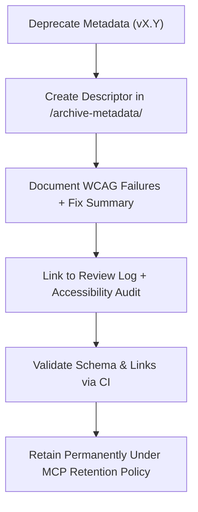

<div align="center">

# 🧾 Kansas Frontier Matrix — Deep Archive: Timeline Metadata Descriptors  
`docs/design/mockups/figma/components/timeline/metadata/archive/archive-metadata/README.md`

**Mission:** Manage and preserve **deep-archive metadata descriptors**  
for all **Timeline components** (bars, markers, zooms, and playback controls)  
within the **Kansas Frontier Matrix (KFM)** design system — ensuring  
long-term accessibility, version lineage, and MCP-grade documentation fidelity.

[](../../../../../../../../)
[](../../../../../../../../)
[](../../../../../../../../../)
[](../../../../../../../../../LICENSE)

</div>

---

## 🎯 Purpose

The `/archive-metadata/` directory holds **final provenance descriptors** for  
archived timeline component metadata, capturing design lineage, accessibility  
status, and linked review history.  

These descriptors serve as immutable historical records documenting:
- Accessibility audit outcomes and WCAG 2.1 checkpoints.  
- Reasons for deprecation and version succession.  
- Figma source and design provenance.  
- Links to audits, exports, and MCP review logs.  

They ensure reproducibility across all timeline iterations within the  
Kansas Frontier Matrix and form part of the permanent MCP accessibility record.

---

## 🧭 Directory Structure

```text
docs/design/mockups/figma/components/timeline/metadata/archive/archive-metadata/
├── README.md                                 # Index (this file)
├── timeline_bar_v1.9.yml                     # Deep archive descriptor (Timeline Bar)
├── timeline_marker_v1.4.yml                  # Deep archive descriptor (Timeline Marker)
└── timeline_zoom_v1.0.yml                    # Deep archive descriptor (Zoom Control)
````

---

## 🧩 YAML Descriptor Schema

Each deep archive YAML descriptor must follow this structure:

```yaml
id: timeline_bar_v1.9
title: Timeline Bar (v1.9)
archived_on: 2025-10-07
archived_by: accessibility.team
status: deprecated
replaced_by: ../../../../metadata/timeline_bar_v2.0.yml
figma_source: https://www.figma.com/file/KFM_TIMELINE_DOCS/Component-Library?node-id=300%3A400
reason: >
  Deprecated due to insufficient focus contrast and inconsistent keyboard tab sequencing.
  Version 2.0 reintroduced focus outlines and improved data sync performance.
accessibility_issues:
  - Focus indicators failed 3:1 minimum contrast ratio.
  - Timeline scroll zone lacked proper `aria-role`.
  - Event clustering overlapped markers at small resolutions.
wcag_criteria:
  - 1.4.3 Contrast (Minimum)
  - 2.1.1 Keyboard Navigation
  - 2.4.7 Focus Visible
linked_review: ../../../../../../../../reviews/2025-09-30_timeline_bar_v1.9.md
linked_audit: ../../../../accessibility-reports/archive/timeline_bar_v1.9_team_audit.md
linked_export: ../../../../../exports/archive/timeline_bar_v1.9.png
license: CC-BY-4.0
notes: >
  This record maintains MCP provenance for Timeline Bar v1.9 and documents all
  accessibility remediations implemented in v2.0.
```

---

## 🧮 Archival Descriptor Workflow



<!-- END OF MERMAID -->

**Workflow Summary**

1. When a timeline component metadata file is deprecated, generate a YAML descriptor in `/archive-metadata/`.
2. Annotate accessibility issues, WCAG criteria, and reasons for replacement.
3. Cross-link review logs, accessibility audits, and replacement versions.
4. Validate syntax and link structure using CI pipelines.
5. Retain permanently under MCP archival retention and audit review.

---

## ♿ Accessibility Regression Record (Example)

| WCAG Ref                     | v1.9 Result | v2.0 Result | Status  |
| :--------------------------- | :---------- | :---------- | :------ |
| 1.4.3 Contrast (Minimum)     | 3.9 : 1     | 4.8 : 1     | ✅ Fixed |
| 2.1.1 Keyboard Accessibility | Partial     | Full        | ✅ Fixed |
| 2.4.7 Focus Visible          | Fail        | Pass        | ✅ Fixed |
| 4.1.2 ARIA Role Accuracy     | Partial     | Full        | ✅ Fixed |

---

## 🧩 Example Descriptor — Marker (v1.4)

```yaml
id: timeline_marker_v1.4
title: Timeline Marker Component (v1.4)
archived_on: 2025-10-07
archived_by: accessibility.team
status: deprecated
replaced_by: ../../../../metadata/timeline_marker_v1.5.yml
figma_source: https://www.figma.com/file/KFM_TIMELINE_DOCS/Component-Library?node-id=400%3A320
reason: >
  Deprecated after accessibility testing revealed focus inconsistencies and tooltip text
  contrast failures under light mode. Fixed in v1.5 via updated hover state tokens.
accessibility_issues:
  - Hover and active tooltip text below contrast ratio 4.5 : 1.
  - Focus indicator color not visible in high-contrast mode.
wcag_criteria:
  - 1.4.3 Contrast (Minimum)
  - 2.4.7 Focus Visible
linked_review: ../../../../../../../../reviews/2025-09-28_timeline_marker_v1.4.md
linked_audit: ../../../../accessibility-reports/archive/timeline_marker_v1.4_team_audit.md
linked_export: ../../../../../exports/archive/timeline_marker_v1.4.png
license: CC-BY-4.0
notes: >
  Timeline Marker v1.4 remains archived as a case study in accessibility remediation.
  Version 1.5 passed WCAG 2.1 AA validation and MCP audit verification.
```

---

## 🧾 CI Validation Rules

| Validation                 | Tool                     | Description                                       |
| :------------------------- | :----------------------- | :------------------------------------------------ |
| **YAML Schema Validation** | `yamllint`, `jsonschema` | Ensures field completeness and correct structure. |
| **WCAG Reference Format**  | Regex (`^\d\.\d+\.\d+$`) | Verifies proper WCAG checkpoint syntax.           |
| **Cross-Link Integrity**   | `validate_links.py`      | Confirms referenced files exist.                  |
| **License Compliance**     | Pre-commit Hook          | Ensures `CC-BY-4.0` license present.              |
| **Replacement Path Check** | CI Automation            | Confirms replacement metadata file exists.        |

---

## 🧠 Governance & Retention Policy

| Action                    | Frequency  | Responsible          | Output                       |
| :------------------------ | :--------- | :------------------- | :--------------------------- |
| Descriptor Validation     | Continuous | CI Bot               | Build log                    |
| Metadata Integrity Review | Quarterly  | `design.board`       | YAML compliance summary      |
| Accessibility Trend Audit | Annual     | `accessibility.team` | WCAG improvement report      |
| Permanent Retention       | Always     | Maintainers          | Immutable MCP Archive Record |

---

## 🧩 Related Documentation

* [`../README.md`](../README.md) — Archived timeline metadata schema
* [`../../README.md`](../../README.md) — Active timeline metadata overview
* [`../../../../README.md`](../../../../README.md) — Timeline component documentation
* [`../../../../../accessibility-reports/archive/README.md`](../../../../../accessibility-reports/archive/README.md) — Archived timeline accessibility reports
* [`../../../../../../../../ui-guidelines.md`](../../../../../../../../ui-guidelines.md) — Accessibility design principles
* [`../../../../../../../../style-guide.md`](../../../../../../../../style-guide.md) — Design tokens and visual consistency rules
* [`../../../../../../../../reviews/`](../../../../../../../../reviews/) — MCP review logs

---

<div align="center">

### 🧾 “Documentation is preservation —

each archived record keeps the path to accessibility open.”
**— Kansas Frontier Matrix Accessibility & Design Governance Council**

</div>
