<div align="center">

# 🧾 Kansas Frontier Matrix — Figma Exports  
`docs/design/mockups/figma/exports/README.md`

**Mission:** Document, version, and validate all **exported design assets**  
from [Figma](https://www.figma.com/) that visually define the Kansas Frontier Matrix (KFM)  
interface, storytelling layouts, and accessibility-approved components.

[](../../)
[](../../)
[](../../../)
[](../../../../LICENSE)

</div>

---

## 🎯 Purpose

The `/docs/design/mockups/figma/exports/` directory holds **finalized visual exports**  
from the KFM Figma projects documented in [`source-links.md`](../source-links.md).  

Each exported asset represents:
- A **snapshot of a design state** (UI, map, timeline, or component).  
- A **reviewed and approved visual** ready for integration or reference.  
- A **record of accessibility and design compliance** per MCP standards.  

Exports include static images, vector assets, or printable diagrams used in:
- Documentation (`/docs/design/` and `/docs/integration/`)  
- Front-end development handoff  
- Public presentations or publications  

---

## 🧭 Directory Structure

```text
docs/design/mockups/figma/exports/
├── README.md                     # Index (this file)
├── timeline_v2.0_barta.png       # Timeline redesign (approved)
├── map_legend_v1.3_ryan.svg      # Map legend + layer toggle design
├── assistant_drawer_v1.1_team.pdf # AI Assistant panel layout
├── accessibility_darkmode_v1.2.png # Contrast testing frame
└── archive/                      # Deprecated or superseded exports
````

---

## 🧩 File Naming Standard

All export filenames must follow this convention:

```
<feature>_<version>_<author>.<ext>
```

**Examples:**

```
timeline_v2.0_barta.png
map_overlay_v1.1_team.svg
ai_drawer_v1.3_figma.pdf
```

### Supported Formats

| Format | Use Case                                  | Notes                                                |
| :----- | :---------------------------------------- | :--------------------------------------------------- |
| `.png` | Screen-ready visuals                      | Use for documentation and changelogs.                |
| `.svg` | Scalable icons and diagrams               | Keep minimal; test in browsers for rendering parity. |
| `.pdf` | High-resolution exports for presentations | Flatten layers; embed fonts.                         |
| `.jpg` | Optional for previews only                | Avoid unless rasterization is required.              |

---

## 🧾 Metadata Template

Each export must have a corresponding YAML or Markdown metadata block,
stored as `<filename>.yml` or in an accompanying `README` section.

```yaml
id: timeline_v2.0_barta
title: Timeline UI (v2.0)
author: andy.barta
date: 2025-10-06
source_figma: https://www.figma.com/file/ABCDE12345/KFM-Timeline
description: >
  Redesigned timeline slider with improved contrast, accessible focus states,
  and adaptive spacing for high-DPI screens.
status: approved
accessibility:
  contrast: passed
  keyboard_focus: simulated
  motion_safe: true
review_log: ../../../reviews/2025-10-06_timeline_v2.0_figma.md
license: CC-BY-4.0
related_docs:
  - ../../ui-guidelines.md
  - ../../style-guide.md
  - ../../interaction-patterns.md
```

---

## 🧮 Export Workflow

```mermaid
flowchart TD
    A["Design in Figma\n(source project)"] --> B["Run Accessibility Audit\n(contrast · focus · colorblind)"]
    B --> C["Export Visuals\nPNG · SVG · PDF"]
    C --> D["Annotate Metadata\n(YAML / Markdown)"]
    D --> E["Design Review Board Approval"]
    E --> F["Commit to Repository\n(mockups/figma/exports/)"]
    F --> G["Archive Previous Version\n(if superseded)"]
```



<!-- END OF MERMAID -->

**Step-by-step:**

1. 🎨 **Design Export** – From Figma, select frames or components, export as PNG/SVG/PDF.
2. ♿ **Accessibility Check** – Validate color contrast, focus state, and reduced-motion compliance.
3. 🧾 **Annotate Metadata** – Add YAML header and update `source-links.md`.
4. 🔍 **Review** – Submit for review in `/docs/design/reviews/`.
5. 📦 **Commit** – Store export in this directory, archive previous versions if replaced.

---

## 🧠 Accessibility Guidelines for Visual Assets

| Requirement             | Description                                                 | Tool                                                                              |
| :---------------------- | :---------------------------------------------------------- | :-------------------------------------------------------------------------------- |
| **Contrast Ratio**      | Minimum 4.5:1 for all text/interactive elements.            | [Able Plugin](https://www.figma.com/community/plugin/733159460536249875/Contrast) |
| **Colorblind Preview**  | Verify readability in Deuteranopia, Protanopia, Tritanopia. | Figma simulator.                                                                  |
| **Keyboard Simulation** | Check prototype tab flow and focus outlines.                | Figma prototype review.                                                           |
| **Reduced Motion**      | Avoid parallax or auto-scroll effects.                      | Motion Audit in Figma preview.                                                    |
| **Alt Text**            | Add captions or labels for each visual export.              | Markdown or metadata entry.                                                       |

---

## 🧩 Version Control & Archival

| Action                  | Location                  | Description                                         |
| :---------------------- | :------------------------ | :-------------------------------------------------- |
| **New Export**          | `/exports/`               | Active version; metadata marked `status: approved`. |
| **Deprecated Version**  | `/exports/archive/`       | Retained for historical record.                     |
| **Rejected Drafts**     | Not committed             | Stored in personal workspace until revision.        |
| **Accessibility Fails** | `/accessibility-reports/` | Kept for audit and improvement tracking.            |

Each archive entry should retain original file, metadata, and review log reference.

---

## 🧾 Example Entry

**File:** `ai_drawer_v1.1_team.pdf`
**Description:**

> Revised AI assistant chat layout featuring a non-modal drawer interface,
> improved text contrast, and “Ask AI” floating button in the footer region.
> Tested in Figma for dark/light mode compliance.

**Linked Docs:**

* [`../../interaction-patterns.md`](../../interaction-patterns.md)
* [`../../style-guide.md`](../../style-guide.md)
* [`../../../reviews/`](../../../reviews/)

---

## 🧮 Change Management Log

| Version | Date       | Reviewer             | Status      | Notes                                          |
| :------ | :--------- | :------------------- | :---------- | :--------------------------------------------- |
| v2.0    | 2025-10-06 | `ui_researcher`      | ✅ Approved  | Updated for 4K scaling; WCAG 2.1 verified.     |
| v1.3    | 2025-09-29 | `accessibility.team` | ✅ Approved  | Reworked legend layout with higher contrast.   |
| v1.1    | 2025-09-15 | `design.board`       | ⚠️ Revision | Focus states inconsistent; re-export required. |

---

## 🧩 Related Documentation

* [`../README.md`](../README.md) — Overview of Figma mockups
* [`../source-links.md`](../source-links.md) — Master list of Figma projects
* [`../../ui-guidelines.md`](../../ui-guidelines.md) — UX structure and accessibility rules
* [`../../style-guide.md`](../../style-guide.md) — Typography and color token definitions
* [`../../../reviews/`](../../../reviews/) — Design review and provenance records

---

<div align="center">

### 🖼️ “An export is a moment in design history —

captured, verified, and reproducible forever.”
**— Kansas Frontier Matrix Design Team**

</div>
