<div align="center">

# 🗃️ Kansas Frontier Matrix — Archived Figma Exports  
`docs/design/mockups/figma/exports/archive/README.md`

**Mission:** Preserve and document **superseded or deprecated visual exports**  
from [Figma](https://www.figma.com/) used in the **Kansas Frontier Matrix (KFM)**.  
These archives ensure that all prior design states remain discoverable, reproducible,  
and accountable under the **Master Coder Protocol (MCP)**.

[](../../../)
[](../../../)
[](../../../../)
[](../../../../../LICENSE)

</div>

---

## 🎯 Purpose

The `/archive/` directory contains **previous versions of exported Figma visuals**  
that have been replaced by updated or approved iterations.  

These archives are not deleted — they serve as the **historical record** of KFM’s  
evolving design language and accessibility practices, providing reference for:
- Regression testing and comparison.
- Historical analysis of UI evolution.
- Provenance tracking for design decisions.  

All archived files must include:
- A **version number** and **deprecation reason**.  
- A link to the **new replacement asset** (if applicable).  
- A **review log reference** and **accessibility notes**.  

---

## 🧭 Directory Structure

```text
docs/design/mockups/figma/exports/archive/
├── README.md                             # Index (this file)
├── timeline_v1.9_barta.png               # Superseded timeline UI
├── map_legend_v1.2_ryan.svg              # Old legend layout (pre-WCAG review)
├── assistant_drawer_v1.0_team.pdf        # Deprecated assistant layout
└── archive-metadata/                     # YAML metadata entries for archived exports
````

---

## 🧩 Metadata Schema

Each archived export must include an accompanying metadata file
stored under `/archive-metadata/` using this YAML schema:

```yaml
id: timeline_v1.9_barta
title: Timeline UI (v1.9)
date_archived: 2025-10-06
archived_by: design.board
status: deprecated
reason: >
  Replaced by v2.0 with updated accessibility contrast and focus outlines.
replaced_by: ../../timeline_v2.0_barta.png
source_figma: https://www.figma.com/file/ABCDE12345/KFM-Timeline
accessibility_issues:
  - low contrast in inactive markers
  - no keyboard focus simulation
linked_review: ../../../reviews/2025-09-15_timeline_v1.9_figma.md
license: CC-BY-4.0
notes: >
  This version failed initial WCAG AA testing for hover state visibility
  but was used for early stakeholder demonstrations.
```

---

## 🧠 Archival Workflow

```mermaid
flowchart TD
    A["New Figma Export (Approved)"] --> B["Archive Old Version\n(status → deprecated)"]
    B --> C["Move File to /archive/"]
    C --> D["Add Metadata\n(archive-metadata/<id>.yml)"]
    D --> E["Reference Review Log\n(docs/design/reviews/)"]
    E --> F["Update README Links\nin /exports/ and /source-links.md"]
```



<!-- END OF MERMAID -->

**Workflow Summary**

1. 🔄 When a new export supersedes an existing file, move the previous one to `/archive/`.
2. 🧾 Create an archive metadata file with a clear reason and linked replacement.
3. ♿ If accessibility issues caused deprecation, list them explicitly.
4. 🪶 Update any docs (`exports/README.md`, `source-links.md`) referencing the old file.
5. 🗂️ Maintain full traceability in `/docs/design/reviews/`.

---

## 🧮 Versioning Policy

| Status         | Definition                                       | Action                                       |
| :------------- | :----------------------------------------------- | :------------------------------------------- |
| **Active**     | Current, approved design export.                 | Lives in `/exports/` with metadata.          |
| **Deprecated** | Replaced but still relevant historically.        | Moved to `/archive/` with metadata + notes.  |
| **Obsolete**   | No longer relevant or used; kept for provenance. | Stored in `/archive/` and marked `obsolete`. |

---

## 🧾 Example Archive Entry

**File:** `map_legend_v1.2_ryan.svg`
**Replaced by:** `map_legend_v1.3_ryan.svg`
**Archived:** 2025-10-05
**Reason:**

> Earlier version used insufficient color contrast (hover state 3.7:1) and lacked ARIA mapping in prototype.
> Updated version fixes these issues and implements tooltips for screen readers.

**Metadata File:** `archive-metadata/map_legend_v1.2_ryan.yml`

**Linked Docs:**

* [`../../../ui-guidelines.md`](../../../ui-guidelines.md)
* [`../../../style-guide.md`](../../../style-guide.md)
* [`../../../interaction-patterns.md`](../../../interaction-patterns.md)

---

## ♿ Accessibility Lessons Archive

Archived exports provide valuable lessons for iterative improvement.
Every archived item with accessibility issues must list the **specific WCAG checkpoint** that failed.

| Issue                  | WCAG Reference                    | Resolution in New Version                              |
| :--------------------- | :-------------------------------- | :----------------------------------------------------- |
| Low contrast text      | 1.4.3 Contrast (Minimum)          | Increased text color to `#1a1a1a` on light background. |
| Hidden focus indicator | 2.4.7 Focus Visible               | Added accent outline for keyboard navigation.          |
| Motion inconsistency   | 2.3.3 Animation from Interactions | Replaced animated hover with color tint.               |

---

## 🧩 Archival Review & Retention

| Task                 | Frequency                  | Responsible          |
| :------------------- | :------------------------- | :------------------- |
| Archive Audit        | Quarterly                  | `design.board`       |
| Metadata Validation  | CI (pre-commit hook)       | Automation Bot       |
| Accessibility Review | Annually                   | `accessibility.team` |
| Backup & Storage     | Continuous (Git versioned) | Repo Maintainers     |

---

## 🧭 Retrieval Guidelines

To reference an archived export:

1. Link to the relative path (e.g., `exports/archive/timeline_v1.9_barta.png`).
2. Include archive metadata reference and deprecation notes.
3. Do **not** reintroduce deprecated assets into active UI unless revalidated.
4. For research or documentation use, cite as:

> *Kansas Frontier Matrix Design Archive – “Timeline UI (v1.9)” by A. Barta, 2025. CC-BY-4.0.*

---

<div align="center">

### 🗃️ “Archiving preserves evolution —

each deprecated export is a footprint of design progress.”
**— Kansas Frontier Matrix Design Team**

</div>
