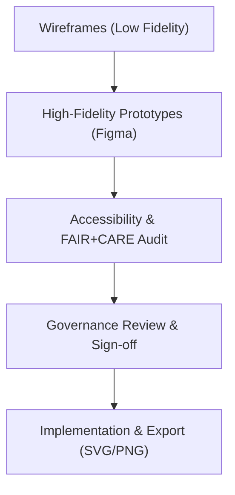

<div align="center">

# 🎨 **Kansas Frontier Matrix — High-Fidelity UI Prototypes (v2.1.1 · Tier-Ω+∞ Certified)**  
`docs/design/mockups/hi_fidelity/README.md`

**Mission:** Provide an auditable, FAIR+CARE-compliant archive of **high-fidelity UI mockups and Figma prototypes** for the  
**Kansas Frontier Matrix (KFM)** web interface, ensuring accessibility, governance, and reproducibility through design validation and version control.

[](../../../../docs/)
[](../../../../docs/standards/accessibility.md)
[](../../../../docs/standards/faircare-validation.md)
[](../../../../LICENSE)

</div>

---

## 📚 Overview

This directory hosts **high-fidelity (hi-fi) UI prototypes** used for final design validation, accessibility testing, and  
FAIR+CARE compliance verification before frontend implementation.  

Each design asset undergoes a full governance workflow:
1. Accessibility (WCAG 2.1 AA / 3.0 draft) testing.  
2. FAIR+CARE ethical evaluation for inclusivity and clarity.  
3. Provenance logging with SHA-256 checksum in the governance ledger.  

---

## 🗂️ Directory Layout

```bash
docs/design/mockups/hi_fidelity/
├── README.md                       # This file — hi-fi prototype governance guide
├── focus_mode_panel_v3.fig         # Final Focus Mode prototype
├── dashboard_overview_v2.fig       # Dashboard interface design
├── timeline_interface_v2.fig       # Time-based dataset visualization
└── metadata.yml                    # Governance and FAIR+CARE metadata registry
```

---

## ⚙️ Design Lifecycle


<!-- END OF MERMAID -->

---

## 🧩 Metadata Schema

Each Figma file is paired with a `.meta.yml` to document provenance, accessibility status, and ethics review.

```yaml
---
title: "Focus Mode Panel v3"
designer: "@kfm-ux"
reviewers: ["@kfm-accessibility","@kfm-governance"]
version: "v2.1.1"
date_created: "2025-11-10"
description: "High-fidelity UI design for Focus Mode with AI insights and map integration."
a11y_score: 98
faircare_score: 97
checksum: "sha256:54cfb7d31c1a2ee0a6d4f9eb52c8..."
license: "CC-BY 4.0"
status: "approved"
---
```

---

## 🧱 FAIR + CARE Integration

| Principle | Implementation | Validation |
|:--|:--|:--|
| **Findable** | All design assets indexed in manifest with metadata references. | `releases/v*/manifest.zip` |
| **Accessible** | Designs tested under WCAG 2.1 AA / 3.0 standards. | `design-validate.yml` |
| **Interoperable** | Design tokens align with the KFM design system. | `docs/design/standards/` |
| **Reusable** | Component-driven Figma structures support cross-project reuse. | Figma Libraries |
| **Collective Benefit (CARE)** | Culturally inclusive visuals and language. | FAIR+CARE Board Review |

---

## 🧠 Accessibility Review Standards

| Test | Requirement | Tool | Status |
|:--|:--|:--|:--:|
| **Contrast Ratio** | Minimum 4.5:1 for all text/UI elements. | Figma Contrast Checker | ✅ |
| **Keyboard Navigation** | Logical focus order with visual indicators. | axe-core + manual audit | ✅ |
| **Alt Text & Labels** | All imagery labeled and ARIA described. | Accessibility plugin | ✅ |
| **Localization Support** | Text layers tagged for i18n (EN, ES, OSA). | Figma i18n plugin | ✅ |
| **Animation Sensitivity** | Motion reviewed for vestibular comfort. | UX governance review | ✅ |

---

## 🔍 Governance Integration

| Workflow | Function | Output |
|:--|:--|:--|
| `design-validate.yml` | Runs accessibility and FAIR+CARE validation for Figma assets. | `reports/validation/design_validation.json` |
| `policy-check.yml` | Ensures license, authorship, and metadata compliance. | `reports/audit/policy_check.json` |
| `governance-ledger.yml` | Registers SHA-256 and FAIR+CARE review in ledger. | `data/reports/audit/ui_governance_ledger.json` |

---

## 🧾 Example Governance Record

```json
{
  "prototype_id": "focus_mode_panel_v3",
  "designer": "@kfm-ux",
  "version": "v2.1.1",
  "checksum": "sha256:54cfb7d31c1a2ee0a6d4f9eb52c8...",
  "a11y_score": 98,
  "faircare_compliance": true,
  "review_date": "2025-11-15T18:30:00Z",
  "status": "approved"
}
```

---

## 🧩 Integration with Frontend Development

All approved hi-fi prototypes map directly to **React components** in the web application:
- `FocusModePanel` → `/web/src/components/focus/FocusModePanel.tsx`  
- `TimelineController` → `/web/src/components/timeline/TimelineController.tsx`  
- `DashboardHeader` → `/web/src/components/layout/Header.tsx`  

Design-to-code traceability is tracked through commit hashes and ledger records.

---

## 🧾 Version History

| Version | Date | Author | Summary |
|:--|:--|:--|:--|
| **v2.1.1** | 2025-11-16 | @kfm-ux | Added metadata schema, governance record structure, and accessibility review summary. |
| v2.0.0 | 2025-10-25 | @kfm-docs | Introduced FAIR+CARE validation workflow mapping. |
| v1.0.0 | 2025-10-04 | @kfm-architecture | Initial hi-fidelity design documentation for governance archive. |

---

<div align="center">

**Kansas Frontier Matrix © 2025**  
*“Precision in Pixels — Provenance in Design.”*  
📍 `docs/design/mockups/hi_fidelity/README.md` — High-fidelity UI prototype and governance documentation for the Kansas Frontier Matrix.

</div>

