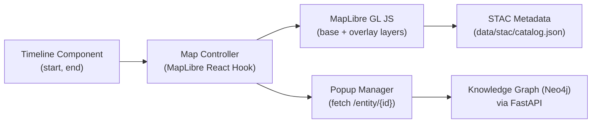
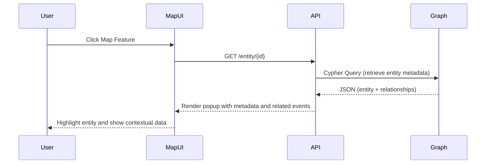

<div align="center">

# 🗺️ Kansas Frontier Matrix — Map Interface  
`docs/design/mockups/map/`

**Spatial · Interactive · Time-Aware Exploration**

[](../../../../docs/)  
[](../../../../docs/design/)  
[](./figma-refs.json)  
[](../../../../LICENSE)

</div>

---

## 🎯 Purpose

The **Map Interface** is the visual and interactive foundation of the Kansas Frontier Matrix (KFM),  
linking geography, time, and knowledge. It allows users to explore **Kansas’s historical, cultural, and environmental narratives** through an integrated map synchronized with the **timeline** and **knowledge graph**.

Design principles include:
- 🌎 **Interactive:** Zoom, pan, and toggle thematic layers dynamically.  
- 🕰 **Temporal:** Filter and synchronize map layers with the timeline scrubber.  
- 🧭 **Contextual:** Integrate AI summaries and provenance links in popups.  
- ♿ **Accessible:** Fully keyboard navigable, ARIA-labeled, and WCAG 2.1 AA-compliant.  
- 🔄 **Reproducible:** STAC-driven configuration ensures consistent spatial layer management.

---

## 🧭 Key Features

| Feature | Description | Implementation |
|----------|-------------|----------------|
| 🗺 **Dynamic Layers** | Toggle historical base maps, hydrology, boundaries, or events. | STAC-driven configuration (`layers.json`) |
| 🕰 **Timeline Sync** | Map automatically filters to selected time range. | React context hook emitting `{start, end}` to MapLibre sources. |
| 🔍 **Entity Highlights** | Click on a feature to zoom and outline geometry. | MapLibre `feature-state` updates and focus ring. |
| 📜 **Tooltips & Popups** | Display entity metadata and AI summaries inline. | Markdown-rendered popups via `/entity/{id}`. |
| 🧩 **Basemap Modes** | Switch between terrain, sepia, and dark/light themes. | MapLibre GL style switcher dropdown. |
| ♿ **Accessibility** | Full keyboard and ARIA-compliant control set. | Focus management and `tabindex` navigation. |

---

## 🗂️ Directory Layout

```text
docs/design/mockups/map/
├── README.md                  # This documentation file
├── wireframes/                # Figma exports for interface layouts
│   ├── map-main-view.png
│   ├── layer-controls.svg
│   ├── popup-preview.png
│   └── timeline-linked-map.svg
├── icons/                     # Map control icons (zoom, locate, basemap)
│   ├── icon-locate.svg
│   ├── icon-layers.svg
│   ├── icon-map-style.svg
│   └── checksums.txt
├── thumbnails/                # Thumbnail previews for documentation
│   ├── map-overview-thumb.png
│   └── popup-thumb.png
└── figma-refs.json            # Figma node reference metadata
````

---

## 🧩 System Integration



The map interface synchronizes with both **timeline filters** and the **knowledge graph** backend, ensuring
spatial and temporal data stay in sync across events, entities, and historical datasets.

---

## 🧠 Layer Taxonomy

| Category           | Example Layer                   | Format              | Source                                |
| ------------------ | ------------------------------- | ------------------- | ------------------------------------- |
| **Base Maps**      | USGS Kansas Topographic (1880s) | GeoTIFF (COG)       | `data/stac/items/usgs_topo_1880.json` |
| **Boundaries**     | County & Treaty Lines           | GeoJSON             | `data/stac/items/treaty_1854.json`    |
| **Hydrology**      | Rivers, Lakes, Aquifers         | GeoJSON / Shapefile | `data/sources/hydro/`                 |
| **Infrastructure** | Railroads, Trails               | GeoJSON             | `data/sources/transport/`             |
| **Events**         | Tornado Tracks, Flood Zones     | CSV → GeoJSON       | `data/sources/hazards/`               |

> All spatial layers are indexed via **STAC (SpatioTemporal Asset Catalog)** in `data/stac/catalog.json`,
> enabling auto-discovery and standardization across the KFM data ecosystem.

---

## 🎨 Design Tokens

| Token             | Example            | Purpose                            |
| ----------------- | ------------------ | ---------------------------------- |
| `--kfm-map-bg`    | `#0b1020`          | Map background (dark mode)         |
| `--kfm-highlight` | `#4F9CF9`          | Active entity border highlight     |
| `--kfm-water`     | `#3BA2E0`          | River and lake coloring            |
| `--kfm-hillshade` | `rgba(0,0,0,0.15)` | Elevation shading overlay          |
| `--kfm-legend-bg` | `#ffffffd9`        | Semi-transparent legend background |

Design tokens align with the global palette defined in `web/src/styles/tokens.css` and ensure consistent cross-theme visuals.

---

## 🧾 Interaction Flow



This real-time workflow connects **user interaction → API → Knowledge Graph**, providing
live contextual details while maintaining synchronization with the timeline range.

---

## ♿ Accessibility & Usability

| Accessibility Requirement | Implementation                                                  |
| ------------------------- | --------------------------------------------------------------- |
| **Keyboard Navigation**   | `Tab`, `Shift+Tab`, `Enter` navigate and activate map controls. |
| **ARIA Labels**           | Applied to all icons and map controls for screen readers.       |
| **Color Contrast**        | All text ≥ 4.5:1, icons ≥ 3:1 (measured in Figma).              |
| **Focus States**          | High-visibility outlines for map markers and buttons.           |
| **Responsive Layouts**    | Collapsible map control panel for screens ≤ 768 px.             |

Accessibility audits are conducted using **axe-core**, verified in **CI**, and tracked via design metadata.

---

## 🧾 Provenance & Integrity

| Asset                     | Figma Node           | Exported   | SHA-256        |
| ------------------------- | -------------------- | ---------- | -------------- |
| `map-main-view.png`       | `figma://node/44:18` | 2025-09-30 | `sha256-3d7a…` |
| `layer-controls.svg`      | `figma://node/44:21` | 2025-09-30 | `sha256-19cd…` |
| `popup-preview.png`       | `figma://node/44:25` | 2025-09-30 | `sha256-f24e…` |
| `timeline-linked-map.svg` | `figma://node/44:28` | 2025-09-30 | `sha256-7ae9…` |

Checksums are validated in CI pipelines to guarantee integrity, reproducibility, and MCP compliance.

---

## 🧮 CI/CD Integration

| Stage | Action               | Validation Target                      |
| ----- | -------------------- | -------------------------------------- |
| **1** | Schema Validation    | `map_wireframes_metadata.json`         |
| **2** | File Integrity       | SHA-256 checksum verification          |
| **3** | Accessibility Review | Contrast and ARIA validation           |
| **4** | Provenance Trace     | Figma → Commit → Export lineage        |
| **5** | Publication          | Documentation deployment to MCP portal |

---

## 📚 Related References

* [🧭 Navigation Components](../figma/components/navigation/README.md)
* [🪶 Panels & Detail Views](../panels/README.md)
* [🧱 Web UI Architecture](../../../../architecture/web_ui_architecture_review.md)
* [🧩 System Architecture](../../../../architecture/README.md)
* [🎨 Design Tokens](../../../../design/reviews/accessibility/README.md)

---

<div align="center">

### Kansas Frontier Matrix — Documentation-First Design

**Spatial Intelligence · Temporal Context · Provenance Integrity**

</div>
