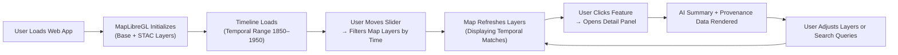

<div align="center">

# 🗺️ Kansas Frontier Matrix — Map Wireframes  
`docs/design/mockups/map/wireframes/`

**Interactive · Temporal · Spatial · Intuitive**

[](../../../../..)  
[](../../../../..)  
[](../../../../..)  
[](../../../../../LICENSE)

</div>

---

## 🧭 Overview

This directory contains **wireframes and interaction blueprints** for the **Map Interface** within the Kansas Frontier Matrix (KFM) web application.  
These designs define how users navigate and explore Kansas’s geography, history, and environment through a unified, **spatially and temporally aware interface**.

Each wireframe visualizes:
- 🗺️ Map layout and toolbar regions (zoom, legend, layer toggles).  
- 🕰️ Timeline overlay and synchronization logic.  
- 🔍 Search and filter controls for geospatial and thematic queries.  
- 🧩 Contextual Detail Panels and AI Summaries.  
- 🎨 Responsive adaptation for desktop, tablet, and mobile.  
- ♿ Accessibility via keyboard controls, color contrast, and ARIA attributes.  

---

## 🗂️ Directory Layout

```text
docs/design/mockups/map/wireframes/
├── README.md                     # This file
├── map_wireframes_v1.fig          # Figma source file
├── exports/                       # Image exports for documentation
│   ├── map_ui_default.png         # Default desktop layout
│   ├── map_ui_mobile.png          # Mobile map-first interface
│   └── timeline_overlay.png       # Combined timeline/map overlay
└── thumbnails/                    # Thumbnail previews
    └── map_wireframe_thumb.png
````

---

## 🧩 Design System Integration

These wireframes map directly to the **MapLibre GL** viewer described in
the [Web UI Architecture](../../../../architecture/web_ui_architecture_review.md).

| UI Region                  | React Component       | Description                                                     |
| -------------------------- | --------------------- | --------------------------------------------------------------- |
| 🗺 **Map Canvas**          | `MapView.tsx`         | Core MapLibre instance rendering base + overlay layers.         |
| 🧭 **Layer Control Panel** | `LayerControls.tsx`   | Toggles visibility and style of STAC-driven map layers.         |
| 🕰 **Timeline Overlay**    | `TimelineOverlay.tsx` | Links temporal filters from the timeline to map display.        |
| 📜 **Detail Panel**        | `DetailPanel.tsx`     | Shows entity metadata, sources, and AI-generated summaries.     |
| 🔍 **Search Bar**          | `SearchBar.tsx`       | Performs entity lookup and highlights features on map/timeline. |
| 💬 **AI Assistant**        | `AssistantPanel.tsx`  | Conversational interface for exploring the knowledge graph.     |

All map layers represented in these wireframes correspond to **STAC Items** (`data/stac/items/*.json`)
and are configured via `web/config/layers.json` for reproducible data visualization.

---

## 🎨 Visual Specifications

| Element               | Purpose                        | Example Style                                      |
| --------------------- | ------------------------------ | -------------------------------------------------- |
| **Base Map**          | Background geography           | Land `#EAEAEA`, Water `#C4D7E0`                    |
| **Active Layer**      | Highlight selected data themes | Hydrology `#3A86FF`, Treaties `#FFADAD`            |
| **Temporal Filter**   | Show timeline overlay          | D3-driven Canvas with range slider                 |
| **Popups / Tooltips** | Display entity metadata        | Rounded, translucent panels with shadow            |
| **Icons**             | Provide interaction controls   | Lucide-react icons (MapPin, Layers, Clock, Search) |

All visual variables reference tokens in `web/src/styles/tokens.css`.

---

## 🕹️ Interaction Flow



The interaction model ensures **spatial-temporal synchronization** —
every user action updates both **map visuals** and **timeline context** in real time.

---

## ♿ Accessibility & Responsiveness

| Accessibility Requirement | Implementation                                            |
| ------------------------- | --------------------------------------------------------- |
| **Keyboard Navigation**   | Tab, Enter, and Arrow keys control map tools and panels.  |
| **Color Contrast**        | WCAG 2.1 AA-compliant in light/dark themes.               |
| **ARIA Labels**           | All controls tagged with `aria-label` and semantic roles. |
| **Responsive Layouts**    | Breakpoints for adaptive UIs across devices.              |

**Responsive Breakpoints**

* ≥1200px → Full interface: map + timeline + side panel.
* 768–1199px → Collapsible or floating tool panels.
* ≤767px → Compact “map-first” mobile layout (timeline hidden by default).

Accessibility validation is handled via **axe-core** in CI pipelines.

---

## 🧾 Provenance & Workflow

| Step         | Description                                                      |
| ------------ | ---------------------------------------------------------------- |
| **Design**   | Wireframes created in Figma (`map_wireframes_v1.fig`).           |
| **Export**   | Exported to PNG/JPG via Figma for documentation.                 |
| **Link**     | Referenced in metadata (`map_wireframes_metadata.json`).         |
| **Validate** | Provenance + accessibility checks in CI workflows.               |
| **Iterate**  | Documentation-first loop — Document → Build → Validate → Refine. |

All updates increment the **semver** value in the front-matter for traceability.

---

## 🧮 Validation & CI Integration

| Stage | Process                  | Validation Target                        |
| ----- | ------------------------ | ---------------------------------------- |
| **1** | Schema Validation        | `map_wireframes_metadata.json`           |
| **2** | File Integrity           | SHA-256 checksum verification            |
| **3** | Accessibility Audit      | WCAG contrast + ARIA compliance          |
| **4** | Provenance Tracking      | Figma node IDs ↔ metadata linkage        |
| **5** | Documentation Publishing | Render verified wireframes in MCP portal |

---

## 📚 Related References

* [🗺 Map Interface Overview](../README.md)
* [🧭 Navigation Components](../../figma/components/navigation/README.md)
* [🪶 Panels & Detail Views](../../panels/README.md)
* [🧱 Web UI Architecture](../../../../architecture/web_ui_architecture_review.md)
* [♿ Accessibility Standards](../../../../design/reviews/accessibility/README.md)

---

<div align="center">

### Kansas Frontier Matrix — Documentation-First Design

**Spatial · Temporal · Accessible · Provenant**

</div>
