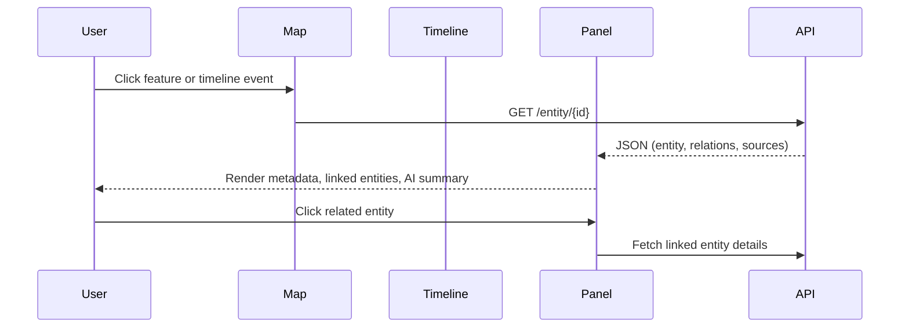

<div align="center">

# 🪶 Kansas Frontier Matrix — Panels & Detail Views  
`docs/design/mockups/panels/`

**Contextual · Interactive · Knowledge-Linked**

[](../../../../docs/)  
[](../../../../docs/design/)  
[](./figma-refs.json)  
[](../../../../LICENSE)

</div>

---

## 🎯 Purpose

The **Panel System** provides the **contextual detail views** within the Kansas Frontier Matrix (KFM) web interface.  
Panels are **dynamic, knowledge-linked modules** that present metadata, document excerpts,  
AI summaries, and relational information derived from the Knowledge Graph.  

These panels function as **interactive bridges** between the **map**, **timeline**, and **knowledge graph**,  
enabling seamless exploration of entities, places, events, and source materials.

Panels allow users to:
- View **entity or event details** fetched from `/entity/{id}`
- Read **document excerpts** with provenance links  
- See **cross-references, sources, and AI summaries**  
- Access **embedded media** (images, treaties, scanned maps)  
- Use **contextual filters and drill-down** interactions  

---

## 🧩 Panel Architecture

```mermaid
flowchart LR
  A["User Action\n(click on map/timeline)"] --> B["API Query\nGET /entity/{id}"]
  B --> C["Panel Renderer\nReact Component"]
  C --> D["Knowledge Graph\nNeo4j via FastAPI"]
  C --> E["AI Summary Service\nBART / T5 Model"]
  C --> F["STAC Links\nPreviewable Media"]
%% END OF MERMAID
````

Panels integrate structured data from the **Knowledge Graph**, **AI summary service**, and **STAC catalog**,
merging them into a unified, context-aware display.
Each panel type adapts to the selected entity or layer —
**Event Panels** highlight participants and timeframes,
**Place Panels** show maps and boundaries,
**Document Panels** display OCR text or scanned pages.

---

## 🗂️ Directory Layout

```text
docs/design/mockups/panels/
├── README.md                  # This documentation
├── wireframes/                # Figma exports for panel layouts
│   ├── entity-panel.png
│   ├── document-panel.svg
│   ├── place-panel.png
│   └── timeline-context.svg
├── thumbnails/                # Preview snapshots for documentation
│   ├── panel-thumb.png
│   └── document-thumb.png
└── figma-refs.json            # Figma node metadata and export hashes
```

Each export links back to its **Figma node reference** in `figma-refs.json` for full design traceability.

---

## 🧭 Panel Types

| Type                 | Description                                                        | Data Source                                             |
| -------------------- | ------------------------------------------------------------------ | ------------------------------------------------------- |
| **Entity Panel**     | Attributes and relationships for people, tribes, or organizations. | Neo4j node data (`Person`, `Organization`)              |
| **Event Panel**      | Displays event metadata, participants, and temporal range.         | Event nodes & relationships (`OCCURRED_AT`, `INVOLVED`) |
| **Place Panel**      | Combines map previews, coordinates, and historical boundaries.     | GeoJSON via STAC + place metadata                       |
| **Document Panel**   | Shows OCR text excerpts and scanned document previews.             | OCR output + NLP summaries                              |
| **AI Summary Panel** | Merges data insights across entities.                              | AI endpoint `/ask` or summarizer model                  |

---

## 🎨 Design Tokens

| Token                | Example             | Purpose                            |
| -------------------- | ------------------- | ---------------------------------- |
| `--kfm-panel-bg`     | `#ffffff / #0b1020` | Panel background (light/dark mode) |
| `--kfm-border-color` | `#d1d5db`           | Divider and outline elements       |
| `--kfm-accent`       | `#4F9CF9`           | Links and highlight text           |
| `--kfm-shadow`       | `rgba(0,0,0,0.15)`  | Panel elevation shadow             |
| `--kfm-radius`       | `1rem`              | Rounded corner radius              |

All design tokens are defined in `web/src/styles/tokens.css`
and synchronized across the entire KFM design system.

---

## 🧠 Interaction Flow



Panels enable recursive navigation through the Knowledge Graph —
users can follow entity links, timelines, and documents **without breaking context**.

---

## 🧾 Provenance & Integrity

| Asset                  | Figma Node           | Exported   | SHA-256        |
| ---------------------- | -------------------- | ---------- | -------------- |
| `entity-panel.png`     | `figma://node/50:10` | 2025-09-30 | `sha256-a4b2…` |
| `document-panel.svg`   | `figma://node/50:12` | 2025-09-30 | `sha256-d8f3…` |
| `timeline-context.svg` | `figma://node/50:15` | 2025-09-30 | `sha256-19ef…` |

Checksums are validated in CI pipelines for reproducibility under the **Master Coder Protocol**.

---

## ♿ Accessibility & Usability

Panels follow **WCAG 2.1 AA** guidelines for readability and interaction:

* Text contrast ≥ 4.5 : 1
* Keyboard navigability (`Tab` / `Shift + Tab`)
* ARIA roles (`role="region"`, `aria-labelledby`)
* Semantic headings and landmark regions
* Responsive design for breakpoints ≤ 768 px

Accessibility testing is automated via **axe-core** and manual Figma audit.

---

## 📚 Related References

* [🗺️ Map Interface](../map/README.md)
* [🧭 Navigation Components](../figma/components/navigation/README.md)
* [🤖 AI Assistant Design](../ai-assistant/README.md)
* [🧱 Web UI Architecture](../../../../architecture/web_ui_architecture_review.md)
* [🧩 System Architecture](../../../../architecture/README.md)

---

<div align="center">

### Kansas Frontier Matrix — Documentation-First Design

**Context · Connectivity · Accessibility · Provenance**

</div>
