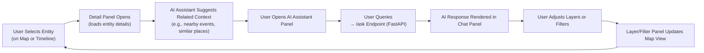

<div align="center">

# 🧩 Kansas Frontier Matrix — Panels Wireframes  
`docs/design/mockups/panels/wireframes/`

**Purpose:** Define the structure, behavior, and visual hierarchy of **panel-based components**  
for the Kansas Frontier Matrix (KFM) Web UI — including the **Detail Panel**, **AI Assistant Panel**,  
and **Layer/Filter Control Panels**.

[](../../../../..)  
[](../../../../..)  
[](../../../../..)  
[](../../../../../LICENSE)

</div>

---

## 🧭 Overview

This directory contains **wireframes and interaction blueprints** for the **KFM panel ecosystem**,  
which defines contextual, data-rich panels within the web application.  

Panels serve as **interactive detail views** connected to the **Map**, **Timeline**, and **Knowledge Graph**,  
displaying relationships, summaries, and AI-assisted insights without leaving the current context.

Design priorities include:
- 📊 **Information Hierarchy:** Structured sections separating metadata, AI summaries, and linked entities.  
- 🔍 **Context Awareness:** Panels adapt dynamically to selected entities, events, or map layers.  
- ⚙️ **Reproducibility:** Linked metadata and version control ensure consistent handoff from design to implementation.  
- ♿ **Accessibility:** Full keyboard, screen-reader, and responsive compliance (WCAG 2.1 AA).  

---

## 🗂️ Directory Layout

```text
docs/design/mockups/panels/wireframes/
├── README.md                      # This file
├── panel_wireframes_v1.fig         # Figma master for all panel wireframes
├── exports/                        # Wireframe image exports
│   ├── detail_panel_default.png
│   ├── ai_assistant_panel.png
│   ├── filter_layer_panel.png
│   └── mobile_stack_panel.png
└── metadata/                       # JSON metadata for each wireframe
    └── panel_wireframes_metadata.json
````

Each export links to its Figma node (via `figma-refs.json`) for validation, traceability, and change tracking.

---

## 🧱 Panel Types and Design Intent

| Panel Type                  | Description                                              | Key Interactions                                                   | Data Sources                          |
| --------------------------- | -------------------------------------------------------- | ------------------------------------------------------------------ | ------------------------------------- |
| **🧾 Detail Panel**         | Displays selected entity details (Person, Place, Event). | Scrollable; includes tabs for timeline, sources, and AI summaries. | Neo4j Knowledge Graph + STAC metadata |
| **🤖 AI Assistant Panel**   | Conversational interface for natural language queries.   | Text input + context suggestions; interactive chat.                | FastAPI `/ask` endpoint (LLM model)   |
| **🧭 Layer/Filter Panel**   | Manages dataset visibility, opacity, and time filters.   | Toggles, sliders, legends for temporal layers.                     | `web/config/layers.json`              |
| **🔍 Search/Results Panel** | Lists search results for entities or events.             | Hover to highlight related map/timeline elements.                  | `/search?q=` API endpoint             |
| **📱 Mobile Stack Panel**   | Responsive hybrid combining Detail and AI panels.        | Swipeable, collapsible; gesture-driven transitions.                | Composite of Detail + AI panel data   |

---

## 🧩 Wireframe Interaction Flow



The **panel ecosystem** provides a **closed interaction loop** — users can query, explore, and refine
context without navigating away from the current map or timeline view.

---

## 🎨 Visual Design Standards

| Element             | Font / Size            | Color Tokens                       | Behavior                          |
| ------------------- | ---------------------- | ---------------------------------- | --------------------------------- |
| **Header**          | Inter · 18px bold      | `--kfm-color-fg`, `--kfm-color-bg` | Persistent top anchor             |
| **Subsection Tabs** | Inter · 14px medium    | `--kfm-color-accent`               | Highlight active section          |
| **Content Body**    | Inter · 14px regular   | `--kfm-color-fg-muted`             | Scrollable with inertia           |
| **Divider Lines**   | 1px solid              | `--kfm-color-border`               | Always visible                    |
| **Icons**           | Lucide-react · 16–24px | `--kfm-color-icon`                 | ARIA-labeled, keyboard accessible |
| **Scrollbars**      | Minimal width          | `--kfm-color-scroll`               | Auto-hide on inactivity           |

> All variables reference `web/src/styles/tokens.css`, maintaining consistency with the KFM global design system.

---

## ♿ Accessibility & Responsiveness

Panels are validated against **WCAG 2.1 AA** criteria to ensure equitable user experience.

### Keyboard & Screen Reader

* Fully navigable via `Tab`, `Shift+Tab`, and `Enter`.
* ARIA roles applied to regions, headings, and buttons.
* Dynamic updates announced via `aria-live`.

### Responsive Layouts

| Viewport    | Behavior                                    |
| ----------- | ------------------------------------------- |
| ≥ 1200 px   | Dual-panel mode (Map + Detail + Assistant)  |
| 768–1199 px | Collapsible left/right panels               |
| ≤ 767 px    | Mobile “sheet stack” view (swipe or expand) |

---

## 🧾 Provenance & Validation

| Attribute           | Description                                   |
| ------------------- | --------------------------------------------- |
| **Design Source**   | `panel_wireframes_v1.fig` (Figma master file) |
| **Metadata Schema** | `schema/panel_wireframe.schema.json`          |
| **Thumbnails**      | Linked in `../thumbnails/metadata/`           |
| **Checksums**       | SHA-256 validation for each export            |
| **CI Workflows**    | `stac-validate.yml`, `jsonschema.yml`         |
| **MCP Compliance**  | Documented → Designed → Validated → Published |

**Manual validation example:**

```bash
python -m jsonschema -i metadata/panel_wireframes_metadata.json schema/panel_wireframe.schema.json
```

---

## 🧮 Integration Notes

| Integration Target      | Description                                 | Path                        |
| ----------------------- | ------------------------------------------- | --------------------------- |
| **Knowledge Graph API** | Supplies entity/event data.                 | `/api/entity/{id}`          |
| **AI Assistant**        | Handles contextual queries and summaries.   | `/api/ask`                  |
| **STAC Catalog**        | Links to geospatial and media assets.       | `/data/stac/*`              |
| **Design Tokens**       | Defines visual consistency for UI elements. | `web/src/styles/tokens.css` |

---

## 📚 Related References

* [🪶 Panels (Main Overview)](../README.md)
* [🗺️ Map Wireframes](../../map/wireframes/README.md)
* [🤖 AI Assistant Wireframes](../../ai-assistant/wireframes/README.md)
* [🧱 Web UI Architecture](../../../../architecture/web_ui_architecture_review.md)
* [♿ Accessibility Standards](../../../../design/reviews/accessibility/README.md)

---

<div align="center">

### Kansas Frontier Matrix — Documentation-First Design

**Context · Connectivity · Accessibility · Provenance**

</div>
