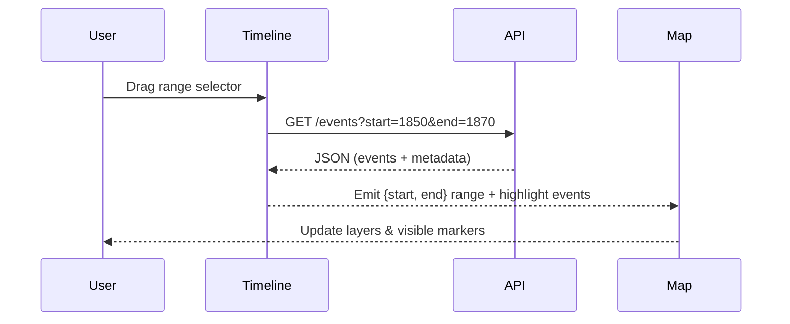

<div align="center">

# ⏳ Kansas Frontier Matrix — Timeline Interface  
`docs/design/mockups/timeline/`

**Temporal · Interactive · Synchronized with Map**

[](../../../../docs/)  
[](../../../../docs/design/)  
[](./figma-refs.json)  
[](../../../../LICENSE)

</div>

---

## 🎯 Purpose

The **Timeline Interface** forms the **temporal backbone** of the Kansas Frontier Matrix (KFM).  
It provides an **interactive, time-based control surface** that lets users explore events, entities, and spatial layers across history.  

Core capabilities:
- Drag-select historical periods using a **range scrubber**  
- Filter **map layers**, **entities**, and **datasets** by date  
- Animate through time with **playback controls**  
- Visualize **temporal clusters** (e.g., droughts, treaties, settlements)  
- Coordinate with the **AI Assistant** for time-bounded queries  

---

## 🧩 Architecture Overview

```mermaid
flowchart LR
  A["User Interaction\n(scrub · zoom · play)"]
    --> B["Timeline Component\n(Canvas + React Hook)"]
    --> C["API Request\nGET /events?start&end"]
    --> D["Knowledge Graph (Neo4j)\nTemporal Query (OWL-Time)"]
    --> E["Frontend Update\nMap · Detail Panels"]
  B --> F["Animation Loop\n(time-play)"]
%% END OF MERMAID
````

The component is implemented in **React** using **HTML5 Canvas** for smooth performance and **D3.js** for temporal scaling and binning.
Interactions emit `{ start, end }` events to synchronize visible layers and entities throughout the KFM UI.

---

## 🗂️ Directory Layout

```text
docs/design/mockups/timeline/
├── README.md                # This documentation
├── wireframes/              # Figma exports
│   ├── timeline-overview.png
│   ├── scrubber-control.svg
│   ├── event-markers.png
│   └── playback-controls.svg
├── thumbnails/              # Preview images
│   ├── timeline-thumb.png
│   └── controls-thumb.png
└── figma-refs.json          # Figma node IDs and export metadata
```

Each visual export is traceable to its Figma node via `figma-refs.json` for **version integrity** and **checksum validation**.

---

## 🧭 Key Features

| Feature                 | Description                                   | Implementation                                    |
| ----------------------- | --------------------------------------------- | ------------------------------------------------- |
| **Scrubber Handle**     | Drag to define visible time range             | Canvas event listeners (`mousedown`, `mousemove`) |
| **Event Markers**       | Visual pins for historical events or clusters | D3 temporal binning + Canvas draw loop            |
| **Playback Control**    | Play/pause animation through time             | React state + `requestAnimationFrame`             |
| **Zoom Levels**         | Multi-resolution views (decades → months)     | D3 temporal scale + adaptive tick density         |
| **Linked Highlighting** | Selecting event highlights linked map entity  | Shared React context with MapLibre                |

---

## 🎨 Design Tokens

| Token                   | Example                 | Purpose                      |
| ----------------------- | ----------------------- | ---------------------------- |
| `--kfm-timeline-bg`     | `#0b1020`               | Background color (dark mode) |
| `--kfm-timeline-accent` | `#4F9CF9`               | Marker and selection color   |
| `--kfm-timeline-range`  | `rgba(79,156,249,0.25)` | Active selection fill        |
| `--kfm-grid-line`       | `#cccccc40`             | Temporal grid lines          |
| `--kfm-font`            | `"Inter", sans-serif`   | Tick labels and captions     |

> Design tokens mirror definitions in `web/src/styles/tokens.css` and are validated during build using stylelint token audits.

---

## 🧠 Interaction Flow



The timeline synchronizes **temporal filtering**, **spatial rendering**, and **entity visibility** across the entire Frontier Matrix ecosystem.

---

## ♿ Accessibility & UX

| Element               | Accessibility Practice                                                 |
| --------------------- | ---------------------------------------------------------------------- |
| **Keyboard Controls** | ← / → to move range; space toggles play/pause                          |
| **ARIA Labels**       | `role="slider"` with `aria-valuemin`, `aria-valuemax`, `aria-valuenow` |
| **Color Contrast**    | All UI elements meet ≥ 4.5 : 1 ratio                                   |
| **Animation Safety**  | Playback limited ≤ 30 fps to prevent motion sickness                   |
| **Responsive Layout** | Collapses into single-bar scrubber on mobile                           |

> All interactions are tested using Axe DevTools and NVDA for compliance with WCAG 2.1 AA.

---

## 🔍 Provenance & Integrity

| Asset                   | Figma Node           | Exported   | SHA-256        |
| ----------------------- | -------------------- | ---------- | -------------- |
| `timeline-overview.png` | `figma://node/52:17` | 2025-09-30 | `sha256-81aa…` |
| `scrubber-control.svg`  | `figma://node/52:19` | 2025-09-30 | `sha256-3f92…` |
| `event-markers.png`     | `figma://node/52:22` | 2025-09-30 | `sha256-6aef…` |
| `playback-controls.svg` | `figma://node/52:25` | 2025-09-30 | `sha256-b9d3…` |

> All exports are validated in CI via SHA-256 checksum and linked commit metadata.

---

## 🧾 MCP Compliance

* **Stage:** Documented → Designed → Validated → Published
* **Design Source:** `figma/timeline_design_v1.fig`
* **Generated By:** Figma export workflow
* **Validated In:** `stac-validate.yml`, `jsonschema.yml`
* **License:** [CC-BY 4.0](../../../../LICENSE) (reuse with attribution)

---

## 📚 Related Documents

* [🗺️ Map Interface](../map/README.md)
* [🧭 Navigation Components](../figma/components/navigation/README.md)
* [🪶 Panels & Detail Views](../panels/README.md)
* [🤖 AI Assistant Design](../ai-assistant/README.md)
* [🧱 Web UI Architecture](../../../../architecture/web_ui_architecture_review.md)

---

<div align="center">

### Kansas Frontier Matrix — Documentation-First Design

*Temporal · Spatial · Narrative Synchronization*

</div>
