<div align="center">

# 🕰️ Kansas Frontier Matrix — Timeline Wireframes  
`docs/design/mockups/timeline/wireframes/`

**Purpose:** Define and document wireframe layouts for the **Timeline UI module** of the  
Kansas Frontier Matrix (KFM) — visualizing how time and story synchronize with the map,  
knowledge graph, and AI assistant panels.

[](../../../../..)  
[](../../../../..)  
[](../../../../..)  
[](../../../../../LICENSE)

</div>

---

## 🧭 Overview

The **Timeline component** is a cornerstone of the Kansas Frontier Matrix web interface.  
It enables users to traverse history dynamically — exploring **events, periods, and entities**  
through an interactive time slider synchronized with the **map**, **knowledge graph**, and **detail panels**.

This directory contains:
- 🎨 **Figma wireframes** defining layout and structure  
- 🖼️ **Exported previews** for visual reference  
- 🧾 **Metadata JSON** documenting accessibility, schema, and provenance compliance  

---

## 🗂️ Directory Layout

```text
docs/design/mockups/timeline/wireframes/
├── README.md                      # This file
├── timeline_wireframes_v1.fig      # Master Figma source for timeline layouts
├── exports/                        # Image exports of wireframes
│   ├── timeline_default.png
│   ├── timeline_condensed.png
│   ├── timeline_mobile.png
│   └── timeline_overlay_map.png
└── metadata/                       # JSON metadata for each wireframe
    └── timeline_wireframes_metadata.json
````

---

## 🧱 Design Goals

| Objective                   | Description                                                                               |
| --------------------------- | ----------------------------------------------------------------------------------------- |
| 🕰️ **Temporal Navigation** | Users should scroll or zoom across years, decades, or centuries smoothly.                 |
| 🗺️ **Map Synchronization** | The timeline’s range filters data shown on the map (via STAC temporal metadata).          |
| 📑 **Event Representation** | Each event node or span should link to a KFM Knowledge Graph entity (type, date, source). |
| 🎞️ **Storytelling Mode**   | Support animated playback of events using a scrubber-based “story mode.”                  |
| ⚙️ **Flexibility**          | Adaptable to multiple datasets (historical eras, environmental, cultural, etc.).          |
| ♿ **Accessibility**         | Fully keyboard navigable and WCAG 2.1 AA color-contrast compliant.                        |

---

## 🧩 Key Components (UI Regions)

| Component                 | Function                                                           | React Module           |
| ------------------------- | ------------------------------------------------------------------ | ---------------------- |
| **TimelineCanvas**        | Renders years, ticks, and event nodes via Canvas or D3.js.         | `TimelineCanvas.tsx`   |
| **TimelineRangeSelector** | Enables range selection and zoom (drag handles).                   | `RangeSelector.tsx`    |
| **TimelinePlayControls**  | Play, step, and pause controls for animation.                      | `TimelineControls.tsx` |
| **EventTooltip / Popup**  | Displays brief summaries for hovered or selected events.           | `EventTooltip.tsx`     |
| **PeriodBands**           | Colored overlays for historical eras (linked to PeriodO ontology). | `PeriodBands.tsx`      |

---

## 🕹️ Interaction Flow

```mermaid
flowchart LR
  A["User Loads Page"] --> B["Timeline Initializes\n(loads events via API)"]
  B --> C["Map Syncs to Initial Time Range"]
  C --> D["User Scrolls or Zooms Timeline"]
  D --> E["Visible Range Updates"]
  E --> F["Map and Panels Refresh\n(Filtered Events Displayed)"]
  F --> G["User Clicks Event Node"]
  G --> H["Detail Panel Opens\nLinked Data Fetched"]
  H --> I["User Activates Play Controls"]
  I --> J["Timeline Animates Over Period\n(Evolving Data Layers)"]
  J --> C
%% END OF MERMAID
```



---

## 🎨 Visual Design Standards

| Element              | Font / Size                 | Color Tokens                                                                   | Notes                                      |
| -------------------- | --------------------------- | ------------------------------------------------------------------------------ | ------------------------------------------ |
| **Year Labels**      | Inter 12–14px               | `--kfm-color-fg-muted`                                                         | Remain visible at all zoom levels          |
| **Event Nodes**      | Circle (6–10px)             | Thematic colors (`--kfm-color-accent-war`, `--kfm-color-accent-climate`, etc.) | Tooltip-enabled                            |
| **Era Bands**        | Semi-transparent rectangles | Light tints per PeriodO ID                                                     | Indicate historical eras                   |
| **Background**       | Neutral gray gradient       | `#F5F6F7`                                                                      | Maintains clarity in both light/dark modes |
| **Playback Buttons** | Icon-only, 20–24px          | `--kfm-color-primary`                                                          | ARIA-labeled, keyboard-accessible          |

---

## ♿ Accessibility & Responsiveness

**Keyboard Support**

* ← / → : Step backward or forward
* * / – : Zoom in or out
* Space : Play / pause animation

**ARIA Labels**

* All interactive elements include roles (e.g. `role="slider"`)
* Dynamic values via `aria-valuemin`, `aria-valuemax`, `aria-valuenow`

**Contrast & Responsiveness**

* Minimum contrast ratio **≥ 4.5:1** verified for text/icons
* Responsive breakpoints:

  * ≥1200px → full timeline with controls
  * 768–1199px → collapsible controls
  * ≤767px → compact vertical timeline (mobile mode)

---

## 🧾 Provenance & Validation

| Category                 | Details                                                   |
| ------------------------ | --------------------------------------------------------- |
| **Design Source**        | `timeline_wireframes_v1.fig`                              |
| **Metadata Schema**      | `schema/timeline_wireframe.schema.json`                   |
| **Export Checksums**     | `../thumbnails/metadata/checksums.sha256`                 |
| **Validation Pipelines** | `jsonschema.yml` & `stac-validate.yml` (CI/CD automation) |

**Manual Validation Example**

```bash
python -m jsonschema -i metadata/timeline_wireframes_metadata.json schema/timeline_wireframe.schema.json
```

---

## 🧮 Linked Standards

| Domain                   | Standard                                        |
| ------------------------ | ----------------------------------------------- |
| ⏳ Temporal Ontology      | [W3C OWL-Time](https://www.w3.org/TR/owl-time/) |
| 🗓️ Historical Periods   | [PeriodO Gazetteer](https://perio.do)           |
| 🏺 Cultural Context      | [CIDOC CRM](https://www.cidoc-crm.org)          |
| 🗺️ Geospatial Alignment | [STAC 1.0.0](https://stacspec.org)              |

---

## 📚 Related References

* [Timeline Module (Design Overview)](../README.md)
* [Panels Wireframes](../../panels/wireframes/README.md)
* [Map Wireframes](../../map/wireframes/README.md)
* [Kansas Frontier Matrix Web UI Architecture](../../../../architecture/web_ui_architecture_review.md)
* [Accessibility Standards](../../../../design/reviews/accessibility/README.md)

---

<div align="center">

### Kansas Frontier Matrix — Documentation-First Design

**Time · Terrain · History · Knowledge Graphs**

</div>
