<div align="center">

# 🔤 Kansas Frontier Matrix — Typography Thumbnails  
`docs/design/mockups/typography/thumbnails/`

**Purpose:** Manage and document **thumbnail previews** of typography design mockups  
showcasing font hierarchies, type scales, and design tokens in the Kansas Frontier Matrix (KFM) visual system.

[](../../../../../..)  
[](../../../../../..)  
[](../../../../../..)  
[](../../../../../../LICENSE)

</div>

---

## 🧭 Overview

This directory contains **visual thumbnail previews** of typography mockups — the foundational  
text and font standards that ensure **readability**, **hierarchy**, and **aesthetic coherence** across  
Kansas Frontier Matrix documentation and the web interface.

Each thumbnail demonstrates:

- Font stacks and CSS tokens (`--kfm-font-*`)  
- Typographic scale and vertical rhythm  
- Responsive text adjustments (mobile vs. desktop)  
- Accessibility-compliant font weights and contrast ratios  

---

## 🗂️ Directory Layout

```text
docs/design/mockups/typography/thumbnails/
├── README.md                             # This file
├── type_scale_thumb.png                  # Type scale preview
├── heading_styles_thumb.png              # Heading hierarchy preview
├── paragraph_text_thumb.png              # Body copy styling preview
├── code_block_thumb.png                  # Monospace code typography preview
└── metadata/                             # JSON metadata index
    └── typography_thumbnails_metadata.json
````

---

## 🧱 Thumbnail Standards

| Property              | Standard                       | Description                                     |
| --------------------- | ------------------------------ | ----------------------------------------------- |
| **Format**            | PNG (preferred)                | Optimized for web documentation                 |
| **Resolution**        | 1280×720 px                    | High-resolution export, consistent aspect ratio |
| **Aspect Ratio**      | 16 : 9                         | Ideal for previews in documentation & UI        |
| **DPI**               | 144                            | Retina-ready export quality                     |
| **Color Profile**     | sRGB                           | Ensures consistent rendering across devices     |
| **Background**        | Neutral `#F5F5F5`              | Matches light documentation theme               |
| **Naming Convention** | `typography_{theme}_thumb.png` | Lowercase, underscores only                     |
| **Accessibility**     | ≥ 4.5 : 1 contrast ratio       | WCAG 2.1 AA-compliant design                    |
| **Metadata**          | JSON index (`metadata/`)       | Includes provenance, accessibility, checksum    |

---

## 🧩 Example Metadata Record

Each thumbnail entry in `metadata/typography_thumbnails_metadata.json`
captures provenance, accessibility, and version tracking:

```json
{
  "id": "heading_styles_thumb",
  "title": "Heading Styles Thumbnail",
  "file": "heading_styles_thumb.png",
  "description": "Thumbnail preview showing Inter type hierarchy (H1–H6) and responsive scaling.",
  "category": "headings",
  "theme": ["typography", "hierarchy", "accessibility"],
  "creator": "KFM Design System Team",
  "license": "CC-BY-4.0",
  "source_figma": "figma/typography_design_v1.fig",
  "checksum": "sha256-7f3b3d9e1a9b24d7f182e1b2eaf34dc5...",
  "provenance": {
    "derived_from": "../wireframes/typography_design_v1.fig",
    "created_with": "Figma Export",
    "commit": "{{ GIT_COMMIT }}"
  },
  "accessibility": {
    "contrast_ratio": 4.8,
    "alt_text": "Typography hierarchy showing H1–H6 styles with proper spacing and contrast."
  }
}
```

---

## 🧮 Validation Workflow

Typography thumbnail metadata and assets are validated automatically through
CI/CD pipelines for **schema compliance, accessibility, and file integrity**.

### ✅ Automated Checks

* Schema compliance (`typography_thumbnail.schema.json`)
* File existence and path validation
* Checksum verification (SHA-256)
* License & provenance completeness
* Accessibility: contrast ≥ 4.5 and alt-text present

### 🧰 Manual Validation Example

```bash
python -m jsonschema \
  -i metadata/typography_thumbnails_metadata.json \
  schema/typography_thumbnail.schema.json
```

---

## ♿ Accessibility Compliance

Typography thumbnails are verified for legibility under **WCAG 2.1 AA** guidelines.

| Criterion              | Threshold                               | Verification Tool             |
| ---------------------- | --------------------------------------- | ----------------------------- |
| **Contrast Ratio**     | ≥ 4.5 : 1 (body), ≥ 3 : 1 (headings)    | Figma Contrast / Axe DevTools |
| **Screen-Reader Text** | Required alt text                       | JSON metadata                 |
| **Mode Coverage**      | Light / Dark parity                     | Design QA checks              |
| **Token Validation**   | Uses `--kfm-color-fg`, `--kfm-color-bg` | CSS variable alignment        |

---

## 🧾 Provenance & Integrity

* **Design Source:** `figma/typography_design_v1.fig`
* **Generated By:** `scripts/generate_thumbnails.py`
* **Validated In:** `jsonschema.yml`, `stac-validate.yml`
* **Checksums:** SHA-256 stored in `metadata/typography_thumbnails_metadata.json`
* **License:** [CC-BY-4.0](../../../../../../LICENSE) — reuse with attribution
* **MCP Compliance:** Documented → Validated → Versioned → Published

---

## 🧭 Traceability Diagram (GitHub-Safe Mermaid)

```mermaid
flowchart LR
  A["Figma Source\n(typography_design_v1.fig)"]
    --> B["Exported Thumbnails\n(PNGs 1280×720 px)"]
    --> C["Metadata JSON\n(provenance · checksum · accessibility)"]
    --> D["CI/CD Validation\n(jsonschema.yml · stac-validate.yml)"]
    --> E["Published Docs\n(KFM Design System & Web UI)"]
%% END OF MERMAID
```



---

## 📚 Related References

* [Typography Design Mockups (Main)](../README.md)
* [Typography Metadata](../metadata/README.md)
* [Panels Thumbnails](../../panels/thumbnails/README.md)
* [Map Thumbnails](../../map/thumbnails/README.md)
* [Web UI Architecture](../../../../../../architecture/web_ui_architecture_review.md)
* [Design Token Standards](../../../../design-tokens/README.md)

---

<div align="center">

### Kansas Frontier Matrix — Documentation-First Design

*Readability · Hierarchy · Accessibility · Consistency*

</div>
