<div align="center">

# 🔤 Kansas Frontier Matrix — Typography Thumbnails Metadata  
`docs/design/mockups/typography/thumbnails/metadata/`

**Purpose:** Define and validate structured metadata for typography thumbnail assets  
used in the Kansas Frontier Matrix (KFM) design system, ensuring documentation reproducibility,  
visual consistency, and accessibility compliance.

[](../../../../../../..)  
[](../../../../../../..)  
[](../../../../../../..)  
[](https://json-schema.org)  
[](../../../../../../../LICENSE)

</div>

---

## 🧭 Overview

This directory contains the **metadata index** describing all **typography thumbnail assets**  
from `docs/design/mockups/typography/thumbnails/`.  
Each record represents a visual preview of typographic standards (headings, paragraphs, type scale, etc.)  
and includes accessibility validation, provenance, and semantic linkage to Figma and style tokens.

These JSON records guarantee:

- 📊 **Traceable provenance** for every design artifact  
- ♿ **Accessibility compliance** through WCAG 2.1 AA contrast metrics  
- 🔒 **Checksum validation** for reproducibility  
- 🧩 **Cross-linking** between thumbnail assets and KFM’s CSS design tokens  

---

## 🗂️ Directory Layout

```text
docs/design/mockups/typography/thumbnails/metadata/
├── README.md                             # This file
├── typography_thumbnails_metadata.json   # Aggregated metadata for all thumbnails
└── schema/                               # Validation schemas
    ├── typography_thumbnail.schema.json
    └── index.schema.json
````

---

## 🧱 Metadata Structure

Each entry documents a **single typography thumbnail asset** within the KFM Design System.
Metadata captures design origin, accessibility validation, and token linkage for reproducibility.

### 🧩 Example Record

```json
{
  "id": "heading_styles_thumb",
  "title": "Heading Styles Thumbnail",
  "file": "heading_styles_thumb.png",
  "description": "Thumbnail showing typography hierarchy and scale from H1 to H6.",
  "category": "headings",
  "theme": ["typography", "hierarchy", "readability"],
  "creator": "KFM Design Team",
  "license": "CC-BY-4.0",
  "source_figma": "figma/typography_design_v1.fig",
  "checksum": "sha256-9f83e38c4bd6f702a0d5e83cd65a1b2d3c909b8a27c9e8f1...",
  "provenance": {
    "derived_from": "../wireframes/typography_design_v1.fig",
    "created_with": "Figma Export",
    "commit": "{{ GIT_COMMIT }}"
  },
  "accessibility": {
    "contrast_ratio": 4.8,
    "alt_text": "Typography hierarchy preview showing Inter typefaces for H1–H6 and body text."
  },
  "tokens_reference": {
    "font_family": "--kfm-font-sans",
    "heading_scale": "--kfm-font-size-xl",
    "line_height": "--kfm-line-height-base"
  }
}
```

---

## 🧩 Field Reference

| Field                | Type     | Description                                                         |
| -------------------- | -------- | ------------------------------------------------------------------- |
| **id**               | `string` | Unique identifier for the thumbnail (kebab-case).                   |
| **title**            | `string` | Human-readable name for the asset.                                  |
| **file**             | `string` | Path to the thumbnail image file.                                   |
| **description**      | `string` | Short summary describing the visual content.                        |
| **category**         | `string` | Type of typography (e.g., headings, paragraphs, monospace).         |
| **theme**            | `array`  | Tags representing design context (e.g., “hierarchy”, “legibility”). |
| **creator**          | `string` | Author or design team attribution.                                  |
| **license**          | `string` | Asset license (default: CC-BY-4.0).                                 |
| **source_figma**     | `string` | Reference to the original Figma source file.                        |
| **checksum**         | `string` | SHA-256 hash ensuring file integrity.                               |
| **provenance**       | `object` | Metadata describing file creation, derivation, and commit.          |
| **accessibility**    | `object` | WCAG validation data: contrast ratio, alt text, etc.                |
| **tokens_reference** | `object` | Links to CSS tokens controlling typography properties.              |

---

## 🧮 Validation Workflow

All metadata is validated in **CI/CD pipelines** (`jsonschema.yml` + `stac-validate.yml`)
to enforce completeness, consistency, and accessibility conformance.

### ✅ Automated Checks

* Schema validation → `typography_thumbnail.schema.json`
* File existence and correct path resolution
* SHA-256 checksum verification
* Accessibility compliance (contrast ≥ 4.5 : 1)
* Token linkage validation against `--kfm-font-*` definitions

### 🧰 Manual Validation Example

```bash
python -m jsonschema \
  -i typography_thumbnails_metadata.json \
  schema/typography_thumbnail.schema.json
```

---

## ♿ Accessibility & Typography Guidelines

Typography thumbnails must adhere to **KFM Accessibility Design Framework** and **WCAG 2.1 AA**:

* Contrast ratio ≥ **4.5 : 1** for body text, ≥ **3 : 1** for headings
* Descriptive alt-text describing hierarchy and intent
* Use of accessible, open-source fonts (`Inter`, `Roboto Mono`, etc.)
* Alignment with KFM CSS tokens (`--kfm-font-size-*`, `--kfm-line-height-*`)

Accessibility checks are **automated during CI** and verified manually during design QA.

---

## 🧾 Provenance & Integrity

* **Design Source:** `figma/typography_design_v1.fig`
* **Generated By:** `scripts/generate_thumbnails.py`
* **Validated In:** `jsonschema.yml`, `stac-validate.yml`
* **Checksums:** Recorded per asset in metadata JSON
* **License:** [CC-BY 4.0](../../../../../../../LICENSE) — attribution required for reuse
* **MCP Compliance:** Document → Validate → Version → Release

---

## 🧭 Traceability Diagram (GitHub-Safe Mermaid)

```mermaid
flowchart LR
  A["Figma Source\n(typography_design_v1.fig)"]
    --> B["Thumbnail Exports\n(PNGs, 1280×720 px)"]
    --> C["Metadata JSON\n(provenance · tokens · accessibility)"]
    --> D["Schema Validation\n(jsonschema.yml · stac-validate.yml)"]
    --> E["Documentation Publication\n(KFM Design System & Web UI)"]
%% END OF MERMAID
```



---

## 📚 Related References

* [Typography Thumbnails (Main)](../README.md)
* [Typography Metadata Schema](schema/README.md)
* [Panels Thumbnails Metadata](../../../panels/thumbnails/metadata/README.md)
* [Map Thumbnails Metadata](../../../map/thumbnails/metadata/README.md)
* [Web UI Architecture](../../../../../../../architecture/web_ui_architecture_review.md)
* [Design Token Reference](../../../../design-tokens/README.md)

---

<div align="center">

### Kansas Frontier Matrix — Documentation-First Design

*Readability · Accessibility · Consistency · Provenance*

</div>
