<div align="center">

# 🔤 Kansas Frontier Matrix — Typography Thumbnail Metadata Schema  
`docs/design/mockups/typography/thumbnails/metadata/schema/`

**Purpose:** Define and validate JSON Schemas for **typography thumbnail metadata**  
ensuring visual consistency, traceability, and accessibility compliance across  
Kansas Frontier Matrix’s design system.

[](../../../../../../../..)  
[](https://json-schema.org)  
[](../../../../../../../..)  
[](../../../../../../../../LICENSE)

</div>

---

## 🧭 Overview

This directory contains **JSON Schema specifications** for validating  
`typography_thumbnails_metadata.json` under  
`docs/design/mockups/typography/thumbnails/metadata/`.

Schemas guarantee:

- 📐 **Consistent structure** for all design metadata  
- ♿ **Accessibility validation** through contrast and alt-text fields  
- 🔍 **Traceability** back to Figma, CSS tokens, and commit history  
- 🧩 **Integration** with related KFM schema modules (Map, Panels, Timeline)  
- 🔒 **Reproducibility** in MCP workflows (`Document → Validate → Version → Release`)  

---

## 🗂️ Directory Layout

```text
docs/design/mockups/typography/thumbnails/metadata/schema/
├── README.md                          # This file
├── typography_thumbnail.schema.json   # Schema for individual thumbnail metadata
└── index.schema.json                  # Schema for aggregated metadata index
````

---

## 📘 `typography_thumbnail.schema.json`

Defines the **structure of individual metadata records** for each typography thumbnail
(e.g., type scale, headings, paragraphs, or code blocks).

### 🧩 Schema Outline

```json
{
  "$schema": "https://json-schema.org/draft/2020-12/schema",
  "title": "KFM Typography Thumbnail Metadata Schema",
  "type": "object",
  "required": ["id", "title", "category", "thumbnail", "license", "provenance", "accessibility"],
  "properties": {
    "id": { "type": "string", "pattern": "^[a-z0-9_\\-]+$", "description": "Unique identifier for the thumbnail asset" },
    "title": { "type": "string", "description": "Human-readable name of the design thumbnail" },
    "category": { "type": "string", "enum": ["headings", "paragraphs", "code", "scale", "tokens"], "description": "Typography category" },
    "thumbnail": { "type": "string", "description": "Relative path to the thumbnail file (e.g., ../heading_styles_thumb.png)" },
    "description": { "type": "string", "description": "Brief explanation of what the image represents" },
    "theme": { "type": "array", "items": { "type": "string" }, "description": "Tags or visual themes" },
    "tokens_reference": {
      "type": "object",
      "properties": {
        "font_family": { "type": "string" },
        "font_size": { "type": "string" },
        "line_height": { "type": "string" },
        "color_token": { "type": "string" }
      },
      "description": "References to CSS variables (web/src/styles/tokens.css)"
    },
    "source_figma": { "type": "string", "description": "Path or URL to Figma source" },
    "license": { "type": "string", "default": "CC-BY-4.0", "description": "License for this design artifact" },
    "checksum": { "type": "string", "pattern": "^sha256-[A-Fa-f0-9]+$", "description": "SHA-256 checksum for integrity" },
    "provenance": {
      "type": "object",
      "required": ["derived_from"],
      "properties": {
        "derived_from": { "type": "string" },
        "created_with": { "type": "string" },
        "commit": { "type": "string" }
      },
      "description": "Design lineage and reproducibility metadata"
    },
    "accessibility": {
      "type": "object",
      "required": ["contrast_ratio", "alt_text"],
      "properties": {
        "contrast_ratio": { "type": "number", "minimum": 4.5 },
        "alt_text": { "type": "string" }
      },
      "description": "Accessibility metrics for WCAG compliance"
    }
  }
}
```

---

## 📗 `index.schema.json`

Defines the **aggregate index schema** for validating batches of thumbnail metadata.

### 🧮 Schema Outline

```json
{
  "$schema": "https://json-schema.org/draft/2020-12/schema",
  "title": "KFM Typography Thumbnails Metadata Index",
  "type": "object",
  "required": ["version", "updated", "thumbnails"],
  "properties": {
    "version": { "type": "string", "pattern": "^\\d+\\.\\d+\\.\\d+$" },
    "updated": { "type": "string", "format": "date-time" },
    "thumbnails": {
      "type": "array",
      "items": { "$ref": "./typography_thumbnail.schema.json" }
    }
  }
}
```

---

## 🧱 Field Validation Summary

| Field                 | Required | Validation             | Purpose                              |
| --------------------- | -------- | ---------------------- | ------------------------------------ |
| **id**                | ✅        | Regex: `^[a-z0-9_-]+$` | Unique identifier                    |
| **category**          | ✅        | Enum constraint        | Thumbnail type classification        |
| **checksum**          | ⚙️       | SHA-256 pattern        | File integrity verification          |
| **contrast_ratio**    | ✅        | ≥ 4.5                  | WCAG 2.1 AA compliance               |
| **alt_text**          | ✅        | Non-empty string       | Screen-reader accessibility          |
| **tokens_reference**  | ⚙️       | CSS token link         | Synchronization with style variables |
| **provenance.commit** | ⚙️       | Git hash               | Traceability & version link          |

---

## 🔄 Validation Workflow

All JSON metadata is validated through **GitHub Actions** (CI/CD).

### ✅ Automated Checks

* JSON Schema compliance (Draft 2020-12)
* Checksum verification (SHA-256)
* File existence for all thumbnail references
* Accessibility: contrast ≥ 4.5 : 1
* Valid CSS token linkage

### 🧰 Manual Validation Example

```bash
python -m jsonschema \
  -i ../typography_thumbnails_metadata.json \
  schema/typography_thumbnail.schema.json
```

---

## ♿ Accessibility Schema Fields

| Field                | Requirement | Description                                     |
| -------------------- | ----------- | ----------------------------------------------- |
| **contrast_ratio**   | ≥ 4.5       | Ensures legible type per WCAG 2.1 AA            |
| **alt_text**         | Required    | Describes content for assistive technologies    |
| **tokens_reference** | Required    | Verifies design reflects implemented CSS tokens |
| **color_safe**       | Recommended | Confirms visibility for color-blind users       |

---

## 🧾 Provenance & Integrity

* **Design Source:** `typography_design_v1.fig`
* **Generated By:** `scripts/generate_thumbnails.py`
* **Validated By:** CI pipelines (`jsonschema.yml`, `stac-validate.yml`)
* **Checksum Storage:** in `typography_thumbnails_metadata.json`
* **License:** [CC-BY 4.0](../../../../../../../../LICENSE) — attribution required
* **MCP Compliance:** Documented → Validated → Versioned → Published

---

## 🧭 Traceability Diagram (GitHub-Safe Mermaid)

```mermaid
flowchart LR
  A["Figma Source\n(typography_design_v1.fig)"]
    --> B["Thumbnail Metadata JSON\n(heading_styles_thumb, etc.)"]
    --> C["Schema Validation\n(typography_thumbnail.schema.json)"]
    --> D["Index Validation\n(index.schema.json)"]
    --> E["CI/CD Verification\n(jsonschema.yml · stac-validate.yml)"]
    --> F["Publication\n(KFM Docs & Design System)"]
%% END OF MERMAID
```



---

## 📚 Related References

* [Typography Thumbnails Metadata](../README.md)
* [Typography Thumbnails](../../README.md)
* [Panels Thumbnails Metadata Schema](../../../panels/thumbnails/metadata/schema/README.md)
* [Map Thumbnails Metadata Schema](../../../map/thumbnails/metadata/schema/README.md)
* [KFM Web UI Architecture](../../../../../../../../architecture/web_ui_architecture_review.md)
* [Design Token Reference](../../../../../design-tokens/README.md)

---

<div align="center">

### Kansas Frontier Matrix — Documentation-First Design

*Readability · Accessibility · Traceability · Reproducibility*

</div>
