<div align="center">

# 🔤 Kansas Frontier Matrix — Typography Wireframe Exports  
`docs/design/mockups/typography/wireframes/exports/`

**Purpose:** Store and document exported visual wireframes for the **KFM Typography System** —  
covering hierarchy, spacing, responsive behavior, and accessibility across design tokens.

[](../../../../../..)  
[](../../../../../..)  
[](../../../../../..)  
[](../../../../../../LICENSE)

</div>

---

## 🧭 Overview

This directory contains **Figma-exported wireframe images** that define and visually document  
the typography system for **Kansas Frontier Matrix (KFM)**. These exports serve as the canonical  
reference for implementing text-based components across the **web UI**, **documentation**,  
and **automated accessibility audits**.

Each export represents a key typography design domain:

- **Heading Hierarchy:** Visual scale (H1–H6) and spacing rhythm  
- **Paragraph Styles:** Line length, line height, and link treatment  
- **Code Block Styles:** Monospace formatting and syntax color schemes  
- **Responsive Typography:** Adaptive scaling and legibility at breakpoints  

---

## 🗂️ Directory Layout

```text
docs/design/mockups/typography/wireframes/exports/
├── README.md                       # This file
├── heading_hierarchy.png            # H1–H6 hierarchy layout
├── paragraph_styles.png             # Body copy, subheadings, and links
├── code_block_styles.png            # Inline and block code examples
└── responsive_typography.png        # Responsive scaling demonstration
````

---

## 🧱 Export Standards

| Property              | Standard                                     | Description                                |
| --------------------- | -------------------------------------------- | ------------------------------------------ |
| **Format**            | PNG (preferred)                              | Exported at 2× resolution for crisp detail |
| **Resolution**        | 1920×1080 px (desktop), 1280×720 px (mobile) | Consistent 16 : 9 aspect ratio             |
| **DPI**               | 144                                          | Retina-ready documentation quality         |
| **Color Profile**     | sRGB                                         | Accurate cross-device color representation |
| **Background**        | Neutral (#F5F5F5)                            | Matches documentation theme                |
| **Naming Convention** | `typography_{element}.png`                   | Lowercase, underscores only                |
| **Accessibility**     | ≥ 4.5 : 1 contrast ratio                     | Verified via Figma Contrast plugin         |
| **Provenance**        | Metadata JSON record                         | Linked to SHA-256 checksum in `metadata/`  |

---

## 🧩 Exported Design Variants

| File                        | Description                                                    | Source                         | Primary Use                            |
| --------------------------- | -------------------------------------------------------------- | ------------------------------ | -------------------------------------- |
| `heading_hierarchy.png`     | Demonstrates heading sizes and hierarchy alignment (H1–H6)     | `typography_wireframes_v1.fig` | Developer reference for CSS font-sizes |
| `paragraph_styles.png`      | Displays paragraph structure, line spacing, and link treatment | `typography_wireframes_v1.fig` | Documentation layout guide             |
| `code_block_styles.png`     | Shows monospace text formatting for inline and block code      | `typography_wireframes_v1.fig` | Developer style guide                  |
| `responsive_typography.png` | Illustrates responsive resizing and scaling across breakpoints | `typography_wireframes_v1.fig` | Accessibility & UX review              |

---

## 🧮 Validation Workflow

All exported assets undergo **automated validation** in CI/CD pipelines for completeness, integrity,
and accessibility.

### ✅ Automated Checks

* File presence in directory
* SHA-256 checksum match with metadata
* JSON Schema validation (`typography_wireframes_metadata.json`)
* Accessibility compliance: contrast ratio ≥ 4.5 and readability at 100 % zoom
* Metadata linkage (`derived_from`, `commit`, `license`)

### 🧰 Manual Validation Example

```bash
shasum -a 256 *.png > checksums.sha256
```

---

## ♿ Accessibility Verification

Typography exports are tested automatically to ensure compliance with **WCAG 2.1 AA** standards.

| Criterion             | Threshold                    | Verification Tool                                          |
| --------------------- | ---------------------------- | ---------------------------------------------------------- |
| **Contrast Ratio**    | ≥ 4.5 : 1                    | Figma Contrast / Axe DevTools                              |
| **Line Length**       | ≤ 75 characters              | Manual & automated audit                                   |
| **Font Weight**       | ≥ 400 normal, ≥ 700 headings | CSS & token validation                                     |
| **Alt-Text Metadata** | Required                     | Recorded in `metadata/typography_wireframes_metadata.json` |

---

## 🧾 Provenance & Integrity

* **Source Design:** `typography_wireframes_v1.fig`
* **Generated By:** KFM Design System (Figma Export Workflow)
* **Validated In:** `jsonschema.yml`, `stac-validate.yml`
* **Checksum Tracking:** `../metadata/typography_wireframes_metadata.json`
* **License:** [CC-BY 4.0](../../../../../../LICENSE) — attribution required for reuse
* **MCP Compliance:** Documented → Exported → Validated → Published

---

## 🧭 Traceability Diagram (GitHub-Safe Mermaid)

```mermaid
flowchart LR
  A["Figma Source\n(typography_wireframes_v1.fig)"]
    --> B["Exported PNGs\n(heading_hierarchy.png,\nparagraph_styles.png, etc.)"]
    --> C["Metadata Records\n(JSON · SHA-256 · license)"]
    --> D["CI/CD Validation\n(jsonschema.yml · stac-validate.yml)"]
    --> E["Publication\n(KFM Docs + Web UI)"]
%% END OF MERMAID
```



---

## 📚 Related References

* [Typography Wireframes (Main)](../README.md)
* [Typography Wireframes Metadata](../metadata/README.md)
* [Typography Thumbnails](../../thumbnails/README.md)
* [Design Tokens (CSS)](../../../../design-tokens/README.md)
* [Kansas Frontier Matrix Web UI Architecture](../../../../../../architecture/web_ui_architecture_review.md)

---

<div align="center">

### Kansas Frontier Matrix — Documentation-First Design

*Readability · Consistency · Accessibility · Provenance*

</div>
