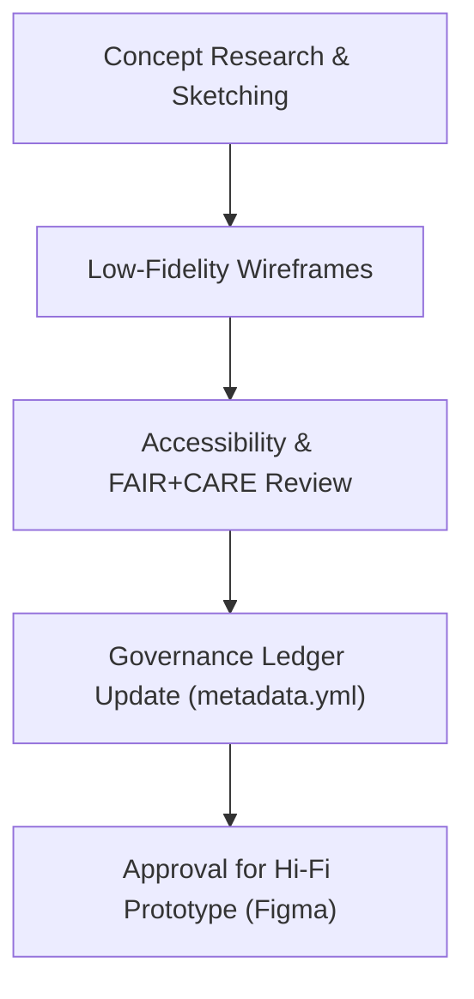

<div align="center">

# 🧱 **Kansas Frontier Matrix — Wireframe Design Archive (v2.1.1 · Tier-Ω+∞ Certified)**  
`docs/design/mockups/wireframes/README.md`

**Mission:** Document and govern all **low-fidelity wireframes and conceptual UI layouts** created for the  
**Kansas Frontier Matrix (KFM)** — enabling accessible, reproducible, and FAIR+CARE-compliant interface planning.

[](../../../docs/)
[](../../../docs/standards/accessibility.md)
[](../../../docs/standards/faircare-validation.md)
[](../../../LICENSE)

</div>

---

## 📚 Overview

This directory contains all **low-fidelity wireframes** used during the early planning and iterative design phases of the Kansas Frontier Matrix web interface.  
Each wireframe undergoes **accessibility validation**, **FAIR+CARE review**, and **governance ledger recording** before approval for high-fidelity implementation.

Wireframes capture:
- Information architecture & layout exploration  
- Navigation, timeline, and map UI flow concepts  
- Early accessibility and localization considerations  
- Ethical design reviews and documentation traceability  

---

## 🗂️ Directory Layout

```bash
docs/design/mockups/wireframes/
├── README.md                          # This file — wireframe archive overview
├── timeline_view_v1.fig               # Timeline interface prototype
├── layer_controls_v2.fig              # Map layer switcher and overlay layout
├── focus_mode_lowfi_v1.fig            # Focus Mode conceptual mockup
└── metadata.yml                       # Governance metadata and checksum registry
```

---

## ⚙️ Wireframe Lifecycle


<!-- END OF MERMAID -->

---

## 🧩 Metadata Schema

Each `.fig` or `.pdf` file is accompanied by a `.meta.yml` containing governance metadata:

```yaml
---
title: "Timeline View v1"
designer: "@kfm-ux"
reviewers: ["@kfm-accessibility","@kfm-docs"]
date_created: "2025-10-22"
version: "v2.1.1"
description: "Low-fidelity layout exploring timeline interaction and dataset filters."
accessibility_review: "2025-Q4 Accessibility Audit"
faircare_status: "Compliant"
checksum: "sha256:95ad7ebc9d3e42a18cf4f5e0b0..."
license: "CC-BY 4.0"
---
```

---

## 🧱 FAIR + CARE Integration

| Principle | Implementation | Validation |
|:--|:--|:--|
| **Findable** | Metadata registered in manifest with unique ID. | `manifest.zip` |
| **Accessible** | Openly shared under CC-BY license. | GitHub Repository |
| **Interoperable** | Stored in Figma and ODTS-compliant formats. | Design Metadata Schema |
| **Reusable** | Reused in subsequent UI iterations and ADRs. | `docs/design/mockups/` |
| **Collective Benefit (CARE)** | Inclusive visual communication for broad accessibility. | FAIR+CARE Council Audit |

---

## 🧠 Accessibility Validation

| Criteria | Description | Status |
|:--|:--|:--:|
| **Contrast Ratio** | Text elements ≥ 4.5:1 contrast verified. | ✅ |
| **Keyboard Flow** | Logical tab order verified via prototype. | ✅ |
| **Readable Fonts** | Sans-serif, scalable fonts tested for readability. | ✅ |
| **Screen Reader Semantics** | Labeled navigation and regions noted. | ✅ |
| **Localization Ready** | English, Spanish, Osage localization placeholders added. | ✅ |

---

## 🔍 Governance Integration

| Workflow | Function | Output |
|:--|:--|:--|
| `design-validate.yml` | Validates metadata and accessibility compliance. | `reports/validation/design_validation.json` |
| `policy-check.yml` | Confirms license and governance references. | `reports/audit/policy_check.json` |
| `governance-ledger.yml` | Registers wireframe version and checksum. | `data/reports/audit/ui_governance_ledger.json` |

---

## 🧾 Example Governance Record

```json
{
  "wireframe_id": "timeline_view_v1",
  "designer": "@kfm-ux",
  "version": "v2.1.1",
  "accessibility_score": 100,
  "faircare_compliant": true,
  "checksum": "sha256:95ad7ebc9d3e42a18cf4f5e0b0...",
  "review_date": "2025-11-16T09:30:00Z",
  "approval_status": "approved"
}
```

---

## 🧾 Version History

| Version | Date | Author | Summary |
|:--|:--|:--|:--|
| **v2.1.1** | 2025-11-16 | @kfm-ux | Standardized wireframe governance; added FAIR+CARE and accessibility review integration. |
| v2.0.0 | 2025-10-25 | @kfm-docs | Introduced metadata schema and validation workflow mapping. |
| v1.0.0 | 2025-10-04 | @kfm-architecture | Initial wireframe archive documentation. |

---

<div align="center">

**Kansas Frontier Matrix © 2025**  
*“Every Sketch Builds a System — Every System Honors Its Users.”*  
📍 `docs/design/mockups/wireframes/README.md` — Wireframe and conceptual UI archive for the Kansas Frontier Matrix.

</div>

