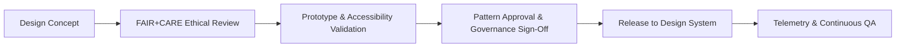

<div align="center">

# 🧭 **Kansas Frontier Matrix — Design Patterns & Ethical UX Guidelines**
`docs/design/patterns/README.md`

**Purpose:**  
Document consistent **user experience (UX) and interface design patterns** for the **Kansas Frontier Matrix (KFM)** web applications, data dashboards, and Focus Mode interfaces, ensuring all experiences meet **WCAG 2.1 AA**, **ISO 9241-210**, and **FAIR+CARE** design ethics standards.

[](../../README.md)
[](../../standards/faircare.md)
[](../../../LICENSE)
[](../../../releases/v10.0.0/manifest.zip)

</div>

---

## 📘 Overview

Design patterns within the **Kansas Frontier Matrix (KFM)** unify UI/UX behavior across systems — from **AI-driven exploration (Focus Mode)** to **governance dashboards** and **map interfaces**.  
They ensure **accessibility, inclusivity, and ethical consistency** across all digital experiences.

Each pattern:
- Is **reproducible**, **machine-readable**, and **culturally neutral**.  
- Aligns with **FAIR+CARE** design ethics.  
- Includes **ARIA and WCAG 2.1 AA** accessibility rules.  
- Is validated by automated testing pipelines and governance review.

---

## 🗂️ Directory Layout

```
docs/design/patterns/
├── README.md                   # This file
├── layouts.md                  # Page and dashboard grid systems
├── dashboards.md               # FAIR+CARE data dashboard standards
├── map-ui.md                   # MapLibre & Cesium UI guidelines
└── story-cards.md              # Historical and narrative display templates
```

---

## 🧩 Core UX Design Principles

| Principle | Description | Compliance |
|---|---|---|
| **Consistency** | Shared design language and behavior across all KFM tools. | MCP v6.3 |
| **Accessibility** | Interfaces conform to WCAG 2.1 AA and ARIA practices. | Accessibility Council |
| **Ethical UX** | Designs minimize bias, promote inclusivity, and avoid manipulation. | FAIR+CARE Council |
| **Transparency** | Provide clear provenance and consent indicators for all datasets. | Governance Protocol |
| **Sustainability** | Use lightweight, energy-efficient interfaces. | ISO 14064 & ISO 50001 |

---

## 🧠 FAIR+CARE Ethical UX Foundations

| Principle | UX Implementation |
|---|---|
| **Collective Benefit** | Designs prioritize user learning and public knowledge sharing. |
| **Authority to Control** | Data visibility and interaction respect Indigenous or personal consent flags. |
| **Responsibility** | Each interactive element includes contextual cues for ethical use. |
| **Ethics** | Avoids dark patterns, manipulative flows, or deceptive affordances. |

> Every user interaction in KFM is designed to **empower discovery, not exploitation**.

---

## 🎨 Common UX Patterns

| Pattern | Purpose | Accessibility Considerations |
|---|---|---|
| **Dashboard Layouts** | Data visualization frameworks (responsive, modular). | Keyboard shortcuts; color contrast validation. |
| **Map Interface** | Geospatial data exploration (2D/3D modes). | Keyboard navigation for panning/zoom; aria-live for map status. |
| **Focus Mode** | AI-assisted exploration with explainability overlays. | Narratives meet readability and tone ethics tests. |
| **Story Cards** | Compact narrative components for historical events. | Includes alt text, aria-describedby for summaries. |
| **Modal Dialogs** | Context-sensitive info or action confirmation. | Trapped focus; ESC key close; aria-modal defined. |

---

## ♿ Accessibility Integration

- All interactive regions include ARIA roles and proper keyboard focus order.  
- Focus rings and hover states respect motion preferences and contrast thresholds.  
- Skip-navigation and live-region alerts facilitate smooth assistive technology use.  
- Patterns are validated by `accessibility_scan.yml` and manual audits via NVDA/VoiceOver.

Example — **Accessible Story Card Pattern**:

```tsx
<article aria-labelledby="story-title" aria-describedby="story-summary">
  <h2 id="story-title">Treaty of Medicine Lodge (1867)</h2>
  <p id="story-summary">
    A pivotal peace negotiation between the U.S. government and several Plains tribes, held in Barber County, Kansas.
  </p>
  <footer>
    <a href="/events/medicine-lodge" aria-label="Read full historical summary">Read more</a>
  </footer>
</article>
```

---

## 🗺️ Geospatial UI Pattern (MapLibre / Cesium)

**Purpose:** Ensure accessibility and ethical use in map interactions.

| Element | Description | Accessibility Rule |
|---|---|---|
| Zoom Controls | Keyboard-operable (± keys) and accessible via aria-labels. | `aria-label="Zoom in/out"` |
| Layer Toggles | Checkbox-style toggles with ARIA states. | `aria-checked` |
| Live Announcements | Describe viewport changes to screen readers. | `aria-live="polite"` |
| Cultural Overlays | Display consent indicators for tribal or heritage data. | `role="region"`; `aria-describedby="consent-info"` |

---

## 📊 FAIR+CARE Dashboard Pattern

- Modular grid supporting multiple visualization types.  
- Built-in provenance and consent indicators per visualization widget.  
- Dynamic annotations showing dataset lineage (`data-provenance-id`).  
- Energy-efficient rendering benchmarked to ISO 50001 (sustainable UX).  

**Sample Dashboard Card:**
```tsx
<section className="bg-surface rounded-xl p-4 border border-neutral-200">
  <header className="flex justify-between">
    <h3 className="text-lg font-semibold">Rainfall Trends (1900–2025)</h3>
    <span aria-label="FAIR+CARE Verified Dataset" title="FAIR+CARE Certified">✅</span>
  </header>
  <div role="figure" aria-label="Rainfall graph with trend lines for Kansas">
    {/* Accessible D3 chart here */}
  </div>
  <footer className="text-sm mt-2">Source: NOAA NCEI · License: CC-BY 4.0</footer>
</section>
```

---

## ⚙️ Governance & Validation

| Workflow | Function | Artifact |
|---|---|---|
| `ux-pattern-validate.yml` | Validates all design patterns for compliance. | `reports/ui/ux-pattern-validation.json` |
| `accessibility_scan.yml` | Verifies ARIA structure and keyboard operability. | `reports/self-validation/web/a11y_summary.json` |
| `faircare-visual-audit.yml` | Checks ethical imagery and narrative tone. | `reports/faircare-visual-validation.json` |
| `governance-telemetry.yml` | Records pattern changes into release manifest. | `releases/v10.0.0/manifest.zip` |

---

## 📈 UX Quality Metrics

| Metric | Target | Source |
|---|---|---|
| **Accessibility (WCAG)** | ≥ 95 | `accessibility_scan.yml` |
| **Cultural Representation Ethics** | ≥ 90% | FAIR+CARE Audit |
| **Component Reuse Ratio** | ≥ 85% | Telemetry Reports |
| **Contrast Compliance** | 100% | Design Token Validation |
| **Energy Efficiency (ISO 50001)** | ≤ 200ms render per pattern | CI Performance Logs |

---

## 🧮 Pattern Lifecycle



Patterns evolve through ethical and accessibility validation, version control, and telemetry tracking.

---

## 🕰️ Version History

| Version | Date | Author | Summary |
|---|---|---|---|
| v10.0.0 | 2025-11-10 | FAIR+CARE Design Council | Created ethical UX pattern documentation for dashboards, maps, story cards, and Focus Mode interfaces under FAIR+CARE design principles. |

---

<div align="center">

**© 2025 Kansas Frontier Matrix — CC-BY 4.0**  
Maintained under **Master Coder Protocol v6.3** · Reviewed by **FAIR+CARE Design Council**  
[⬅ Back to Design Index](../README.md) · [Components →](../components/README.md)

</div>