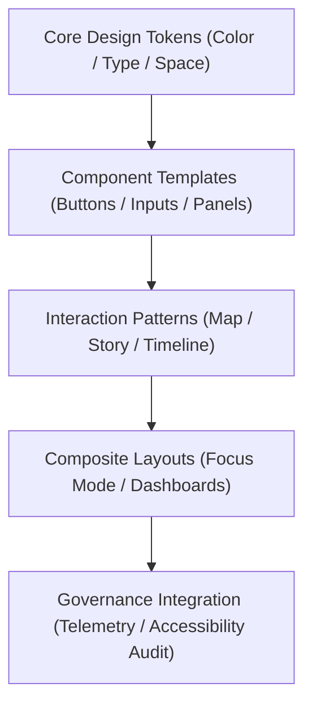

<div align="center">

# 🧩 Kansas Frontier Matrix — **Design Patterns & Interaction Framework**
`docs/design/patterns/README.md`

**Purpose:**  
Outlines the **interaction, layout, and usability design patterns** that guide the Kansas Frontier Matrix (KFM) web, governance, and AI visualization systems.  
Each pattern enforces FAIR+CARE, ISO, and WCAG principles to ensure ethical, accessible, and sustainable digital experiences across Focus Mode, Governance Dashboards, and Data Explorer interfaces.

[](../../../docs/standards/faircare-validation.md)
[]()
[]()
[](../../../LICENSE)

</div>

---

## 📚 Overview

The **Design Patterns Framework** provides reusable visual and behavioral guidelines for implementing user interactions across all KFM interfaces.  
It ensures that layouts, components, and workflows maintain consistency, equity, and transparency while reinforcing the FAIR+CARE governance model.

Each pattern is:
- **Provenance-linked** via governance telemetry (`focus-telemetry.json`).  
- **Accessibility-tested** to WCAG 2.2 AA standards.  
- **Version-controlled** under MCP-DL documentation lifecycle.  
- **Reusable and ethical**, designed for human-centered transparency.

---

## 🗂️ Directory Layout

```plaintext
docs/design/patterns/
├── README.md                              # This file — design pattern framework overview
│
├── interaction-patterns.md                 # Common user flows (map, timeline, dashboard)
├── layout-patterns.md                      # Responsive grids, composition rules
├── ai-visualization-patterns.md            # AI reasoning and explainability visuals
├── accessibility-patterns.md               # Inclusive design behaviors and focus management
└── governance-patterns.md                  # Ledger-linked interaction and provenance displays
```

---

## 🧠 Design Pattern Architecture



### System Layers
| Layer | Description | Source |
|--------|--------------|---------|
| **Design Tokens** | Base color, typography, and spacing rules defining the visual identity. | `docs/design/tokens/` |
| **Components** | Building blocks like buttons, dropdowns, and cards. | `docs/design/components/` |
| **Interaction Patterns** | User flows and state management behaviors. | `docs/design/patterns/interaction-patterns.md` |
| **Governance Hooks** | Ethical and provenance-based telemetry rules. | `docs/design/patterns/governance-patterns.md` |

---

## ⚙️ Core Interaction Patterns

| Pattern | Description | FAIR+CARE Purpose |
|----------|--------------|-------------------|
| **Map Interaction** | Pan, zoom, and filter layers via Focus Mode. | Spatial transparency and discovery. |
| **Timeline Scrubbing** | Time-based filtering for historical datasets. | Contextual storytelling and ethics review. |
| **AI Explainability Panel** | Displays reasoning metrics and model transparency. | Informed consent and responsible AI use. |
| **Governance Modal** | Allows users to view checksum, provenance, and ledger info. | Audit visibility and trust. |
| **Narrative Scroll Pattern** | Progressive disclosure of historical data with map sync. | Accessibility and narrative equity. |

---

## 🧩 Layout & Composition Patterns

| Pattern | Description | Framework |
|----------|--------------|-----------|
| **12-Column Grid** | Responsive structure across all device sizes. | MCP-DL Layout Standard |
| **Focus-First Hierarchy** | Prioritizes the primary data interaction point. | ISO 9241-210 UX Design |
| **Split View (Map + Metadata)** | Enables contextual exploration alongside data provenance. | FAIR F2 / CARE R1 |
| **Adaptive Timeline Panels** | Dynamically scales to dataset density. | Accessibility Token Sync |
| **Dashboard Modular Cards** | Flexible metrics display for FAIR+CARE validation results. | Governance Interface Design |

---

## 🎨 Visual & Ethical AI Patterns

| AI Pattern | Description | Ethical Standard |
|-------------|--------------|------------------|
| **Explainability Overlay** | Displays SHAP/LIME feature attribution on map. | FAIR+CARE Responsible AI |
| **Confidence Gradient** | Visualizes uncertainty through color scales. | ISO 19115 Visualization Metadata |
| **Ethics Alert Banner** | Flags incomplete metadata or unverified governance data. | CARE Authority to Control |
| **AI-User Feedback Loop** | Captures user feedback for drift correction. | FAIR Reusability / MCP-DL Lifecycle |
| **Governance Transparency Drawer** | Provides full lineage of model reasoning results. | FAIR F1 / CARE Ethics |

---

## ♿ Accessibility Patterns

| Pattern | Behavior | Standard |
|----------|-----------|----------|
| **Keyboard Navigation Loop** | Enables full interaction without mouse use. | WCAG 2.2 AA |
| **Screen Reader Labels** | Semantic HTML and ARIA labeling for all key interactions. | ISO 9241-210 |
| **Reduced Motion Mode** | Deactivates animations for users with vestibular sensitivity. | FAIR+CARE Inclusivity |
| **Color Contrast Checker** | Applies dynamic token-based contrast validation. | WCAG 2.2 |
| **Accessible Tooltip Timing** | Ensures readability with 1.5s minimum hover delay. | Accessibility Tokens |

Accessibility reports validated in:  
`data/reports/validation/ui_accessibility_summary.json`

---

## ⚖️ Governance Pattern Integration

Design patterns are tied to governance through **provenance-linked telemetry** ensuring traceability across all interfaces.

| Governance Feature | Implementation | Record Source |
|--------------------|----------------|----------------|
| **Ledger Viewer Modal** | Displays FAIR+CARE and provenance metadata in UI. | `web/src/components/governance/` |
| **Checksum Badge** | Verifies dataset authenticity via SHA-256 ledger link. | Manifest System |
| **Audit Log Drawer** | Interactive UI element listing all changes in dataset lineage. | Governance API |
| **Telemetry Beacon** | Tracks component performance and accessibility events. | `releases/v9.6.0/focus-telemetry.json` |
| **FAIR+CARE Badge Display** | Live validation badge linked to governance council certification. | Governance Dashboard |

---

## 🧩 Ethical Design Principles

KFM’s design patterns enforce ethical UI behavior through four guiding principles:

1. **Transparency:** Every UI interaction is auditable through the Governance Ledger.  
2. **Inclusion:** Accessibility patterns guarantee usability for all ability levels.  
3. **Equity:** Historical and environmental content balanced through non-biased design.  
4. **Accountability:** FAIR+CARE Council approves all new UX or UI pattern releases.  

All ethical patterns reviewed under ISO 37000 governance procedures.

---

## 🌱 Sustainable Design Metrics

| Metric | Target | Verified By |
|---------|---------|--------------|
| Component Reuse Ratio | ≥ 90% | @kfm-design |
| UI Accessibility Compliance | ≥ 95% | @kfm-accessibility |
| Renewable Design Platform Use | 100% | @faircare-council |
| Governance Audit Traceability | 100% | @kfm-governance |

Metrics tracked in:  
`releases/v9.6.0/focus-telemetry.json`

---

## 🧾 Internal Use Citation

```text
Kansas Frontier Matrix (2025). Design Patterns & Interaction Framework (v9.6.0).
Defines reusable, accessible, and ethically governed interaction design patterns for the Kansas Frontier Matrix ecosystem.
Integrates FAIR+CARE ethics, ISO usability standards, and governance telemetry for sustainable UI systems.
```

---

## 🧾 Version Notes

| Version | Date | Notes |
|----------|------|--------|
| v9.6.0 | 2025-11-03 | Introduced governance-integrated interaction patterns and AI visualization overlays. |
| v9.5.0 | 2025-11-02 | Added FAIR+CARE accessibility patterns and telemetry linkage. |
| v9.3.2 | 2025-10-28 | Established baseline design pattern documentation under ISO and FAIR+CARE standards. |

---

<div align="center">

**Kansas Frontier Matrix** · *Ethical Interaction × FAIR+CARE Accessibility × Sustainable Governance Design*  
[🔗 Repository](https://github.com/bartytime4life/Kansas-Frontier-Matrix) • [🎨 Design Docs](../README.md) • [⚖️ Governance Ledger](../../../docs/standards/governance/DATA-GOVERNANCE.md)

</div>