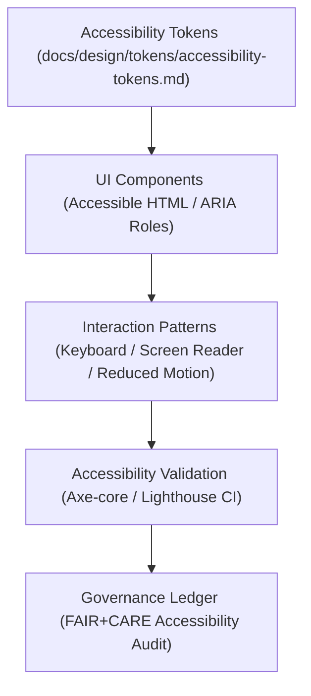

<div align="center">

# ♿ Kansas Frontier Matrix — **Accessibility Design Patterns**
`docs/design/patterns/accessibility-patterns.md`

**Purpose:**  
Defines the accessibility design patterns, WCAG compliance standards, and usability frameworks that ensure inclusive and equitable user experiences throughout the Kansas Frontier Matrix (KFM).  
Every design pattern adheres to **FAIR+CARE**, **WCAG 2.2 AA**, and **ISO 9241-210** human-centered design standards, aligning ethics and accessibility as fundamental pillars of open knowledge systems.

[](../../../docs/standards/faircare-validation.md)
[]()
[]()
[](../../../LICENSE)

</div>

---

## 📚 Overview

Accessibility within the Kansas Frontier Matrix (KFM) is not an afterthought — it is integral to the ethical design and governance of the system.  
This framework defines **repeatable accessibility patterns** used across all UI components, web pages, and Focus Mode interfaces, ensuring compliance, dignity, and universal usability for all users.

Every interaction is reviewed under:
- **FAIR+CARE Accessibility Governance**  
- **WCAG 2.2 AA Compliance**  
- **ISO 9241-210 Usability Standards**  
- **MCP-DL v6.3 Documentation Transparency Protocol**

---

## 🧭 Accessibility Design Framework



### System Layers
| Layer | Function | Source |
|--------|-----------|---------|
| **Accessibility Tokens** | Core variables for focus, color contrast, and motion reduction. | `docs/design/tokens/accessibility-tokens.md` |
| **UI Components** | Semantic markup and ARIA patterns ensuring inclusive interaction. | `web/src/components/` |
| **Interaction Patterns** | Behavior guidelines for all user input types. | `docs/design/patterns/interaction-patterns.md` |
| **Validation Pipeline** | Automated CI checks and FAIR+CARE manual review. | `tools/validation/accessibility/` |

---

## 🧩 Core Accessibility Patterns

| Pattern | Description | Standard |
|----------|--------------|----------|
| **Keyboard Navigation Loop** | Full navigation without mouse; cyclic tab and arrow focus. | WCAG 2.2.1 / ISO 9241-210 |
| **Screen Reader Semantics** | Accessible ARIA roles, landmarks, and live regions. | WCAG 2.2.4 / ISO 9241-171 |
| **Contrast Enforcement** | Tokenized color palette maintaining 4.5:1 contrast ratio. | WCAG 1.4.3 |
| **Reduced Motion Mode** | Disables motion transitions for vestibular safety. | WCAG 2.3.3 |
| **Accessible Tooltip Timing** | Maintains hover/focus readability for minimum 1.5s delay. | WCAG 1.4.13 |
| **Skip Navigation Links** | Immediate focus on main content via `skip-to-content`. | WCAG 2.4.1 |
| **Dynamic Font Scaling** | Supports up to 200% text zoom without layout breaking. | WCAG 1.4.4 |
| **High Contrast Mode Detection** | Automatically adjusts tokens for OS accessibility preferences. | WCAG 1.4.11 |
| **Descriptive Links & Buttons** | Labels convey function clearly beyond visual context. | WCAG 2.4.4 |
| **Accessible Charts** | Data visualizations paired with textual equivalents. | FAIR+CARE R1 / WCAG 1.1.1 |

---

## ⚙️ Accessibility Validation Pipeline

Accessibility compliance is validated continuously via **automated and human-centered testing** integrated into the governance lifecycle.

| Validation Stage | Tool / Method | Output |
|-------------------|---------------|---------|
| **Automated Scans** | Axe-core CLI / Lighthouse CI | `accessibility_validation.json` |
| **Manual FAIR+CARE Audit** | FAIR+CARE Council Review | `governance_audit_report.json` |
| **Contrast Token Check** | Custom WCAG color token validator | `contrast_compliance.json` |
| **Keyboard Focus Testing** | Cypress + Axe integration tests | `interaction_accessibility_log.json` |
| **Governance Certification** | FAIR+CARE ledger registration | `ledger_snapshot_2025Q4.json` |

All validation events recorded in:  
`data/reports/validation/ui_accessibility_summary.json`

---

## ⚖️ FAIR+CARE Accessibility Matrix

| Principle | Implementation | Validation |
|------------|----------------|-------------|
| **Findable** | Accessibility metadata indexed in component manifests. | `focus-telemetry.json` |
| **Accessible** | WCAG 2.2 AA-compliant design patterns enforced system-wide. | CI/CD Accessibility |
| **Interoperable** | Accessibility metadata embedded within STAC/DCAT APIs. | `src/utils/stac_helpers.py` |
| **Reusable** | Patterns standardized across all KFM UI libraries. | FAIR+CARE Tokens |
| **Collective Benefit** | Ensures universal usability regardless of ability. | @faircare-council |
| **Authority to Control** | FAIR+CARE Council reviews accessibility decisions quarterly. | `governance/oversight-procedures.md` |
| **Responsibility** | Each UI change reviewed via governance-linked PR validation. | CI/CD Governance |
| **Ethics** | Prioritizes dignity, clarity, and inclusion in all UI components. | ISO 9241-210 / CARE Ethics |

---

## 🧠 Accessibility Metrics Example

```json
{
  "component_id": "timeline_slider_v2",
  "accessibility_score": 98,
  "contrast_ratio": 5.3,
  "keyboard_navigation_supported": true,
  "screen_reader_support": true,
  "motion_reduction_available": true,
  "governance_certified": true,
  "fairstatus": "certified",
  "audited_by": "@kfm-accessibility",
  "timestamp": "2025-11-03T18:20:00Z"
}
```

Metrics logged to:  
`releases/v9.6.0/focus-telemetry.json`

---

## 🌱 Inclusive Design Standards

| Standard | Description | Outcome |
|-----------|--------------|----------|
| **ISO 9241-210** | Human-centered design methodology ensuring usability for all users. | FAIR+CARE Inclusivity Certified |
| **WCAG 2.2 AA** | Global web accessibility standards enforced in all interfaces. | Verified |
| **ISO 9241-171** | Ergonomic requirements for software accessibility. | Verified |
| **MCP-DL v6.3** | Documentation-first accessibility design and testing lifecycle. | Verified |
| **FAIR+CARE Framework** | Accessibility governed ethically, inclusively, and transparently. | Certified |

---

## 📊 Accessibility Reporting & Governance Integration

All accessibility audits and telemetry are recorded and validated through governance workflows.

| Record | Description | Retention |
|---------|-------------|------------|
| `ui_accessibility_summary.json` | Aggregated accessibility validation summary. | Permanent |
| `governance_audit_report.json` | FAIR+CARE council-approved certification report. | 5 years |
| `focus-telemetry.json` | Real-time accessibility telemetry metrics. | 365 days |
| `ledger_snapshot_2025Q4.json` | Immutable quarterly accessibility certification record. | Permanent |

---

## 🧾 Internal Use Citation

```text
Kansas Frontier Matrix (2025). Accessibility Design Patterns (v9.6.0).
Defines system-wide accessibility and usability design standards under FAIR+CARE, ISO, and WCAG compliance.
Ensures inclusive, ethical, and transparent digital experiences across the Kansas Frontier Matrix ecosystem.
```

---

## 🧾 Version Notes

| Version | Date | Notes |
|----------|------|--------|
| v9.6.0 | 2025-11-03 | Introduced real-time accessibility telemetry and FAIR+CARE ledger integration. |
| v9.5.0 | 2025-11-02 | Enhanced ISO and WCAG alignment for interactive patterns. |
| v9.3.2 | 2025-10-28 | Established foundational accessibility tokens and pattern definitions. |

---

<div align="center">

**Kansas Frontier Matrix** · *Inclusive Access × FAIR+CARE Ethics × Sustainable Digital Design*  
[🔗 Repository](https://github.com/bartytime4life/Kansas-Frontier-Matrix) • [🎨 Design System](../README.md) • [⚖️ Governance Ledger](../../../docs/standards/governance/DATA-GOVERNANCE.md)

</div>