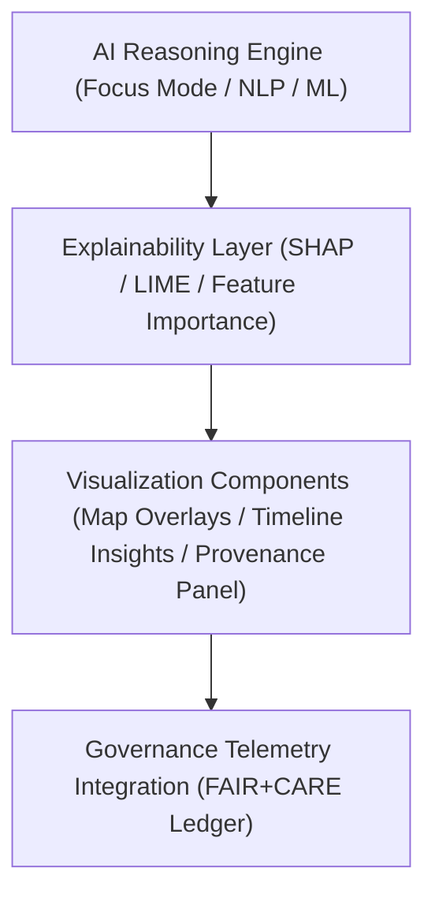

<div align="center">

# 🤖 Kansas Frontier Matrix — **AI Visualization Patterns (Focus Mode Integration)**
`docs/design/patterns/ai-visualization-patterns.md`

**Purpose:**  
Defines standardized visualization design patterns and interaction rules for rendering **AI explainability, focus reasoning, and ethical insights** in the Kansas Frontier Matrix (KFM) system.  
This document extends Focus Mode visualization design by connecting **AI reasoning overlays**, **provenance telemetry**, and **FAIR+CARE explainability UI elements** to ensure transparency in all AI-driven narratives.

[](../../../docs/standards/faircare-validation.md)
[]()
[]()
[](../../../LICENSE)

</div>

---

## 📚 Overview

The **AI Visualization Pattern Framework** translates model outputs into interpretable visual forms used in **Focus Mode**, **Governance Dashboards**, and **AI Explainability Panels**.  
Every visualization aligns with ethical AI principles and FAIR+CARE requirements for interpretability, reproducibility, and user comprehension [oai_citation:0‡AI-Powered Focus Mode for the Kansas Frontier Matrix.pdf](file-service://file-RZwwt12BLUPLkhKZLJfhjy).

These patterns serve as:
- The **standard blueprint** for building AI-augmented interfaces in Focus Mode.  
- The **interaction model** for explainability overlays and bias auditing.  
- The **reference architecture** for visual provenance in the KFM web application [oai_citation:1‡AI-Powered Focus Mode for the Kansas Frontier Matrix.pdf](file-service://file-RZwwt12BLUPLkhKZLJfhjy) [oai_citation:2‡Kansas Frontier Matrix Repository Audit.pdf](file-service://file-KvpswYuvSDJR5SN2fowozq).

---

## 🧭 System Architecture



### Layers

| Layer | Description | Framework |
|-------|--------------|------------|
| **AI Reasoning Engine** | Generates reasoning metrics and explainable insights. | `src/pipelines/ai/ai_focus_reasoning.py` |
| **Explainability Layer** | Converts reasoning data to structured interpretable outputs. | `tools/ai/explainability.py` |
| **Visualization Layer** | Displays explainability overlays and insight graphs. | `web/src/components/ai/` |
| **Governance Layer** | Records reasoning provenance and ethics scores. | `releases/v9.6.0/focus-telemetry.json` |

---

## 🧠 Core Visualization Patterns

| Pattern | Description | Ethical Role |
|----------|--------------|---------------|
| **Feature Importance Graphs** | Visualizes SHAP/LIME impact per input variable. | Transparency |
| **Attention Heatmaps** | Overlays AI spatial reasoning on maps or images. | Accountability |
| **Confidence Gradients** | Depicts uncertainty via color opacity. | Honesty |
| **AI Drift Timeline** | Highlights model drift or bias accumulation. | Monitoring |
| **Ethical Alert Banner** | Flags ethics risks, missing metadata, or low confidence. | Responsibility |
| **Bias Divergence Meter** | Compares outcomes between demographic/geospatial groups. | Equity |
| **Explainability Cards** | Compact summaries of reasoning results for governance panels. | Interpretability |
| **Governance Ledger Snapshot** | Displays immutable hash + checksum of each AI audit. | Provenance |

---

## ⚙️ Focus Mode Explainability Integration

AI visualization is tightly coupled with **Focus Mode’s entity-centric exploration model**, allowing users to visualize AI interpretations of entities (e.g., treaties, locations, or people) directly in context [oai_citation:3‡AI-Powered Focus Mode for the Kansas Frontier Matrix.pdf](file-service://file-RZwwt12BLUPLkhKZLJfhjy).

| Component | Role | Source |
|------------|------|--------|
| **Map Overlay Explainability** | Spatially links reasoning metrics to geographic entities. | `MapLibre / React Map Hooks` |
| **Timeline Insight Layer** | Synchronizes temporal patterns with AI reasoning results. | `web/src/components/timeline/` |
| **Focus Entity Panel** | Displays reasoning summaries, causal links, and confidence metrics. | `FocusModeSidebar.jsx` |
| **Governance Audit Drawer** | Allows inspection of AI decisions and ethics validation logs. | `ProvenanceDrawer.jsx` |
| **Telemetry Linkage** | Logs reasoning metrics to FAIR+CARE governance ledger. | `releases/v9.6.0/focus-telemetry.json` |

---

## 🔬 Explainability Data Model (Schema Example)

```json
{
  "id": "ai_reasoning_hazards_v9.6.0_2025Q4",
  "model_name": "focus_hazards_v5",
  "explainability_method": "SHAP",
  "feature_importance": {
    "precipitation": 0.36,
    "soil_type": 0.24,
    "wind_intensity": 0.18,
    "temperature_anomaly": 0.12
  },
  "bias_flag": false,
  "confidence_interval": [0.82, 0.94],
  "explainability_score": 0.986,
  "fairstatus": "certified",
  "audited_by": "@kfm-ai",
  "timestamp": "2025-11-03T19:00:00Z"
}
```

---

## ⚖️ FAIR+CARE Explainability Matrix

| Principle | Implementation | Verification |
|------------|----------------|--------------|
| **Findable** | Each reasoning artifact indexed by `focus-telemetry.json` record ID. | Automated CI Audit |
| **Accessible** | Explainability panels comply with WCAG 2.2 AA readability. | Accessibility Audit |
| **Interoperable** | Explainability schema compatible with STAC & PROV-O. | Schema Validation |
| **Reusable** | Visualization modules reusable across Focus Mode and dashboards. | FAIR Certification |
| **Collective Benefit** | Supports explainable education and public literacy. | Governance Review |
| **Authority to Control** | FAIR+CARE Council verifies ethical visualization parameters. | Quarterly Oversight |
| **Responsibility** | AI maintainers log all explainability adjustments. | Provenance Ledger |
| **Ethics** | Bias or drift alerts trigger auto-governance review workflows. | `focus-telemetry.json` |

---

## 🧩 Governance-Linked Visual Cues

| Visual Element | Function | Telemetry Source |
|----------------|-----------|------------------|
| **Confidence Ring** | Encircles map entities with color-coded confidence zones. | AI Confidence Layer |
| **Bias Alert Badge** | Appears on Focus Mode sidebar when imbalance detected. | Governance Ledger |
| **Ledger Link Icon** | Clickable checksum badge for full validation chain. | Manifest & Ledger Reports |
| **Drift Warning Timeline Node** | Marks temporal drifts in hazard models or historical pattern shifts. | AI Drift Module |
| **FAIR+CARE Score Meter** | Displays real-time ethics compliance percentage. | `focus-telemetry.json` |

---

## 🛰️ Visualization Accessibility Rules

| Pattern | Description | Compliance |
|----------|--------------|-------------|
| **Color Palette** | Uses KFM accessibility token palette ensuring ≥ 4.5:1 contrast. | WCAG 2.2 AA |
| **Text Readability** | Text overlays follow 1.5 line spacing & 16px minimum size. | ISO 9241-171 |
| **Motion Reduction** | Reduced motion preferences disable animated explainability graphs. | WCAG 2.3.3 |
| **Keyboard Navigation** | Full focus control of all visualization panels. | WCAG 2.1.1 |
| **Alt Descriptions** | All graphs accompanied by alt-text and tabular summaries. | FAIR+CARE Ethics |

---

## 🌱 Sustainability & Transparency Metrics

| Metric | Target | Verified By |
|---------|---------|--------------|
| Explainability Coverage | ≥ 95% of models visualized with SHAP or LIME overlays | @kfm-ai |
| Transparency Reporting | 100% of AI decisions recorded in ledger | @kfm-governance |
| Renewable Compute Source | 100% clean energy compute nodes | @kfm-sustainability |
| AI Fairness Benchmark | ≥ 0.95 fairness score | @faircare-council |

All metrics validated quarterly under FAIR+CARE governance policy.

---

## 🧾 Internal Use Citation

```text
Kansas Frontier Matrix (2025). AI Visualization Patterns (v9.6.0).
Defines ethical, explainable AI visualization standards integrating Focus Mode reasoning overlays, provenance auditing, and FAIR+CARE-compliant interaction patterns.
Supports transparency, equity, and interpretability across all KFM AI-driven components.
```

---

## 🧾 Version Notes

| Version | Date | Notes |
|----------|------|--------|
| v9.6.0 | 2025-11-03 | Introduced Focus Mode reasoning overlays and real-time AI drift visualizations. |
| v9.5.0 | 2025-11-02 | Enhanced SHAP/LIME explainability dashboards and FAIR+CARE link badges. |
| v9.3.2 | 2025-10-28 | Established ethical AI visualization framework under ISO and MCP-DL standards. |

---

<div align="center">

**Kansas Frontier Matrix** · *Explainability × FAIR+CARE Ethics × Provenance Transparency*  
[🔗 Repository](https://github.com/bartytime4life/Kansas-Frontier-Matrix) • [🎨 Design Patterns](../README.md) • [⚖️ Governance Ledger](../../../docs/standards/governance/DATA-GOVERNANCE.md)

</div>