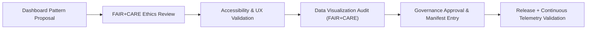

<div align="center">

# 📊 **Kansas Frontier Matrix — Dashboard UX & Visualization Patterns**
`docs/design/patterns/dashboards.md`

**Purpose:**  
Document the standardized **dashboard layouts**, **data visualization patterns**, and **ethical interaction principles** used across the **Kansas Frontier Matrix (KFM)** web and governance interfaces.  
Dashboards must comply with **WCAG 2.1 AA**, **ISO 9241-210**, and **FAIR+CARE** guidelines for transparency, accessibility, and equitable representation.

[](../../README.md)
[](../../standards/faircare.md)
[](../../../LICENSE)
[](../../../releases/v10.0.0/manifest.zip)

</div>

---

## 📘 Overview

The **Kansas Frontier Matrix Dashboard System** is the ethical visualization layer that unifies data analysis, telemetry insights, and Focus Mode analytics within the platform.  
Dashboards provide **clear, inclusive, and interpretable representations of data** while maintaining accessibility and cultural neutrality.

KFM dashboards:
- Integrate **data lineage and provenance tags**.  
- Employ **FAIR+CARE ethical visualization principles**.  
- Are **keyboard and screen-reader accessible**.  
- Use **energy-efficient rendering pipelines (ISO 50001-compliant)**.  

---

## 🗂️ Directory Layout

```
docs/design/patterns/
├── README.md                   # Overview of design patterns
├── dashboards.md                # Dashboard and visualization guidelines
├── layouts.md                   # Responsive grid and UI layout rules
├── map-ui.md                    # MapLibre and Cesium interface guidelines
└── story-cards.md               # Historical narrative pattern documentation
```

---

## 🧩 Dashboard Design Principles

| Principle | Description | Alignment |
|---|---|---|
| **Accessibility** | All dashboard elements meet WCAG 2.1 AA for navigation, contrast, and interaction. | Accessibility Council |
| **Transparency** | Provenance and FAIR+CARE indicators visible per widget. | Governance Standard |
| **Cultural Neutrality** | Visual representations avoid bias and respect Indigenous consent. | FAIR+CARE Ethics |
| **Consistency** | Unified color palette, typography, and spacing via design tokens. | MCP Design Tokens |
| **Responsiveness** | Layout adapts gracefully across screen sizes and input methods. | Web Standards |

---

## 🎨 Visual Layout Specification

| Token | Description | Example Value |
|---|---|---|
| `color.bg.dashboard` | Dashboard surface background | `#FAFAFA` |
| `color.card.bg` | Widget card surface color | `#FFFFFF` |
| `color.data.primary` | Primary data line color | `#004FC6` |
| `color.data.secondary` | Secondary data color | `#FFB300` |
| `font.size.dashboardTitle` | Dashboard title font size | `1.5rem` |
| `grid.columns.default` | Default responsive grid columns | `12` |
| `spacing.grid.gap` | Space between visual cards | `1rem` |

Dashboards employ an **asymmetric grid system** built on 12 columns with breakpoints aligned to Tailwind’s responsive utilities.

---

## 📊 FAIR+CARE Ethical Visualization Guidelines

| Guideline | Implementation |
|---|---|
| **Collective Benefit** | Dashboards convey knowledge that benefits public understanding, not exploitation. |
| **Authority to Control** | Indigenous or sensitive datasets display consent tags and access tier badges. |
| **Responsibility** | Data is contextualized; no decontextualized charts or cherry-picked visuals. |
| **Ethics** | Colors, symbols, and scaling chosen to avoid misrepresentation or cultural harm. |

> Visualization should **clarify data, not persuade** — all designs must communicate with integrity.

---

## ♿ Accessibility Requirements

| Requirement | Description | Compliance |
|---|---|---|
| **Keyboard Navigation** | Tab traversal through chart controls and tooltips. | WCAG 2.1.1 |
| **Color Contrast** | ≥ 4.5:1 for chart text and legend. | WCAG 1.4.3 |
| **ARIA Integration** | Charts labeled with `role="figure"` and `aria-label`. | ARIA 1.2 |
| **Screen Reader Summaries** | Each chart includes `aria-describedby` text summary. | Manual Audit |
| **Motion Preferences** | Animations disabled when `prefers-reduced-motion` is set. | WCAG 2.3.3 |

---

## 🧠 Example: FAIR+CARE Dashboard Card

```tsx
<section
  className="bg-surface border border-neutral-200 rounded-xl p-4 shadow-sm"
  role="figure"
  aria-labelledby="chart-title"
  aria-describedby="chart-summary"
>
  <header className="flex justify-between items-center">
    <h3 id="chart-title" className="text-lg font-semibold text-primary">
      Rainfall Trends in Kansas (1900–2025)
    </h3>
    <span
      className="text-xs text-success"
      aria-label="FAIR+CARE Certified"
      title="Dataset verified by FAIR+CARE Council"
    >
      ✅
    </span>
  </header>

  {/* Accessible chart visualization */}
  <div id="chart" aria-hidden="false">
    <svg role="img" aria-label="Bar chart showing average rainfall by decade"></svg>
  </div>

  <footer id="chart-summary" className="text-sm text-muted mt-2">
    Data source: NOAA NCEI · License: CC-BY 4.0 · Ethical Use: Educational
  </footer>
</section>
```

**Features:**
- Uses `aria-labelledby` and `aria-describedby` for semantic context.  
- Provenance and FAIR+CARE verification displayed visibly.  
- Responsive design validated via Lighthouse.  

---

## 🗺️ Dashboard Provenance Layer

Each visualization widget includes provenance metadata encoded via JSON-LD:

```json
{
  "@context": "https://schema.org/",
  "@type": "Dataset",
  "identifier": "noaa_ks_rainfall",
  "name": "Kansas Rainfall by Decade",
  "license": "CC-BY-4.0",
  "faircare": {
    "collective_benefit": "Public environmental research",
    "authority_to_control": "Open",
    "ethics": "Reviewed and certified by FAIR+CARE Council"
  }
}
```

This metadata is used for **interactive FAIR+CARE tooltips** and **dataset lineage visualization** within the dashboard.

---

## ⚙️ CI/CD Validation Workflows

| Workflow | Purpose | Output |
|---|---|---|
| `ux-pattern-validate.yml` | Validates dashboard structure, spacing, and responsiveness. | `reports/ui/ux-pattern-validation.json` |
| `accessibility_scan.yml` | Confirms ARIA compliance and chart alt-text presence. | `reports/self-validation/web/a11y_summary.json` |
| `faircare-visual-audit.yml` | Checks ethical color use and cultural neutrality in data. | `reports/faircare-visual-validation.json` |
| `dashboard-performance.yml` | Monitors render speed and energy use metrics. | `reports/ui/performance-metrics.json` |

---

## 📈 Ethical Data Visualization Checklist

| Category | Requirement | Status |
|---|---|---|
| **Provenance Shown** | Data source, license, and FAIR+CARE certification visible. | ✅ |
| **Contextualized Data** | Includes timeframe, uncertainty range, and sampling notes. | ✅ |
| **Cultural Sensitivity** | Indigenous or sensitive datasets include consent flag. | ✅ |
| **Ethical Color Mapping** | Avoids misleading red-green encoding or cultural connotations. | ✅ |
| **Transparent Interpretation** | No exaggeration of scale or omission of context. | ✅ |

---

## 🧩 Layout Pattern Example

```tsx
<main className="grid grid-cols-1 md:grid-cols-3 gap-4 p-4" role="main">
  <section className="col-span-2">
    {/* Primary chart */}
  </section>
  <aside>
    {/* Provenance details / FAIR+CARE status */}
  </aside>
</main>
```

- Grid-based modular layout.  
- Keyboard focus cycle defined left-to-right, top-to-bottom.  
- Screen reader summary region included in `<aside>`.  

---

## 📊 Quality Metrics

| Metric | Target | Verified By |
|---|---|---|
| **Accessibility (WCAG)** | ≥ 95 | `accessibility_scan.yml` |
| **FAIR+CARE Compliance** | ≥ 90% | Council Audit |
| **Chart Label Accuracy** | 100% | Visual Validation |
| **Provenance Metadata Coverage** | 100% | Governance Ledger |
| **Render Performance** | ≤ 200ms per widget | `dashboard-performance.yml` |

---

## 🧮 Pattern Lifecycle



All dashboard updates are logged into the Governance Manifest and validated by the FAIR+CARE Council before deployment.

---

## 🕰️ Version History

| Version | Date | Author | Summary |
|---|---|---|---|
| v10.0.0 | 2025-11-10 | FAIR+CARE Design & Data Visualization Council | Created standardized ethical UX dashboard pattern guide covering layout, provenance, FAIR+CARE labeling, and accessibility validation workflows. |

---

<div align="center">

**© 2025 Kansas Frontier Matrix — CC-BY 4.0**  
Developed under **Master Coder Protocol v6.3** · FAIR+CARE Certified · Diamond⁹ Ω / Crown∞Ω Ultimate Certified  
[⬅ Back to Design Patterns Index](README.md) · [Layouts →](layouts.md)

</div>