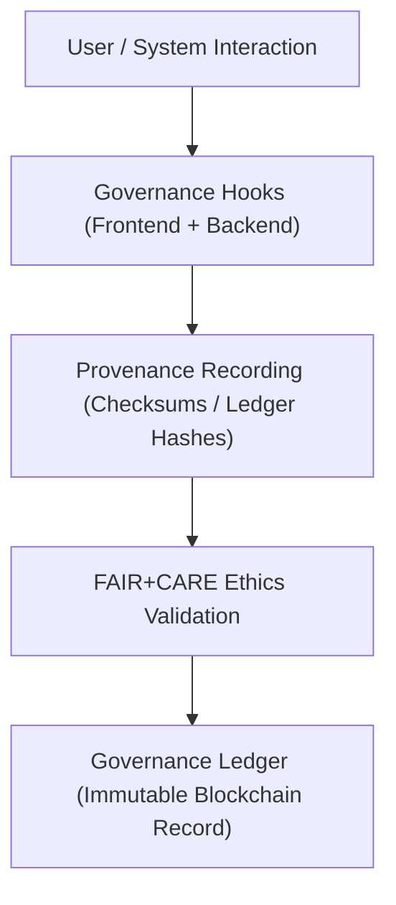
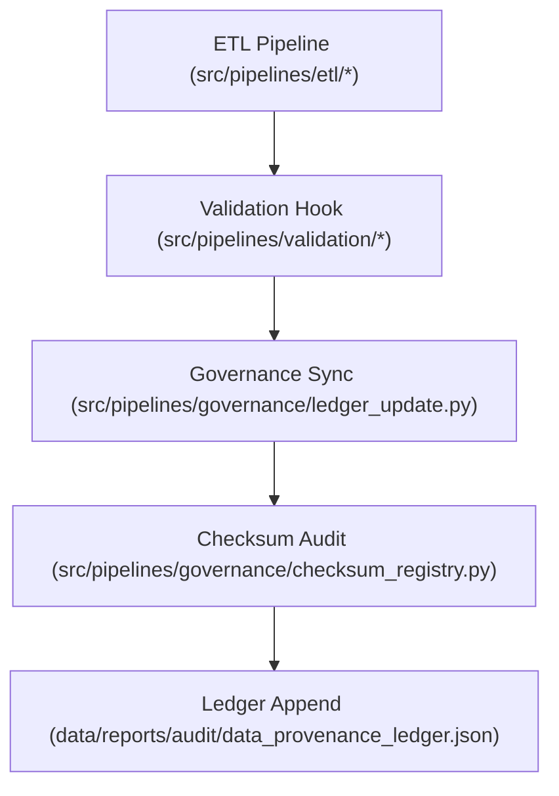

<div align="center">

# ⚖️ Kansas Frontier Matrix — **Governance Design Patterns**
`docs/design/patterns/governance-patterns.md`

**Purpose:**  
Defines the reusable **governance, provenance, and ethical oversight design patterns** that ensure all user interactions, AI results, and data operations within the **Kansas Frontier Matrix (KFM)** remain FAIR+CARE-certified, traceable, and transparent.  
This framework links the **user interface**, **data contracts**, and **blockchain-backed governance ledger** into a single interoperable oversight model.

[](../../../docs/standards/faircare-validation.md)
[]()
[]()
[](../../../LICENSE)

</div>

---

## 📚 Overview

The **Governance Design Pattern Framework** codifies ethical oversight and data lineage visualization across all KFM systems.  
It transforms compliance rules into **reusable interaction and architecture patterns**, ensuring consistent ethics, reproducibility, and auditability in Focus Mode, dashboards, and backend workflows.

### Governance Principles Implemented
- Every dataset, AI output, and user interaction produces **immutable provenance logs**.  
- All governance events are **auditable** via the blockchain-synced ledger.  
- FAIR+CARE and ISO 37000 standards drive documentation, design, and execution.  
- **Provenance visualization patterns** unify ethical, technical, and spatial dimensions of accountability.

---

## 🧭 Governance System Architecture



### Core Layers
| Layer | Description | Implemented In |
|--------|--------------|----------------|
| **Governance Hooks** | Event listeners that record all system actions tied to ethics metadata. | `src/pipelines/governance/` |
| **Checksum + Provenance** | SHA-256 and PGP verification of all modified assets. | `src/pipelines/governance/checksum_registry.py` |
| **FAIR+CARE Audit** | Validation of CARE principles before publishing. | `data/reports/fair/data_care_assessment.json` |
| **Blockchain Ledger** | Immutable record of data changes and AI outcomes. | `data/reports/audit/data_provenance_ledger.json` |

---

## 🧠 Core Governance Patterns

| Pattern | Description | Ethical Alignment |
|----------|--------------|-------------------|
| **Ledger-Linked UI Pattern** | UI displays live governance badges and audit hashes. | FAIR F1 + CARE Authority to Control |
| **Checksum Verification Flow** | All data interactions validated via automated hash registry. | ISO 19115 + MCP-DL v6.3 |
| **Provenance Drawer** | Interactive governance viewer within Focus Mode. | FAIR+CARE Responsibility |
| **Ethics Validation Hook** | Real-time ethics compliance check integrated into ETL. | CARE Principles |
| **Governance Audit Modal** | User-accessible display of dataset compliance reports. | FAIR Accessibility |
| **FAIR+CARE Badge Component** | Icon representing dataset ethical certification. | CARE Transparency |
| **Governance Drift Detection** | Automated alert if metadata diverges from governance record. | FAIR Reusability |
| **Ledger Signature Validation** | PGP and checksum verification of signed records. | ISO 37000 Governance Compliance |

---

## ⚙️ FAIR+CARE Governance Matrix

| Principle | Implementation | Oversight |
|------------|----------------|------------|
| **Findable** | Every dataset linked to governance hash and metadata index. | @kfm-data |
| **Accessible** | Governance logs publicly auditable under open license. | @kfm-accessibility |
| **Interoperable** | Ledger records adhere to STAC, DCAT, and PROV-O schemas. | @kfm-architecture |
| **Reusable** | Governance metadata reusable across repositories. | @kfm-governance |
| **Collective Benefit** | Open, traceable governance builds trust and transparency. | @faircare-council |
| **Authority to Control** | FAIR+CARE Council manages ethical sign-offs. | @kfm-fair |
| **Responsibility** | Audit trails ensure all changes are ethically reviewed. | @kfm-security |
| **Ethics** | Cultural and environmental data vetted before publication. | @kfm-ethics |

Audit entries consolidated in:  
`releases/governance/ledger_snapshot_2025Q4.json`

---

## 📜 Provenance Visualization Patterns

| Pattern | Description | Context |
|----------|--------------|----------|
| **Governance Ledger Timeline** | Interactive timeline showing ethics and validation events. | Governance Dashboard |
| **Ledger Signature Card** | PGP-signed dataset hash with validator identity. | FAIR+CARE Ledger View |
| **Governance Diff Panel** | Displays delta between validated and modified versions. | Focus Mode QA |
| **Data Provenance Tree** | Hierarchical lineage graph linking dataset generations. | `web/src/components/governance/` |
| **Checksum Chain Map** | Displays distributed hash ledger verifying multi-domain ETL events. | Provenance API Layer |

Each pattern connects directly to telemetry in:  
`releases/v9.6.0/focus-telemetry.json`

---

## 🔐 Governance Event Schema

```json
{
  "event_id": "gov_event_2025Q4_017",
  "dataset": "hazards_flood_extents_v9.6.0",
  "event_type": "validation_passed",
  "checksum_sha256": "3a4b7f9c88e11d8c...",
  "validator": "@kfm-fair",
  "fairstatus": "certified",
  "ethics_compliance": true,
  "ledger_signature": "pgp-sha256:<hash>",
  "timestamp": "2025-11-03T18:00:00Z"
}
```

---

## ⚖️ Governance Workflow Integration



All workflow events automatically reported to the **Governance Council Ledger**, ensuring traceability, auditability, and reproducibility.

---

## 🧩 Governance UI Components

| Component | Function | Source |
|------------|-----------|--------|
| **Ledger Badge** | Displays governance certification level (Bronze → Diamond⁹ Ω). | `web/src/components/governance/LedgerBadge.jsx` |
| **Audit Log Drawer** | Interactive list of governance events linked to selected dataset. | `web/src/components/governance/AuditDrawer.jsx` |
| **FAIR+CARE Score Meter** | Visual meter summarizing compliance score. | `web/src/components/governance/FairCareMeter.jsx` |
| **Governance Diff Viewer** | Displays JSON delta of ledger-approved changes. | `web/src/components/governance/DiffViewer.jsx` |
| **Checksum Validator** | Verifies SHA-256 and PGP signatures for all records. | `web/src/components/governance/ChecksumValidator.jsx` |

---

## 🌱 Sustainable & Ethical Governance Metrics

| Metric | Target | Verified By |
|---------|---------|--------------|
| Governance Transparency Score | 100% | @kfm-governance |
| FAIR+CARE Certification Rate | ≥ 98% | @faircare-council |
| Ledger Audit Retention | Permanent | @kfm-security |
| Renewable Compute for Validation | 100% | @kfm-sustainability |
| Provenance Drift Tolerance | ≤ 1% | @kfm-data |

Metrics tracked and logged via:  
`releases/v9.6.0/focus-telemetry.json`

---

## 🧾 Internal Use Citation

```text
Kansas Frontier Matrix (2025). Governance Design Patterns (v9.6.0).
Defines reusable ethical oversight and provenance visualization patterns under FAIR+CARE, ISO 37000, and MCP-DL standards.
Ensures governance traceability, accountability, and transparency across all data, AI, and user-facing systems.
```

---

## 🧾 Version Notes

| Version | Date | Notes |
|----------|------|--------|
| v9.6.0 | 2025-11-03 | Added live governance badge system and ledger-linked UI patterns. |
| v9.5.0 | 2025-11-02 | Enhanced checksum registry and FAIR+CARE badge integrations. |
| v9.3.2 | 2025-10-28 | Established baseline governance pattern architecture and audit hooks. |

---

<div align="center">

**Kansas Frontier Matrix** · *Ethical Oversight × Provenance Transparency × FAIR+CARE Governance*  
[🔗 Repository](https://github.com/bartytime4life/Kansas-Frontier-Matrix) • [⚙️ Governance Docs](../../standards/governance/README.md) • [🧭 Data Governance Standard](../../../docs/standards/governance/DATA-GOVERNANCE.md)

</div>