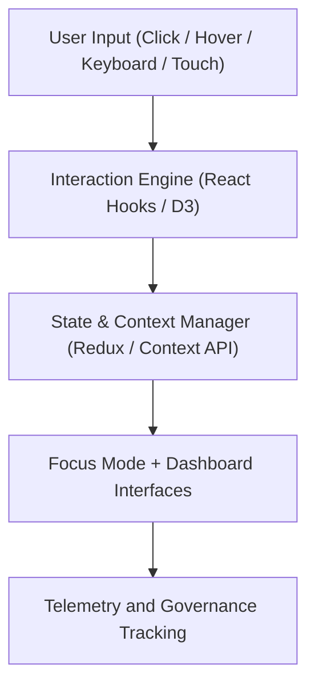

<div align="center">

# 🧭 Kansas Frontier Matrix — **Interaction Design Patterns**
`docs/design/patterns/interaction-patterns.md`

**Purpose:**  
Defines **interaction principles, user flow behaviors, and cognitive design rules** across all interfaces of the Kansas Frontier Matrix (KFM).  
These patterns ensure every user interaction — whether through Focus Mode, Governance Dashboards, or Map Explorers — follows FAIR+CARE, WCAG 2.2, and ISO 9241-210 human-centered design ethics.

[](../../../docs/standards/faircare-validation.md)
[]()
[]()
[](../../../LICENSE)

</div>

---

## 📚 Overview

The **Interaction Design Framework** governs the cognitive, sensory, and ethical principles guiding all user engagement across KFM interfaces.  
Every user flow is designed to enhance comprehension of complex data while maintaining accessibility, reproducibility, and cultural sensitivity.

Interaction patterns within KFM unify:
- **Spatial and Temporal Navigation (Map + Timeline)**  
- **AI Explainability and Ethical Engagement**  
- **Governance and Provenance Interactions**  
- **Inclusive Design for Accessibility and Learning**

---

## 🧩 Interaction Framework Overview



### Interaction Architecture Layers
| Layer | Description | Source |
|--------|--------------|--------|
| **User Input Layer** | Captures input modalities including mouse, keyboard, and touch. | Web / Map UI |
| **Interaction Engine** | Controls gesture recognition, hover states, and input feedback. | `web/src/hooks/useInteraction.js` |
| **State Manager** | Synchronizes user intent and system feedback loops. | Redux / Context API |
| **Telemetry Layer** | Logs all validated actions to FAIR+CARE governance ledger. | `releases/v9.6.0/focus-telemetry.json` |

---

## 🎮 Core Interaction Patterns

| Pattern | Description | Ethical / Usability Purpose |
|----------|--------------|-----------------------------|
| **Focus-First Map Navigation** | Centers map views dynamically on areas of user or data interest. | Cognitive efficiency and discovery. |
| **Timeline Scrubbing** | Allows users to navigate historical events or data through time sliders. | Transparency and learning through context. |
| **Governance Drawer Pattern** | Enables inspection of provenance and FAIR+CARE audit trails. | Accountability and user trust. |
| **AI Explainability Toggle** | Allows users to reveal or hide AI reasoning layers on demand. | Informed consent and interpretability. |
| **Provenance Hover Cards** | Displays metadata summaries upon interaction with entities. | Ethical visibility of data origins. |
| **Semantic Tooltip Pattern** | Contextual information surfaced via focus or hover. | Accessibility and comprehension. |
| **Modal Confirmation Flow** | Asks explicit consent before triggering irreversible or sensitive operations. | Responsibility and ethical safeguards. |
| **Keyboard Navigation Loop** | Ensures full interaction without reliance on pointing devices. | WCAG 2.2 compliance. |
| **Narrative Scroll Sync** | Binds story text to map timeline movement for contextual storytelling. | Multi-sensory comprehension. |
| **Error Transparency Modal** | Provides explainable error details with recovery suggestions. | User agency and resilience. |

---

## ⚙️ Interaction States & Feedback Patterns

| State Type | Behavior | Accessibility Outcome |
|-------------|-----------|------------------------|
| **Hover / Focus** | Highlights visual affordances with high-contrast outlines and ARIA states. | Improved visibility for low-vision users. |
| **Active / Pressed** | Provides tactile and color feedback for interaction confirmation. | Cognitive reinforcement. |
| **Loading / Pending** | Displays progress indicators with textual explanations. | Reduced anxiety and ambiguity. |
| **Disabled / Inactive** | Clear de-emphasis without removing elements from accessibility tree. | Clarity and structure. |
| **Error / Alert** | Ethical and respectful alert language, free from alarmism. | Inclusivity and tone governance. |

---

## 🧠 Cognitive Interaction Principles

KFM follows ISO 9241-210’s **human-centered design approach**, aligning with FAIR+CARE ethics for transparency and inclusion.

| Cognitive Principle | Implementation | Benefit |
|----------------------|----------------|----------|
| **Progressive Disclosure** | Present complexity in gradual, manageable layers. | Prevents overload. |
| **Recognition Over Recall** | Visual icons and summaries replace memory-based navigation. | Accessibility and cognitive ease. |
| **Predictability** | Consistent component placement and animation timing. | Builds trust and comfort. |
| **Error Forgiveness** | Undo/Redo and confirmation dialogs. | User empowerment and recovery. |
| **Learnability** | Interaction patterns repeat across modules (Map, Timeline, Governance). | Intuitive user onboarding. |

---

## ♿ Accessibility-Centered Interaction

| Pattern | Implementation | Compliance |
|----------|----------------|-------------|
| **Skip Navigation Links** | `tabindex` navigation to key sections. | WCAG 2.4.1 |
| **Keyboard Shortcuts** | Configurable shortcuts for essential commands. | ISO 9241-171 |
| **Dynamic Focus Management** | Auto-focus on actionable components post-transition. | WCAG 2.4.3 |
| **Accessible Motion Control** | Detects reduced-motion preference and disables animations. | WCAG 2.3.3 |
| **Focus Ring Tokens** | Uses tokenized outlines for visual consistency. | FAIR+CARE UI Tokens |

All accessibility telemetry stored in:  
`data/reports/validation/ui_accessibility_summary.json`

---

## 🧩 AI & Governance Interaction Patterns

AI explainability and governance layers introduce new ethical responsibilities for interaction patterns:

| Pattern | Description | FAIR+CARE Role |
|----------|--------------|----------------|
| **Explainability Hover Pattern** | Reveals AI reasoning context under cursor or focus. | FAIR+CARE Responsibility |
| **Governance Diff Pattern** | Displays ledger-recorded data lineage differences. | Transparency & Traceability |
| **Ethics Consent Modal** | Requests explicit user consent for AI explanations. | CARE Authority to Control |
| **Bias Disclosure Banner** | Alerts user when AI results are under ethical review. | FAIR Reusability & CARE Ethics |
| **AI Provenance Link** | Clickable checksum or ledger entry validating explainability data. | FAIR Findability |

---

## 📊 Telemetry Integration

Each interaction is recorded as a telemetry event for analytics and ethical review.

```json
{
  "event_id": "user_timeline_scrub_v9.6.0",
  "interaction_type": "timeline",
  "component": "TimelineSlider",
  "duration_ms": 1224,
  "keyboard_used": true,
  "screen_reader_active": false,
  "ai_layer_visible": true,
  "fairstatus": "compliant",
  "timestamp": "2025-11-03T18:45:00Z"
}
```

Telemetry synchronized via:  
`releases/v9.6.0/focus-telemetry.json`

---

## ⚖️ FAIR+CARE Interaction Governance Matrix

| Principle | Implementation | Verified By |
|------------|----------------|--------------|
| **Findable** | Each interaction pattern linked to manifest and telemetry ID. | @kfm-data |
| **Accessible** | Inclusive behavior design per WCAG and ISO standards. | @kfm-accessibility |
| **Interoperable** | Interaction patterns reusable across maps, dashboards, and archives. | @kfm-architecture |
| **Reusable** | FAIR+CARE-certified React patterns exported as modular code. | @kfm-design |
| **Collective Benefit** | Enhances knowledge equity through ethical interface design. | @faircare-council |
| **Authority to Control** | Users empowered to manage AI and governance views. | @kfm-governance |
| **Responsibility** | All user flows audited via telemetry and governance logs. | @kfm-security |
| **Ethics** | Interaction tone and visuals reviewed for cultural sensitivity. | @kfm-ethics |

Audit evidence located in:  
`releases/governance/ledger_snapshot_2025Q4.json`

---

## 🌱 Sustainable Interaction Metrics

| Metric | Target | Verified By |
|---------|---------|--------------|
| Interaction Accessibility Score | ≥ 95% | @kfm-accessibility |
| Motion Reduction Compliance | 100% | @kfm-ui |
| Telemetry Logging Accuracy | ≥ 99% | @kfm-telemetry |
| FAIR+CARE Interaction Retention | Permanent | @kfm-governance |
| Energy Efficiency per Interaction | ≤ 10 Wh | @kfm-sustainability |

All metrics captured in:  
`focus-telemetry.json`

---

## 🧾 Internal Use Citation

```text
Kansas Frontier Matrix (2025). Interaction Design Patterns (v9.6.0).
Defines the ethical, accessible, and human-centered interaction frameworks guiding all KFM user experiences.
Ensures transparency, inclusivity, and reproducibility across AI-driven and governance-linked workflows.
```

---

## 🧾 Version Notes

| Version | Date | Notes |
|----------|------|--------|
| v9.6.0 | 2025-11-03 | Introduced Focus Mode consent modals and timeline accessibility loops. |
| v9.5.0 | 2025-11-02 | Added AI explainability and governance-linked interaction patterns. |
| v9.3.2 | 2025-10-28 | Established ethical interaction architecture under ISO and FAIR+CARE standards. |

---

<div align="center">

**Kansas Frontier Matrix** · *Human-Centered Interaction × FAIR+CARE Ethics × Accessible Intelligence*  
[🔗 Repository](https://github.com/bartytime4life/Kansas-Frontier-Matrix) • [🎨 Design System](../README.md) • [⚖️ Governance Ledger](../../../docs/standards/governance/DATA-GOVERNANCE.md)

</div>